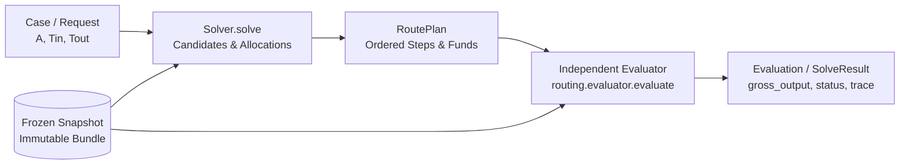
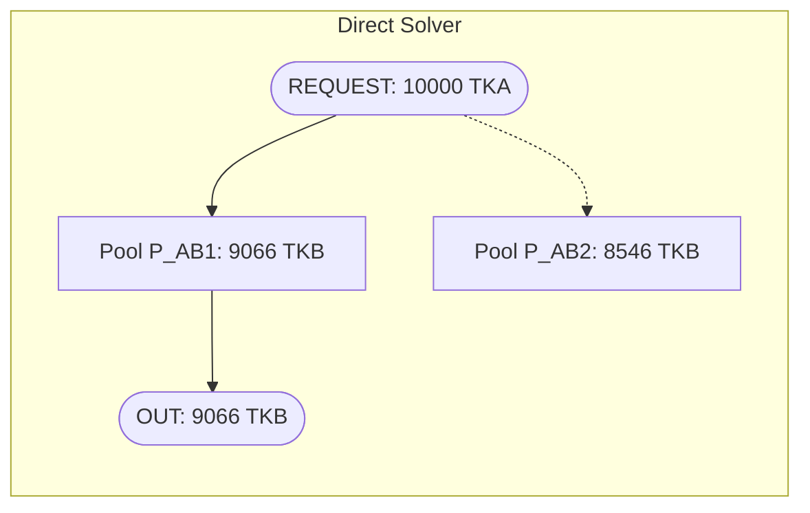
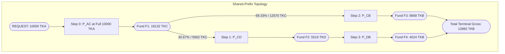

# Routing Algorithms: Architecture, Theory, and Reproducible Worked Examples

This guide provides a first-principles explanation of the six exact-input routing algorithms
implemented in this repository. It covers their mathematical foundations, search mechanics,
state management, and practical trade-offs against frozen Mantle liquidity snapshots.

Inspected source commit: `b2a680578f65ac65653a8160f04a3d97a5c5e71e` (Release 0.1.1).  
All numeric traces are verified offline by `tests/docs/test_routing_algorithm_examples.py`
and runnable via `docs/examples/routing-algorithms/run_examples.py`.

---

## 1. Problem, Roadmap, Terminology, and Architecture

### 1.1 The Routing Problem on Mantle

A decentralized exchange (DEX) aggregator solves the **Exact Input Routing Problem**: given an
immutable liquidity snapshot at block $B$, a source token $T_{\text{in}}$, a destination token
$T_{\text{out}}$, and an exact integer input amount $A \in \mathbb{N}^+$, find an executable
order plan (a `RoutePlan`) that maximizes the target output under an objective function
(gross output or net output after transaction costs):

$$\max_{\mathcal{P} \in \mathbb{P}} \quad \text{Objective}(\mathcal{P})$$

subject to:
1. **Conservation of Funds:** Every intermediate fund is strictly conserved; the sum of input
   allocations equals $A$, and no intermediate token balance is leaked or donated.
2. **Topological Feasibility:** Swaps execute across valid pools in directed order; no cyclical
   token dependencies or execution deadlocks exist.
3. **Discrete Integer Execution:** All AMM curve evaluations and balance allocations operate
   on integer base units (EVM `uint256`/`uint112`), with floor division $\lfloor \cdot \rfloor$.

### 1.2 Reading Roadmap

- **Section 1:** Core concepts, notation, common execution pipeline, fund ledgers, and CPMM derivation.
- **Section 2:** `direct` — Single-pool baseline, candidate filtering, and incomplete snapshot semantics.
- **Section 3:** `single_path` — Bounded hop-major path search, prefix memoization, and pruning.
- **Section 4:** `direct_split` — Discrete grid sampling, residue tracking, and exact dynamic programming.
- **Section 5:** `path_split` — Multi-hop candidate generation, pool-conflict pruning, and branch-and-bound.
- **Section 6:** `incremental_graph` — Marginal allocation over aggregate pool inputs, acyclic graph expansion, and merged execution.
- **Section 7:** `uni_sor_port` — Upstream Uniswap SOR V2/V3 parity core, amount distribution, BFS seed queues, and adapter fill.
- **Section 8:** Reproducible Real-State Fixed-Block Walkthrough (Block 101082044).
- **Section 9:** Algorithmic Comparison Matrix, Complexity Bounds, and Source-Reading Map.
- **Section 10:** Operational Boundaries, Limitations, and Known Debt.

### 1.3 Terminology and Symbol Table

| Symbol | Definition | Unit / Type |
|---|---|---|
| $A$ | Request input amount | Raw integer base units (`uint256`) |
| $T_{\text{in}}, T_{\text{out}}$ | Source and destination token addresses | Hex string (`0x...`) |
| $P$ | Admitted physical pool instance | `PoolState` (CPMM, CL, LB) |
| $K$ | Number of discrete allocation chunks | Integer ($K \ge 1$) |
| $H$ | Hop bound (`search.max_hops`) | Integer ($H \ge 1$) |
| $S$ | Split bound (`search.max_splits`) | Integer ($S \ge 1$) |
| $G$ | Grid units ($100 / \text{percent\_step}$) | Integer ($G \in \{1, \dots, 100\}$) |
| $f_p(x)$ | Exact simulated output of pool $p$ for input $x$ | Pure function: $\mathbb{N} \to \mathbb{N}$ |
| $\text{fee\_bps}$ | Pool swap fee in basis points | Integer ($1 \text{ bps} = 0.01\% = 10^{-4}$) |
| `RoutePlan` | Ordered list of `SwapStep` records | Immutable plan data structure |
| `Evaluation` | Independent replay record of a plan | Status, gross output, traces, ledger |

### 1.4 Tokens vs. Physical Pools

A token pair $(T_0, T_1)$ in a modern DEX ecosystem does not map to a single liquidity curve.
Instead, multiple independent pools exist simultaneously:
- **Protocol differences:** Constant Product (Uniswap V2 / Merchant Moe Classic), Concentrated
  Liquidity (Uniswap V3, Agni V3, FusionX V3), and Liquidity Book (Merchant Moe LB v2.2).
- **Fee tiers:** Pools on the same protocol can have distinct fee tiers (e.g. 1 bps, 5 bps, 30 bps, 100 bps).
- **State isolation:** Each pool has isolated reserves, tick arrays, or active bin trees. Swapping
  through pool $P_1$ does not alter the reserves of parallel pool $P_2$.

### 1.5 Non-Linear AMM Quotes vs. Static Graph Search

In traditional shortest-path routing (e.g., standard Dijkstra), edges have static scalar weights
$w(u, v)$ such that $w(u, w) = w(u, v) + w(v, w)$. AMMs violate this property:
1. **Amount-Dependent Price Impact:** As input amount $x$ increases, the marginal output
   $\partial f(x) / \partial x$ decreases monotonically on concave liquidity curves.
2. **State Exhaustion:** A large swap can cross multiple ticks or exhaust active bins, sharply
   shifting the exchange rate.
3. **No Dynamic Sub-structure across Arbitrary Splits:** An optimal path for an input of $1\,000$
   units is often suboptimal for $10\,000$ units. Consequently, static spot-price Dijkstra cannot
   solve AMM routing.

### 1.6 Common Execution Architecture

All algorithms interact with the benchmarking system through a strict, decoupled pipeline:



1. **Solver Isolation:** Solvers explore candidate paths, sample discrete amounts, and produce
   a `RoutePlan`. Solvers do not mutate bundle state and do not report self-certified outputs.
2. **Independent Plan Evaluation:** The evaluator (`routing.evaluator.evaluate`) takes the
   submitted `RoutePlan` and replays it from scratch against fresh copies of the bundle's
   physical pools.
3. **Fund Ledger:** Funds start in the `REQUEST` fund. Intermediate swap steps write outputs to
   unique fund IDs (e.g., `L1H1`, `F1`, `OUT1`). Later steps consume earlier funds.
4. **Remainder Draining:** Floor division integer remainder is explicitly allocated to the final
   step consuming a fund via the sentinel `ALL_REMAINING`. Residual unallocated balances cause
   immediate `invalid_plan` rejection.

### 1.7 Derivation of the Teaching Constant-Product Model

To ensure reproducible hand calculations across all chapters, we establish a standard
Constant Product Market Maker (CPMM) model with swap fee $\text{fee\_bps} \in [0, 10000)$:

Let the pool reserves be $(x, y)$, where $x$ is the reserve of token $T_{\text{in}}$ and $y$ is
the reserve of token $T_{\text{out}}$. When an input $\Delta x$ is provided:
1. The fee-adjusted input amount is:
   $$\Delta x_{\text{fee}} = \Delta x \cdot (10000 - \text{fee\_bps})$$
2. The invariant $(x \cdot 10000 + \Delta x_{\text{fee}})(y - \Delta y) \ge x \cdot y \cdot 10000$ requires:
   $$\Delta y = \left\lfloor \frac{\Delta x_{\text{fee}} \cdot y}{x \cdot 10000 + \Delta x_{\text{fee}}} \right\rfloor$$
3. State update:
   $$x' = x + \Delta x, \quad y' = y - \Delta y$$

*Note:* This integer formula governs Uniswap V2 and Merchant Moe Classic (`moe_classic_v1`).
Concentrated Liquidity (CL) and Liquidity Book (LB) use tick bitmaps and bin discrete trees,
which are evaluated in Section 8 via their exact protocol simulators.

---

## 2. Algorithm 1: `direct` (Single Pool Baseline)

### 2.1 Problem and Inclusion Rationale
`direct` evaluates every admitted physical pool that directly connects $T_{\text{in}}$ and
$T_{\text{out}}$ using 100% of the input amount $A$. It represents the minimal baseline
capability (no multi-hop, no split) required by `docs/DESIGN.md` §2.6.

### 2.2 Mathematical Model and Assumptions
- Candidate set: $\mathbb{P}_{\text{direct}} = \{p \in \text{Bundle} \mid \text{pairs}(p) = \{T_{\text{in}}, T_{\text{out}}\}\}$.
- Output for pool $p$: $O_p = f_p(A)$.
- Selection: $p^* = \arg\max_{p \in \mathbb{P}_{\text{direct}}} O_p$.
- **Incomplete Snapshot Policy:** If any evaluated direct pool fails with `INCOMPLETE_SNAPSHOT`
  (meaning the swap amount crossed into uncollected tick/bin state), the entire solve returns
  `SolveStatus.INCOMPLETE_SNAPSHOT`. Because that uncollected pool might have offered the best rate,
  claiming another pool is "best direct" would be misleading.

### 2.3 Concise Pseudocode
```python
def solve_direct(case, bundle, objective, budget):
    pools = bundle.pools_for_pair(case.token_in, case.token_out)
    candidates = pools[:min(budget.max_candidates, budget.max_quotes)]
    best_plan, best_score = None, -infinity
    incomplete = []
    
    for pool in candidates:
        plan = make_single_step_plan(pool.pool_id, case.amount_in)
        eval_result = evaluate(bundle, case, plan, objective)
        if eval_result.status == INCOMPLETE_SNAPSHOT:
            incomplete.append(pool.pool_id)
            continue
        if eval_result.status == OK and eval_result.score > best_score:
            best_plan, best_score = plan, eval_result.score
            
    if incomplete:
        return SolveResult(status=INCOMPLETE_SNAPSHOT)
    if not best_plan:
        return SolveResult(status=NO_ROUTE)
    return SolveResult(status=OK, plan=best_plan)
```

### 2.4 Architecture and Topology Diagram



### 2.5 Hand-Worked Numeric Example
Using our synthetic teaching bundle:
- Request: $A = 10\,000$ `TKA` $\to$ `TKB`.
- Pool `P_AB1`: Reserves $(100\,000, 100\,000)$, $\text{fee\_bps} = 30$.
  $$\Delta x_{\text{fee}} = 10\,000 \cdot 9970 = 99\,700\,000$$
  $$\text{num} = 99\,700\,000 \cdot 100\,000 = 9\,970\,000\,000\,000$$
  $$\text{den} = 100\,000 \cdot 10\,000 + 99\,700\,000 = 1\,099\,700\,000$$
  $$\Delta y_1 = \lfloor 9\,970\,000\,000\,000 / 1\,099\,700\,000 \rfloor = 9066 \text{ TKB}$$
- Pool `P_AB2`: Reserves $(200\,000, 180\,000)$, $\text{fee\_bps} = 30$.
  $$\Delta x_{\text{fee}} = 99\,700\,000$$
  $$\text{num} = 99\,700\,000 \cdot 180\,000 = 17\,946\,000\,000\,000$$
  $$\text{den} = 200\,000 \cdot 10\,000 + 99\,700\,000 = 2\,099\,700\,000$$
  $$\Delta y_2 = \lfloor 17\,946\,000\,000\,000 / 2\,099\,700\,000 \rfloor = 8546 \text{ TKB}$$
- **Selection:** $9066 > 8546 \implies$ `P_AB1` is selected. Evaluated output: `9066`.

### 2.6 Implementation Map
- File: `routing/algorithms/direct.py`
- Main entry point: `solve(case, context, budget)` (lines 48–109)
- Plan creation: `_plan_for_pool(pool_id, case)` (lines 35–45)

### 2.7 Parameters, Budgets, and Ties
- Parameters: None.
- Budgets: `Budget.max_candidates` and `Budget.max_quotes` truncate the candidate pool list:
  `candidates = admitted[:min(max_candidates, max_quotes)]`.
- Ties: First pool in bundle insertion order is retained (`score > best_score`).

### 2.8 Computational and Memory Cost
- Time Complexity: $\mathcal{O}(|\mathbb{P}_{\text{direct}}| \cdot \text{cost}_{\text{quote}})$.
- Quote Work: At most $|\mathbb{P}_{\text{direct}}|$ quotes.
- Memory: $\mathcal{O}(1)$ beyond bundle structures.

### 2.9 Guarantees and Limitations
- **Guarantee:** Globally optimal among single-pool direct routes for the given input.
- **Limitation:** Blind to multi-hop routes and split allocations; fails completely when no direct
  pool exists (`NO_ROUTE`).

---

## 3. Algorithm 2: `single_path` (Bounded Hop-Major Path Search)

### 3.1 Problem and Inclusion Rationale
When direct pools suffer from deep price impact or do not exist, routing through intermediate
tokens (multi-hop) can unlock superior exchange rates. `single_path` evaluates complete,
cycle-free multi-hop paths at 100% of the input amount.

### 3.2 Mathematical Model and Assumptions
- Candidate paths: $\Pi_H = \{\pi = (e_1, \dots, e_k) \mid 1 \le k \le H, \pi \text{ is cycle-free}\}$.
- Chained quote: $y_0 = A, \quad y_i = f_{e_i}(y_{i-1}) \quad \forall i \in \{1, \dots, k\}$.
- Selection: $\pi^* = \arg\max_{\pi \in \Pi_H} y_k(\pi)$.
- **Pruning Assumption:** If step $i$ along prefix $(e_1, \dots, e_i)$ fails (zero output,
  insufficient liquidity, or uncollected tick state), all candidate paths sharing that exact
  prefix are pruned immediately without quoting.

### 3.3 Concise Pseudocode
```python
def solve_single_path(case, bundle, index, max_hops, cache, budget):
    best_plan, best_score = None, -infinity
    pruned_prefixes = set()
    
    for path in enumerate_paths(index, case.token_in, case.token_out, max_hops):
        if any(path[:k] in pruned_prefixes for k in range(1, len(path)+1)):
            continue
        plan = make_path_plan(path, case.amount_in)
        eval_result = evaluate(bundle, case, plan, quote=cache)
        if eval_result.status != OK:
            pruned_prefixes.add(path[:eval_result.failed_step + 1])
            continue
        if eval_result.score > best_score:
            best_plan, best_score = plan, eval_result.score
            
    return SolveResult(status=OK if best_plan else NO_ROUTE, plan=best_plan)
```

### 3.4 Architecture and Topology Diagram


### 3.5 Hand-Worked Numeric Example
Consider the multi-hop candidate path `TKA -[P_AC]-> TKC -[P_CB]-> TKB`:
- Hop 1 (`P_AC`): Reserves $(100\,000, 200\,000)$, $\text{fee\_bps} = 30$, input $10\,000$ TKA:
  $$\Delta x_{\text{fee}} = 10\,000 \cdot 9970 = 99\,700\,000$$
  $$\text{num} = 99\,700\,000 \cdot 200\,000 = 19\,940\,000\,000\,000$$
  $$\text{den} = 100\,000 \cdot 10\,000 + 99\,700\,000 = 1\,099\,700\,000$$
  $$\Delta y_{\text{AC}} = \lfloor 19\,940\,000\,000\,000 / 1\,099\,700\,000 \rfloor = 18132 \text{ TKC}$$
- Hop 2 (`P_CB`): Reserves $(200\,000, 150\,000)$, $\text{fee\_bps} = 30$, input $18132$ TKC:
  $$\Delta x_{\text{fee}} = 18132 \cdot 9970 = 180\,776\,040$$
  $$\text{num} = 180\,776\,040 \cdot 150\,000 = 27\,116\,406\,000\,000$$
  $$\text{den} = 200\,000 \cdot 10\,000 + 180\,776\,040 = 2\,180\,776\,040$$
  $$\Delta y_{\text{CB}} = \lfloor 27\,116\,406\,000\,000 / 2\,180\,776\,040 \rfloor = 12434 \text{ TKB}$$
- **Outcome:** The 2-hop path yields $12434$ TKB, outperforming the direct pool ($9066$ TKB) by $+3368$ raw units (+37.15%).

### 3.6 Implementation Map
- File: `routing/algorithms/single_path.py`
- Preparation: `prepare(bundle, config)` (lines 101–117) creates immutable `GraphIndex`.
- Traversal generator: `routing/search.py:enumerate_paths` (lines 142–165).
- Solver: `solve(case, context, budget)` (lines 164–294).

### 3.7 Parameters, Budgets, and Ties
- `search.max_hops`: Hop bound $H$ (integer $\ge 1$).
- Bounded enumeration order: Hop-major (1-hop, then 2-hop, ..., up to $H$ hops). Within the same
  hop count, adjacency depth-first order based on pool insertion order.
- Status differentiation:
  - `unreachable`: $T_{\text{out}}$ has no path from $T_{\text{in}}$ at any hop distance.
  - `hop-bound`: $T_{\text{out}}$ is reachable, but the shortest path requires $> H$ hops.
  - `timeout`: Budget truncated the search before any valid candidate was evaluated.

### 3.8 Computational and Memory Cost
- Path Space: $\mathcal{O}(|\mathbb{P}|^H)$ paths in the worst case.
- Memoization: `QuoteCache` stores exact `(pool_id, token_in, amount)` tuples.
- Overhead: $\mathcal{O}(|\Pi_H|)$ generator stack memory; bounded recursion depth.

### 3.9 Guarantees and Limitations
- **Guarantee:** Optimal full-input single path within the bounded graph $\Pi_H$.
- **Limitation:** Cannot split volume across parallel paths; vulnerable to price impact on large trades.

---

## 4. Algorithm 3: `direct_split` (Discrete Dynamic Programming)

### 4.1 Problem and Inclusion Rationale
When multiple pools directly connect $T_{\text{in}}$ and $T_{\text{out}}$, splitting the input
across them mitigates individual price impact. `direct_split` finds the gross-optimal split
allocation across direct pools using a discrete percentage grid and exact dynamic programming.

### 4.2 Mathematical Model and Assumptions
- Grid: Step size $\delta \in (0, 100]$ dividing 100; total units $N = 100 / \delta$.
- Splits: At most $S = \text{max\_splits}$ nonzero legs.
- Allocation vector: $u = (u_1, \dots, u_m)$ with $u_i \in \{1, \dots, N\}$, $\sum u_i = N$.
- Integer Amounts and Remainder:
  $$\text{amount}_i = \left\lfloor \frac{A \cdot u_i}{N} \right\rfloor \quad \forall i < m$$
  $$\text{amount}_m = A - \sum_{i=1}^{m-1} \text{amount}_i \quad (\text{via } \texttt{ALL\_REMAINING})$$
- Accumulator Residue: $r = \sum_{i=1}^{m-1} (A \cdot u_i \bmod N)$, ensuring exact integer conservation.

### 4.3 Concise Pseudocode
```python
def solve_direct_split(case, bundle, max_splits, percent_step, cache):
    N = 100 // percent_step
    pools = bundle.pools_for_pair(case.token_in, case.token_out)
    sample_table = precompute_grid_quotes(pools, case.amount_in, N, cache)
    
    # DP State: (legs_used, units_used, residue) -> (max_gross, legs_tuple)
    dp = {(0, 0, 0): (0, ())}
    finalists = {} # split_count -> (gross, allocation)
    
    for j, pool in enumerate(pools):
        new_dp = dict(dp)
        for (legs, used, res), (gross, alloc) in dp.items():
            # Option A: Close allocation as final leg
            rem_units = N - used
            final_amt = case.amount_in - sum(leg.amount for leg in alloc)
            out_final = quote(pool, final_amt)
            update_finalists(finalists, legs + 1, gross + out_final, alloc + (pool, rem_units))
            
            # Option B: Add as intermediate leg
            if legs + 1 < max_splits:
                for u in range(1, rem_units):
                    out_u = sample_table[pool, u]
                    new_state = (legs + 1, used + u, res + (case.amount_in * u % N))
                    update_dp(new_dp, new_state, gross + out_u, alloc + (pool, u))
        dp = new_dp
        
    # Re-score finalists under complete-plan objective
    return select_best_finalist(finalists)
```

### 4.4 Architecture and Topology Diagram


### 4.5 Hand-Worked Numeric Example
Input $A = 10\,000$ TKA, $\text{percent\_step} = 10 \implies N = 10$ units ($1\,000$ TKA/unit), $\text{max\_splits} = 2$.
1. **Grid Sampling:**
   - `P_AB1`: Quotes for $u \in \{1, \dots, 10\}$ yield:
     $[987, 1955, 2904, 3835, 4748, 5644, 6523, 7386, 8234, 9066]$.
   - `P_AB2`: Quotes for $u \in \{1, \dots, 10\}$ yield:
     $[892, 1776, 2652, 3519, 4377, 5227, 6069, 6903, 7728, 8546]$.
2. **DP Transition (2 Splits):**
   - Evaluating $u_1 \cdot 1000$ on `P_AB1` and $(10 - u_1) \cdot 1000$ on `P_AB2`:
     - $u_1 = 5 (5000) + u_2 = 5 (5000): 4748 + 4377 = 9125$ TKB
     - $u_1 = 6 (6000) + u_2 = 4 (4000): 5644 + 3519 = 9163$ TKB
     - $u_1 = 7 (7000) + u_2 = 3 (3000): 6523 + 2652 = \mathbf{9175}$ TKB
     - $u_1 = 8 (8000) + u_2 = 2 (2000): 7386 + 1776 = 9162$ TKB
3. **Outcome:** $u = (7, 3)$ achieves $9175$ TKB, outperforming single pool `P_AB1` ($9066$ TKB) by $+109$ TKB (+1.20%).
4. **Nondivisible Remainder Walkthrough:**
   - Input $A = 10\,005$, $u = (7, 3)$:
     - Leg 1: $\lfloor 10005 \cdot 7 / 10 \rfloor = \lfloor 7003.5 \rfloor = 7003$.
     - Leg 2: $10005 - 7003 = 3002$ (`ALL_REMAINING`, carrying remainder 1).
     - Sum: $7003 + 3002 = 10\,005$ raw units (0 residual).

### 4.6 Implementation Map
- File: `routing/algorithms/direct_split.py`
- Preparation: `prepare(bundle, config)` (lines 68–84) validates $N = 100 / \text{percent\_step}$.
- Leg amount calculation: `leg_amounts(amount_in, legs, units)` (lines 121–125).
- Solver: `solve(case, context, budget)` (lines 160–348).

### 4.7 Parameters, Budgets, and Ties
- `search.percent_step`: Divisor of 100 (e.g. 5, 10).
- `search.max_splits`: Upper bound on leg count $S$.
- Ties: Fewer splits win ties; earlier admitted pools win identical gross outputs.

### 4.8 Computational and Memory Cost
- Sample complexity: $\mathcal{O}(|\mathbb{P}_{\text{direct}}| \cdot N)$ quotes.
- DP States: At most $\mathcal{O}(S \cdot N^2)$ states.
- Re-scoring: Exactly $S$ candidate plans re-evaluated under `ObjectiveContext`.

### 4.9 Guarantees and Limitations
- **Guarantee:** Globally optimal allocation over the declared finite grid under additive gross output.
- **Limitation:** Does not support multi-hop routes; finalist re-scoring does not exhaustively
  search non-additive per-pool fixed fees across all non-finalist grid combinations.

---

## 5. Algorithm 4: `path_split` (Conflict-Aware Branch-and-Bound)

### 5.1 Problem and Inclusion Rationale
To combine multi-hop routing with volume splitting, an aggregator must split volume across
multi-hop paths. However, paths that share physical pools cannot be evaluated independently
because sequential transactions on the same pool alter reserves and invalidate additive quotes.
`path_split` strictly enforces **physical-pool disjointness**: no two paths in a split plan
may share a pool ID.

### 5.2 Mathematical Model and Assumptions
- Candidate paths: $\Pi_H$ generated as in `single_path`.
- Pool Disjointness Constraint:
  $$\text{pools}(\pi_i) \cap \text{pools}(\pi_j) = \emptyset \quad \forall i \ne j$$
- Pruning Bound $B$: Let $B = (S - 1) \cdot H$. If more than $B$ pairwise pool-disjoint paths
  are each strictly superior to path $P$ at grid size $u$, then $P$ cannot be part of the optimal
  $S$-split plan and is safely pruned.
- Upper Bound on Path Quote:
  $$\text{UB}(P, u) = \min\left(\text{out}_P(N), \left\lceil \frac{(\text{out}_P(u_0) + 1) \cdot a_u}{a_{u_0}} \right\rceil\right)$$

### 5.3 Concise Pseudocode
```python
def solve_path_split(case, bundle, max_hops, max_splits, percent_step, cache):
    # Stage 1: Retain simpler candidates
    best_single = solve_single_path(...)
    best_direct_split = solve_direct_split(...)
    
    # Stage 2: Sample all paths at u0 and N
    paths = enumerate_paths(...)
    sample_endpoints(paths, u0, N)
    
    # Stage 3: Conflict-aware candidate pruning
    kept_table = prune_dominated_paths(paths, B=(max_splits - 1) * max_hops)
    
    # Stage 4: Exact Branch-and-Bound
    # State: (current_legs, accumulated_pools, current_gross, remaining_units)
    # Bound: current_gross + knapsack_bound(remaining_units)
    finalists = branch_and_bound(kept_table, max_splits)
    
    # Stage 5: Re-evaluate finalists as fund-referenced RoutePlans
    return select_best_plan([best_single, best_direct_split, finalists])
```

### 5.4 Architecture and Topology Diagram


### 5.5 Hand-Worked Numeric Example
Request: $10\,000$ TKA $\to$ TKB, $\text{percent\_step} = 10, \text{max\_splits} = 2$.
1. **Candidate Paths:**
   - $\pi_1$: `TKA -[P_AC]-> TKC -[P_CB]-> TKB` (Pools: `P_AC`, `P_CB`)
   - $\pi_2$: `TKA -[P_AD]-> TKD -[P_DB]-> TKB` (Pools: `P_AD`, `P_DB`)
   - $\pi_3$: `TKA -[P_AC]-> TKC -[P_CD]-> TKD -[P_DB]-> TKB` (Pools: `P_AC`, `P_CD`, `P_DB`)
2. **Conflict Rejection:**
   - Attempting to combine $\pi_1$ and $\pi_3$ fails because $\text{pools}(\pi_1) \cap \text{pools}(\pi_3) = \{\text{P\_AC}\} \ne \emptyset$.
   - Attempting to combine $\pi_2$ and $\pi_3$ fails because $\text{pools}(\pi_2) \cap \text{pools}(\pi_3) = \{\text{P\_DB}\} \ne \emptyset$.
   - Combining $\pi_1$ and $\pi_2$ is valid: $\{\text{P\_AC}, \text{P\_CB}\} \cap \{\text{P\_AD}, \text{P\_DB}\} = \emptyset$.
3. **Allocation Evaluation (80% / 20%):**
   - $\pi_1$ at $8\,000$ TKA:
     - Hop 1 (`P_AC`): $8\,000$ TKA $\to 14751$ TKC
     - Hop 2 (`P_CB`): $14751$ TKC $\to 10565$ TKB
   - $\pi_2$ at $2\,000$ TKA:
     - Hop 1 (`P_AD`): $2\,000$ TKA $\to 2950$ TKD
     - Hop 2 (`P_DB`): $2950$ TKD $\to 2016$ TKB
   - Total Gross Output: $10565 + 2016 = \mathbf{12581}$ TKB.
   - Comparison: Outperforms `single_path` ($12434$ TKB) by $+147$ raw units (+1.18%).

### 5.6 Implementation Map
- File: `routing/algorithms/path_split.py`
- Conflict check: `paths_conflict(p1, p2)` (lines 142–148).
- Candidate pruning: `_prune_candidates(...)` (lines 280–360).
- Branch-and-bound engine: `_branch_and_bound(...)` (lines 380–470).

### 5.7 Parameters, Budgets, and Ties
- Parameters: `search.max_hops`, `search.max_splits`, `search.percent_step`.
- Pruning: Relaxed knapsack upper bound stops exploring branches that cannot exceed current best.
- Ties: Simpler route wins ties (single path > direct split > fewer legs).

### 5.8 Computational and Memory Cost
- Complexity: $\mathcal{O}(|\Pi_H| \cdot N + \binom{|\Pi_H|}{S})$ in worst-case combinatorial search,
  heavily reduced by disjoint pruning and knapsack branch-and-bound.
- Cache: Shared `QuoteCache` prevents redundant simulation across search phases.

### 5.9 Guarantees and Limitations
- **Guarantee:** Best evaluated pool-disjoint allocation on the discrete grid.
- **Limitation:** Cannot route through shared pools or topology merges (e.g., cannot split volume
  after a common first hop).

---

## 6. Algorithm 5: `incremental_graph` (Shared-Pool Marginal Routing)

### 6.1 Problem and Inclusion Rationale
Restricting multi-hop routes to disjoint pools forbids natural liquidity topologies such as
shared-prefix splits (e.g., all funds route through a high-liquidity `USDC -> WMNT` pool, then
split across distinct pools to the target). `incremental_graph` solves this by allowing
paths to share physical pools.

### 6.2 Mathematical Model and Assumptions
- Chunks: Input $A$ is partitioned into $K = \text{graph.chunks}$ integer chunks:
  $$\Delta_k = \left\lfloor \frac{A \cdot k}{K} \right\rfloor - \left\lfloor \frac{A \cdot (k-1)}{K} \right\rfloor$$
- Aggregate Input Accounting: Each pool maintains total tentative input $x_p$. When a chunk
  of size $d$ traverses pool $p$, its marginal output is:
  $$m = f_p(x_p + d) - f_p(x_p)$$
  and pool state is updated to $x_p \leftarrow x_p + d$.
- **Crucial Invariant:** $f(x + \Delta) - f(x)$ represents one merged swap of size $x + \Delta$,
  **not** two sequential swaps. Sequential fee-bearing swaps would re-apply base fees and yield
  strictly less.
- **Merged Plan Normalization:** All chunks traversing pool $p$ are coalesced into a single
  `SwapStep` executing $x_p$ in the final transaction plan.

### 6.3 Concise Pseudocode
```python
def solve_incremental_graph(case, bundle, chunks_K, max_hops, cache):
    retained_candidate = solve_path_split(...)
    paths = enumerate_paths(...)
    
    pool_inputs = defaultdict(int)
    chunk_allocations = []
    
    for k in range(1, chunks_K + 1):
        chunk_size = floor(A * k / K) - floor(A * (k-1) / K)
        best_path, best_marginal = None, 0
        
        for path in paths:
            if creates_cycle(chunk_allocations + [path]):
                continue
            marginal = simulate_marginal(path, chunk_size, pool_inputs)
            if marginal > best_marginal:
                best_path, best_marginal = path, marginal
                
        if not best_path:
            abandon_incremental_plan()
            return retained_candidate
            
        commit_chunk(best_path, chunk_size, pool_inputs)
        
    merged_plan = build_merged_topological_plan(pool_inputs, chunk_allocations)
    eval_result = evaluate(bundle, case, merged_plan)
    return select_best(retained_candidate, (merged_plan, eval_result))
```

### 6.4 Architecture and Topology Diagram



### 6.5 Hand-Worked Numeric Example
Using our synthetic teaching bundle, let $K = 10$ chunks ($1\,000$ TKA each):
1. **Marginal Greedy Allocation:**
   - Early chunks find that `P_AC` has massive reserves. All $10$ chunks ($10\,000$ TKA) route through `P_AC` into intermediate token `TKC`, yielding $18132$ TKC.
   - At token `TKC`, flow splits across two branches to reach `TKB`:
     - Branch 1: `TKC -[P_CB]-> TKB`
     - Branch 2: `TKC -[P_CD]-> TKD -[P_DB]-> TKB`
   - Allocating $12570$ TKC to Branch 1 produces $8868$ TKB.
   - Allocating $5562$ TKC to Branch 2 produces $5519$ TKD on `P_CD`, which then produces $4024$ TKB on `P_DB`.
2. **Merged Plan Evaluation:**
   - Step 0 (`P_AC`): $10\,000$ TKA $\to 18132$ TKC (Fund `F1`)
   - Step 1 (`P_CD`): $5562$ TKC (from `F1`) $\to 5519$ TKD (Fund `F2`)
   - Step 2 (`P_CB`): $12570$ TKC (`ALL_REMAINING` of `F1`) $\to 8868$ TKB (Fund `F3`)
   - Step 3 (`P_DB`): $5519$ TKD (from `F2`) $\to 4024$ TKB (Fund `F4`)
   - Total Gross: $8868 + 4024 = \mathbf{12892}$ TKB.
3. **Comparison:** Beats disjoint `path_split` ($12581$ TKB) by $+311$ TKB (+2.47%) and single path ($12434$ TKB) by $+458$ TKB (+3.68%).

### 6.6 Implementation Map
- File: `routing/algorithms/incremental_graph.py`
- Chunk schedule: `chunk_amounts(amount_in, chunks)` (lines 92–104).
- Cycle detection: `creates_cycle(token_edges, new_path)` (lines 140–160).
- Merged plan constructor: `merged_plan(case, allocations)` (lines 180–270).

### 6.7 Parameters, Budgets, and Ties
- `graph.chunks`: Number of discrete allocation increments $K$.
- Dust and Carry: Chunks yielding zero marginal output are carried into the next chunk.
- Simpler Candidate Fallback: If the incremental heuristic produces a score lower than `path_split`,
  the `path_split` candidate plan is retained.

### 6.8 Computational and Memory Cost
- Simulation Work: $\mathcal{O}(K \cdot |\Pi_H|)$ marginal quote checks.
- Memory: $\mathcal{O}(|\mathbb{P}| + K)$ to maintain tentative pool inputs and path allocations.

### 6.9 Guarantees and Limitations
- **Guarantee:** Never performs worse than `path_split` (fallback preservation).
- **Limitation:** Greedy heuristic; larger chunk counts $K$ do not guarantee monotonic improvements
  due to greedy path trapping.

---

## 7. Algorithm 6: `uni_sor_port` (Uniswap Smart Order Router Parity Port)

### 7.1 Problem and Inclusion Rationale
Uniswap SOR is the industry standard benchmark for EVM DEX aggregation. `uni_sor_port` is an exact
source-pinned Python translation of the routing core from
`Uniswap/smart-order-router@04c7c0b4` (v4.31.10). It provides an authoritative reference
comparator for exact-input V2/V3 routing.

### 7.2 Mathematical Model and Assumptions
- Scope: Exact-input V2 and V3 pools only. Merchant Moe Liquidity Book (LB) pools are strictly
  excluded by Contract Deviation D-4.
- Candidate Generation (`compute_all_routes`): Bounded BFS/DFS across V3 and V2 pools (max 2 hops).
- Quote Matrix: Precomputes quotes for routes across percentage distribution (e.g. 10%, 20%, ..., 100%).
- Search Queue (`get_best_swap_route_by`):
  - Initialized with the best route and second-best route for each percentage slice.
  - Greedy queue exploration combining routes that have non-overlapping pools (`find_first_route_not_using_used_pools`).
- Tie Breaking: Strict V8 binary insertion sort emulation (`v8_small_array_sort`).

### 7.3 Concise Pseudocode
```python
def solve_uni_sor_port(case, bundle, max_hops=2, max_splits=2, percent_step=10):
    routes = compute_all_routes(case.token_in, case.token_out, max_hops, bundle.sor_pools)
    percentages = amount_distribution(percent_step)
    quote_table = build_route_quotes(routes, percentages, case.amount_in)
    
    # Priority Queue of Partial Solutions
    best_swap_route = None
    queue = initialize_queue_with_best_and_second_best(quote_table)
    
    while queue:
        current = queue.pop()
        if current.total_percent == 100:
            if is_better(current, best_swap_route):
                best_swap_route = current
            continue
            
        next_route = find_first_route_not_using_used_pools(routes, current.used_pools)
        if next_route:
            queue.push(current.combine(next_route))
            
    # Apply Adapter Integer Fill (D-1) and Re-Quote (D-3)
    plan = build_integer_fill_plan(best_swap_route, case.amount_in)
    eval_result = evaluate(bundle, case, plan)
    return SolveResult(status=OK, plan=plan, evaluation=eval_result)
```

### 7.4 Architecture and Topology Diagram


### 7.5 Hand-Worked Numeric Example
On our synthetic teaching graph ($N = 10, S = 2$):
1. Routes discovered: $\pi_1 = \text{P\_AB1}, \pi_2 = \text{P\_AB2}, \pi_3 = \text{P\_AC}\to\text{P\_CB}, \pi_4 = \text{P\_AD}\to\text{P\_DB}$.
2. Upstream Quote Table:
   - At 80% ($8\,000$ TKA): $\pi_3$ yields $10565$ TKB.
   - At 20% ($2\,000$ TKA): $\pi_4$ yields $2016$ TKB.
3. Queue Expansion:
   - Seed $\pi_3$ (80%) searches for non-overlapping routes for the remaining 20%.
   - $\pi_4$ uses pools `P_AD`, `P_DB`, which are disjoint from `P_AC`, `P_CB`.
   - Combined candidate $\pi_3 (80\%) + \pi_4 (20\%)$ reaches 100% with cached quote:
     $$10565 + 2016 = 12581 \text{ TKB}$$
4. Adapter Fill (D-1) and Re-quote (D-3):
   - Leg 1 draws $8\,000$ TKA; Leg 2 draws `ALL_REMAINING` ($2\,000$ TKA).
   - Independent replay yields $12581$ TKB (`requote_delta` = 0).

### 7.6 Implementation Map
- File: `routing/algorithms/uni_sor_port.py`
- Upstream Core Functions:
  - Route discovery: `compute_all_routes(...)` (lines 350–430)
  - Amount distribution: `amount_distribution(step)` (lines 435–445)
  - Quote matrix: `build_route_quotes(...)` (lines 450–520)
  - Queue search: `get_best_swap_route_by(...)` (lines 530–670)
  - V8 Sort: `v8_small_array_sort(...)` (lines 200–310)
- Benchmark Adapter: `solve(...)` (lines 750–920).

### 7.7 Parameters, Budgets, and Ties
- Fixed Upstream Constants: Max 2 hops in V3/V2 core; gas scores set to zero (`(0, 0, 0)` under adaptation A-3).
- Excluded Pools: Liquidity Book pools are excluded from candidate generation (D-4).

### 7.8 Computational and Memory Cost
- Complexity: $\mathcal{O}(|\Pi_2| \cdot N + |Q| \log |Q|)$ where $|Q|$ is the BFS queue size.
- Memory: Stores dense 2D quote table $|\Pi_2| \times N$.

### 7.9 Guarantees and Limitations
- **Guarantee:** 100% bit-for-bit parity with pinned upstream Uniswap SOR selection logic
  over identical inputs (`tests/routing/test_uni_sor_parity.py`).
- **Limitation:** Does not support Liquidity Book pools, negative quote loops, or arbitrary-depth DAG topologies.

---

## 8. Real-State Fixed-Block Walkthrough (Block 101082044)

To demonstrate how these algorithms behave on real blockchain liquidity, we execute all six
solvers against the verified frozen Mantle snapshot `mantle-5src-101082044-091b0759-fixture`:
- **Block:** 101082044
- **Block Hash:** `0x091b0759c9d3031f30658cdfa8bf4cd5ed311ece986e3c91eb1eeb121b2b65c4`
- **Request:** $10\,000$ USDC $\to$ USDT0
  - In: `0x09bc4e0d864854c6afb6eb9a9cdf58ac190d0df9` (decimals: 6, raw: `10000000000`)
  - Out: `0x779ded0c9e1022225f8e0630b35a9b54be713736` (decimals: 6)
- **Profile:** `config/daily_gross.yaml` (`gross_only` development mode)

### 8.1 Summary Comparison Table

| Algorithm | Status | Evaluated Gross (USDT0) | Gross Raw Units | Quotes Counted | Trace Characteristics |
|---|---|---|---|---|---|
| `direct` | `ok` | 10000.660449 | 10000660449 | 4 | 100% Agni V3 pool `0x36f6...` |
| `single_path` | `ok` | 10000.660449 | 10000660449 | 4 | 100% Agni V3 pool `0x36f6...` |
| `direct_split` | `ok` | 10000.660449 | 10000660449 | 80 | 100% Agni V3 (split rejected by DP) |
| `path_split` | `ok` | 10000.660449 | 10000660449 | 80 | 100% Agni V3 (multi-hop splits unviable) |
| `incremental_graph` | `ok` | **10000.663447** | **10000663447** | 264 | **99.5% Agni V3 + 0.5% Moe LB** |
| `uni_sor_port` | `ok` | 10000.660449 | 10000660449 | 40 | 100% Agni V3 (LB pool excluded) |

### 8.2 Execution Order and Fund Ledger Trace

#### The Baseline Plan (`direct`, `single_path`, `direct_split`, `path_split`, `uni_sor_port`)
```
Step 0: agni_v3 pool 0x36f66548cda219c6fc037037cee063b9f28b13ef
  Token In:  USDC (0x09bc4e0d864854c6afb6eb9a9cdf58ac190d0df9)
  Token Out: USDT0 (0x779ded0c9e1022225f8e0630b35a9b54be713736)
  Input:     REQUEST 10000000000 raw (10,000 USDC)
  Output:    OUT 10000660449 raw (10000.660449 USDT0)
Terminal Total: 10000660449 raw
Residuals: None. Reconciled exactly.
```

#### The Incremental Split Plan (`incremental_graph`)
```
Step 0: agni_v3 pool 0x36f66548cda219c6fc037037cee063b9f28b13ef
  Input:     REQUEST 9950000000 raw (99.5% = 9,950 USDC)
  Output:    F1 9950659893 raw (9950.659893 USDT0)
Step 1: moe_lb_v2_2 pool 0x368b148052a1a775dbe70e56d04474e54c694cac
  Input:     REQUEST ALL_REMAINING (0.5% = 50 USDC = 50000000 raw)
  Output:    F2 50003554 raw (50.003554 USDT0)
Terminal Total: 9950659893 + 50003554 = 10000663447 raw
Residuals: None. Reconciled exactly.
```

### 8.3 Analysis of Real-World Behavior
1. **Marginal Exploitation:** `incremental_graph` identified that Merchant Moe Liquidity Book pool
   `0x368b...` possessed an extremely favorable active bin exchange rate for the first $50$ USDC,
   capturing a marginal gain of $+2998$ raw base units (+0.03 bps) over the dominant Agni V3 pool.
2. **Contract-Enforced Boundary:** `uni_sor_port` evaluated only the Agni V3 pool because Contract
   Deviation D-4 explicitly excludes Liquidity Book pools. This accurately mirrors upstream Uniswap
   SOR behavior on non-Uniswap concentrated architectures.

---

## 9. Algorithmic Comparison Matrix, Complexity, and Reading Map

### 9.1 High-Level Comparison Matrix

| Property | `direct` | `single_path` | `direct_split` | `path_split` | `incremental_graph` | `uni_sor_port` |
|---|---|---|---|---|---|---|
| **Multi-Hop Support** | No | Yes ($\le H$) | No | Yes ($\le H$) | Yes ($\le H$) | Yes ($\le 2$) |
| **Split Support** | No | No | Yes ($\le S$) | Yes ($\le S$) | Yes ($\le K$) | Yes ($\le S$) |
| **Shared Intermediate Pools** | N/A | N/A | No | No | **Yes** | No |
| **Supported Protocols** | All 5 | All 5 | All 5 | All 5 | All 5 | CPMM + CL only (No LB) |
| **Search Mechanism** | Exhaustive scan | Hop-major bounded DFS | Exact Grid DP | Knapsack Branch & Bound | Greedy marginal chunks | BFS seed priority queue |
| **Optimality Scope** | Global (Single) | Global (Bounded path) | Global (Grid) | Global (Disjoint grid) | Local heuristic | Local heuristic |

### 9.2 Asymptotic Search Complexity

Let:
- $P$: Number of admitted pools in snapshot.
- $K$: Incremental chunks (`graph.chunks`).
- $H$: Maximum hops (`search.max_hops`).
- $G$: Grid units ($100 / \text{percent\_step}$).
- $S$: Maximum splits (`search.max_splits`).
- $c_q$: Computational cost of one simulated quote (CL/LB tick traversal).

| Algorithm | Worst-Case Time Complexity | Quote Work ($c_q$ operations) | Memory Complexity |
|---|---|---|---|
| `direct` | $\mathcal{O}(P_{\text{direct}} \cdot c_q)$ | $\le P_{\text{direct}}$ | $\mathcal{O}(1)$ |
| `single_path` | $\mathcal{O}(P^H \cdot c_q)$ | $\le |\Pi_H|$ | $\mathcal{O}(H)$ stack |
| `direct_split` | $\mathcal{O}(P_{\text{direct}} \cdot G \cdot c_q + S \cdot G^2)$ | $\le P_{\text{direct}} \cdot G$ | $\mathcal{O}(S \cdot G^2)$ |
| `path_split` | $\mathcal{O}(|\Pi_H| \cdot G \cdot c_q + \binom{|\Pi_H|}{S})$ | $\le |\Pi_H| \cdot G$ | $\mathcal{O}(|\Pi_H| \cdot G)$ |
| `incremental_graph` | $\mathcal{O}(K \cdot |\Pi_H| \cdot c_q)$ | $\le K \cdot |\Pi_H|$ | $\mathcal{O}(P + K)$ |
| `uni_sor_port` | $\mathcal{O}(|\Pi_2| \cdot G \cdot c_q + |Q| \log |Q|)$ | $\le |\Pi_2| \cdot G$ | $\mathcal{O}(|\Pi_2| \cdot G + |Q|)$ |

### 9.3 Source Reading Map

When navigating the codebase, consult these authoritative entry points:
- **Interfaces & Context:** `routing/algorithms/base.py` (`SolveContext`, `Budget`, `SolveResult`, `SolveStatus`).
- **Graph Traversal & Memoization:** `routing/search.py` (`build_graph_index`, `enumerate_paths`, `QuoteCache`).
- **Plan Evaluation Seam:** `routing/evaluator.py` (`evaluate`, `_check_plan`, `Evaluation`).
- **Contract Verification:**
  - Uniswap SOR: `docs/references/uni-sor-port-contract.md` and `tests/routing/test_uni_sor_parity.py`.
  - Cost Model: `docs/references/cost-model.md` and `benchmark/costs.py`.

---

## 10. Operational Boundaries, Limitations, and Known Debt

1. **`quote` CLI Profile Restrictions:**
   The `main.py quote` command explicitly refuses `empirical_cost` profiles (such as `config/daily.yaml`).
   Because an exploratory single request lacks a calibrated corpus price context, evaluating an
   empirical cost model would silently revert to unranked gross scoring. Users must use `gross_only`
   or `synthetic_fixed_cost`.
2. **Synthetic Cost Mechanics:**
   `synthetic_fixed_cost` subtracts a constant integer per plan. It exercises solver ordering
   logic in unit tests but cannot simulate per-hop execution gas fees or price cross-chain gas.
3. **SOR Zero Gas Scores (Adaptation A-3):**
   `uni_sor_port` evaluates routes assuming zero gas overhead (`(0, 0, 0)`), selecting purely on
   gross quotes. Even when the benchmark runner re-evaluates the resulting plan under a cost model,
   the internal SOR selection remains gross-driven.
4. **Uncalibrated Split Costs:**
   Empirical cost models currently calibrate standard 1-hop and 2-hop single routes. Complex
   split or shared-pool topologies produce `UNRANKED` cost statuses in acceptance benchmarks
   (`docs/DEFERRED_ISSUES.md`).
5. **Economic Cycle Rejection:**
   Plans exhibiting token cycles (e.g., $T_A \to T_B \to T_A \to T_C$) are strictly rejected by the
   evaluator static check with status `INVALID_PLAN`.
6. **Execution Latency Measurements:**
   Single-quote CLI latencies represent one isolated process observation. They do not constitute
   a statistically valid latency distribution and must not be used for production performance claims.
