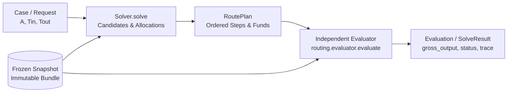

# Routing Algorithms: Architecture, Theory, and Reproducible Worked Examples

This guide provides a first-principles explanation of the six exact-input routing algorithms
implemented in this repository. It covers their mathematical foundations, search mechanics,
state management, and practical trade-offs against frozen Mantle liquidity snapshots.
To compare these algorithms on a single swap via the CLI, see [`single-request.md`](single-request.md).

Inspected source commit: `b2a680578f65ac65653a8160f04a3d97a5c5e71e` (Release 0.1.1).  
All numeric traces and intermediate transitions are verified offline by
`tests/docs/test_routing_algorithm_examples.py` and runnable via
`docs/examples/routing-algorithms/run_examples.py`.

---

## 1. Problem, Roadmap, Terminology, and Architecture

### 1.1 The Routing Problem on Mantle

A decentralized exchange (DEX) aggregator solves the **Exact Input Routing Problem**: given an
immutable liquidity snapshot at block $B$, a source token $T_{\text{in}}$, a destination token
$T_{\text{out}}$, and an exact integer input amount $A \in \mathbb{N}^+$, find an executable
order plan (a `RoutePlan`) that maximizes the target output under an objective function
(gross output or net output after transaction costs):

$$\max_{\mathcal{P} \in \mathbb{P}} \quad \text{Objective}(\mathcal{P})$$

subject to:
1. **Conservation of Funds:** Every intermediate fund is strictly conserved; the sum of input
   allocations equals $A$, and no intermediate token balance is leaked or donated.
2. **Topological Feasibility:** Swaps execute across valid pools in directed order; no cyclical
   token dependencies or execution deadlocks exist.
3. **Discrete Integer Execution:** All AMM curve evaluations and balance allocations operate
   on integer base units (EVM `uint256`/`uint112`), with floor division $\lfloor \cdot \rfloor$.

### 1.2 Reading Roadmap

- **Section 1:** Core concepts, notation, common execution pipeline, fund ledgers, and CPMM derivation.
- **Section 2:** `direct` — Single-pool baseline, candidate filtering, and incomplete snapshot semantics.
- **Section 3:** `single_path` — Bounded hop-major path search, prefix memoization, and pruning.
- **Section 4:** `direct_split` — Discrete grid sampling, residue tracking, and exact dynamic programming.
- **Section 5:** `path_split` — Multi-hop candidate generation, pool-conflict pruning, and branch-and-bound.
- **Section 6:** `incremental_graph` — Marginal allocation over aggregate pool inputs, acyclic graph expansion, and merged execution.
- **Section 7:** `uni_sor_port` — Upstream Uniswap SOR V2/V3 parity core, amount distribution, BFS seed queues, and adapter fill.
- **Section 8:** Reproducible Real-State Fixed-Block Walkthrough (Block 101082044).
- **Section 9:** Algorithmic Comparison Matrix, Complexity Bounds, and Source-Reading Map.
- **Section 10:** Operational Boundaries, Limitations, and Known Debt.

### 1.3 Terminology and Symbol Table

| Symbol | Definition | Unit / Type |
|---|---|---|
| $A$ | Request input amount | Raw integer base units (`uint256`) |
| $T_{\text{in}}, T_{\text{out}}$ | Source and destination token addresses | Hex string (`0x...`) |
| $P$ | Admitted physical pool instance | `PoolState` (CPMM, CL, LB) |
| $K$ | Number of discrete allocation chunks | Integer ($K \ge 1$) |
| $H$ | Hop bound (`search.max_hops`) | Integer ($H \ge 1$) |
| $S$ | Split bound (`search.max_splits`) | Integer ($S \ge 1$) |
| $G$ | Grid units ($100 / \text{percent\_step}$) | Integer ($G \in \{1, \dots, 100\}$) |
| $f_p(x)$ | Exact simulated output of pool $p$ for input $x$ | Pure function: $\mathbb{N} \to \mathbb{N}$ |
| $\text{fee\_bps}$ | Pool swap fee in basis points | Integer ($1 \text{ bps} = 0.01\% = 10^{-4}$) |
| `RoutePlan` | Ordered list of `SwapStep` records | Immutable plan data structure |
| `Evaluation` | Independent replay record of a plan | Status, gross output, traces, ledger |

### 1.4 Tokens vs. Physical Pools

A token pair $(T_0, T_1)$ in a modern DEX ecosystem does not map to a single liquidity curve.
Instead, multiple independent pools exist simultaneously:
- **Protocol differences:** Constant Product (Uniswap V2 / Merchant Moe Classic), Concentrated
  Liquidity (Uniswap V3, Agni V3, FusionX V3), and Liquidity Book (Merchant Moe LB v2.2).
- **Fee tiers:** Pools on the same protocol can have distinct fee tiers (e.g. 1 bps, 5 bps, 30 bps, 100 bps).
- **State isolation:** Each pool has isolated reserves, tick arrays, or active bin trees. Swapping
  through pool $P_1$ does not alter the reserves of parallel pool $P_2$.

### 1.5 Non-Linear AMM Quotes vs. Static Graph Search

In traditional shortest-path routing (e.g., standard Dijkstra), edges have static scalar weights
$w(u, v)$ such that $w(u, w) = w(u, v) + w(v, w)$. AMMs violate this property:
1. **Amount-Dependent Price Impact:** As input amount $x$ increases, the marginal output
   $\partial f(x) / \partial x$ decreases monotonically on concave liquidity curves.
2. **State Exhaustion:** A large swap can cross multiple ticks or exhaust active bins, sharply
   shifting the exchange rate.
3. **No Dynamic Sub-structure across Arbitrary Splits:** An optimal path for an input of $1\,000$
   units is often suboptimal for $10\,000$ units. Consequently, static spot-price Dijkstra cannot
   solve AMM routing.

### 1.6 Common Execution Architecture

All algorithms interact with the benchmarking system through a strict, decoupled pipeline:



1. **Solver Isolation:** Solvers explore candidate paths, sample discrete amounts, and produce
   a `RoutePlan`. Solvers do not mutate bundle state and do not report self-certified outputs.
2. **Independent Plan Evaluation:** The evaluator (`routing.evaluator.evaluate`) takes the
   submitted `RoutePlan` and replays it from scratch against fresh copies of the bundle's
   physical pools.
3. **Fund Ledger:** Funds start in the `REQUEST` fund. Intermediate swap steps write outputs to
   unique fund IDs (e.g., `L1H1`, `F1`, `OUT1`). Later steps consume earlier funds.
4. **Remainder Draining:** Floor division integer remainder is explicitly allocated to the final
   step consuming a fund via the sentinel `ALL_REMAINING`. Residual unallocated balances cause
   immediate `invalid_plan` rejection.

### 1.7 Derivation of the Teaching Constant-Product Model

To ensure reproducible hand calculations across all chapters, we establish a standard
Constant Product Market Maker (CPMM) model with swap fee $\text{fee\_bps} \in [0, 10000)$:

Let the pool reserves be $(x, y)$, where $x$ is the reserve of token $T_{\text{in}}$ and $y$ is
the reserve of token $T_{\text{out}}$. When an input $\Delta x$ is provided:
1. The fee-adjusted input amount is:
   $$\Delta x_{\text{fee}} = \Delta x \cdot (10000 - \text{fee\_bps})$$
2. The invariant $(x \cdot 10000 + \Delta x_{\text{fee}})(y - \Delta y) \ge x \cdot y \cdot 10000$ requires:
   $$\Delta y = \left\lfloor \frac{\Delta x_{\text{fee}} \cdot y}{x \cdot 10000 + \Delta x_{\text{fee}}} \right\rfloor$$
3. State update:
   $$x' = x + \Delta x, \quad y' = y - \Delta y$$

*Note:* This integer formula governs Uniswap V2 and Merchant Moe Classic (`moe_classic_v1`).
Concentrated Liquidity (CL) and Liquidity Book (LB) use tick bitmaps and bin discrete trees,
which are evaluated in Section 8 via their exact protocol simulators.

---

## 2. Algorithm 1: `direct` (Single Pool Baseline)

### 2.1 Problem and Inclusion Rationale
`direct` evaluates every admitted physical pool that directly connects $T_{\text{in}}$ and
$T_{\text{out}}$ using 100% of the input amount $A$. It represents the minimal baseline
capability (no multi-hop, no split) required by `docs/DESIGN.md` §2.6.

### 2.2 Mathematical Model and Assumptions
- Candidate set: $\mathbb{P}_{\text{direct}} = \{p \in \text{Bundle} \mid \text{pairs}(p) = \{T_{\text{in}}, T_{\text{out}}\}\}$.
- Output for pool $p$: $O_p = f_p(A)$.
- Selection: $p^* = \arg\max_{p \in \mathbb{P}_{\text{direct}}} O_p$.
- **Incomplete Snapshot Policy:** If any evaluated direct pool fails with `INCOMPLETE_SNAPSHOT`
  (meaning the swap amount crossed into uncollected tick/bin state), the entire solve returns
  `SolveStatus.INCOMPLETE_SNAPSHOT`. Because that uncollected pool might have offered the best rate,
  claiming another pool is "best direct" would be misleading (`docs/DESIGN.md` §2.2).

### 2.3 Concise Pseudocode
```python
def solve_direct(case, bundle, objective, budget):
    pools = bundle.pools_for_pair(case.token_in, case.token_out)
    caps = [c for c in (budget.max_candidates, budget.max_quotes) if c is not None]
    candidates = pools[:min(caps)] if caps else pools
    truncated = len(pools) - len(candidates)
    
    best_plan, best_eval, best_score = None, None, None
    incomplete = []
    
    for pool in candidates:
        plan = plan_for_pool(pool.pool_id, case)
        evaluation = evaluate(bundle, case, plan, objective)
        if evaluation.status != OK:
            if evaluation.trace and evaluation.trace[-1].status == INCOMPLETE_SNAPSHOT:
                incomplete.append(pool.pool_id)
            continue
        score = objective.score(evaluation)
        if best_score is None or score > best_score:
            best_plan, best_eval, best_score = plan, evaluation, score
            report_candidate(plan)
            
    if incomplete:
        return SolveResult(status=INCOMPLETE_SNAPSHOT)
    if best_plan is None:
        return SolveResult(status=NO_ROUTE)
    return SolveResult(status=OK, plan=best_plan, evaluation=best_eval)
```

### 2.4 Architecture and Topology Diagram


### 2.5 Hand-Worked Numeric Example
Using our synthetic teaching bundle:
- Request: $A = 10\,000$ `TKA` $\to$ `TKB`.
- Pool `P_AB1`: Reserves $(100\,000, 100\,000)$, $\text{fee\_bps} = 30$.
  $$\Delta x_{\text{fee}} = 10\,000 \cdot 9970 = 99\,700\,000$$
  $$\text{num} = 99\,700\,000 \cdot 100\,000 = 9\,970\,000\,000\,000$$
  $$\text{den} = 100\,000 \cdot 10\,000 + 99\,700\,000 = 1\,099\,700\,000$$
  $$\Delta y_1 = \lfloor 9\,970\,000\,000\,000 / 1\,099\,700\,000 \rfloor = 9066 \text{ TKB}$$
- Pool `P_AB2`: Reserves $(200\,000, 180\,000)$, $\text{fee\_bps} = 30$.
  $$\Delta x_{\text{fee}} = 99\,700\,000$$
  $$\text{num} = 99\,700\,000 \cdot 180\,000 = 17\,946\,000\,000\,000$$
  $$\text{den} = 200\,000 \cdot 10\,000 + 99\,700\,000 = 2\,099\,700\,000$$
  $$\Delta y_2 = \lfloor 17\,946\,000\,000\,000 / 2\,099\,700\,000 \rfloor = 8546 \text{ TKB}$$
- **Selection:** $9066 > 8546 \implies$ `P_AB1` is selected. Evaluated output: `9066`.

### 2.6 Implementation Map
- File: `routing/algorithms/direct.py`
- Main entry point: `solve(case, context, budget)` (lines 48–109)
- Plan creation: `_plan_for_pool(pool_id, case)` (lines 35–45)

### 2.7 Parameters, Budgets, and Ties
- Parameters: None.
- Budgets: `Budget.max_candidates` and `Budget.max_quotes` truncate the candidate pool list:
  `candidates = admitted[:min(max_candidates, max_quotes)]`.
- Ties: First pool in bundle insertion order is retained (`score > best_score`).

### 2.8 Computational and Memory Cost
- Time Complexity: $\mathcal{O}(\lvert \mathbb{P}_{\text{direct}} \rvert \cdot c_q)$, where $c_q$ is the quote simulation cost.
- Quote Work: At most $\lvert \mathbb{P}_{\text{direct}} \rvert$ quotes.
- Memory: $\mathcal{O}(1)$ beyond immutable bundle data structures.

### 2.9 Guarantees and Limitations
- **Guarantee:** Globally optimal among single-pool direct routes across the *evaluated complete-state*
  candidates under the declared budget.
- **Limitation:** Blind to multi-hop routes and split allocations; fails completely when no direct
  pool exists (`NO_ROUTE`). If truncated by budget, `no_route` indicates that no *evaluated*
  pool succeeded.

---

## 3. Algorithm 2: `single_path` (Bounded Hop-Major Path Search)

### 3.1 Problem and Inclusion Rationale
When direct pools suffer from deep price impact or do not exist, routing through intermediate
tokens (multi-hop) can unlock superior exchange rates. `single_path` evaluates complete,
cycle-free multi-hop paths at 100% of the input amount.

### 3.2 Mathematical Model and Assumptions
- Candidate paths: $\Pi_H = \{\pi = (e_1, \dots, e_k) \mid 1 \le k \le H, \pi \text{ is cycle-free}\}$.
- Chained quote: $y_0 = A, \quad y_i = f_{e_i}(y_{i-1}) \quad \forall i \in \{1, \dots, k\}$.
- Selection: $\pi^* = \arg\max_{\pi \in \Pi_H} y_k(\pi)$.
- **Pruning Assumption:** If step $i$ along prefix $(e_1, \dots, e_i)$ fails (zero output,
  insufficient liquidity, or uncollected tick state), all candidate paths sharing that exact
  prefix are pruned immediately without quoting.
- **Incomplete Candidates Excluded:** Unlike `direct`, incomplete intermediate detours are
  excluded and recorded in `search_stats["paths_incomplete"]` rather than aborting the case,
  because intermediate amounts on multi-hop paths cannot be bounded by a token envelope.

### 3.3 Concise Pseudocode
```python
def solve_single_path(case, bundle, index, max_hops, cache, budget):
    best_plan, best_score = None, None
    pruned_prefixes = set()
    
    for path in enumerate_paths(index, case.token_in, case.token_out, max_hops):
        if any(path[:k] in pruned_prefixes for k in range(1, len(path) + 1)):
            continue
        if budget_would_be_exceeded(path, budget, cache):
            record_truncation()
            continue
            
        plan = path_plan(path, case.amount_in)
        evaluation = evaluate(bundle, case, plan, objective, quote=cache)
        
        if evaluation.status != OK:
            pruned_prefixes.add(path[:len(evaluation.trace)])
            continue
            
        score = objective.score(evaluation)
        if best_score is None or score > best_score:
            best_plan, best_score = plan, score
            report_candidate(plan)
            
    return format_result(best_plan, best_score)
```

### 3.4 Architecture and Topology Diagram


### 3.5 Hand-Worked Numeric Example
Consider the multi-hop candidate path `TKA -[P_AC]-> TKC -[P_CB]-> TKB`:
- Hop 1 (`P_AC`): Reserves $(100\,000, 200\,000)$, $\text{fee\_bps} = 30$, input $10\,000$ TKA:
  $$\Delta x_{\text{fee}} = 10\,000 \cdot 9970 = 99\,700\,000$$
  $$\text{num} = 99\,700\,000 \cdot 200\,000 = 19\,940\,000\,000\,000$$
  $$\text{den} = 100\,000 \cdot 10\,000 + 99\,700\,000 = 1\,099\,700\,000$$
  $$\Delta y_{\text{AC}} = \lfloor 19\,940\,000\,000\,000 / 1\,099\,700\,000 \rfloor = 18132 \text{ TKC}$$
- Hop 2 (`P_CB`): Reserves $(200\,000, 150\,000)$, $\text{fee\_bps} = 30$, input $18132$ TKC:
  $$\Delta x_{\text{fee}} = 18132 \cdot 9970 = 180\,776\,040$$
  $$\text{num} = 180\,776\,040 \cdot 150\,000 = 27\,116\,406\,000\,000$$
  $$\text{den} = 200\,000 \cdot 10\,000 + 180\,776\,040 = 2\,180\,776\,040$$
  $$\Delta y_{\text{CB}} = \lfloor 27\,116\,406\,000\,000 / 2\,180\,776\,040 \rfloor = 12434 \text{ TKB}$$
- **Outcome:** The 2-hop path yields $12434$ TKB, outperforming direct pool `P_AB1` ($9066$ TKB) by $+3368$ raw units (+37.15%).
- **Quote Work & Memoization:** On the 6 enumerated paths of the teaching graph, exactly 10 pool quotes are executed and 2 are memoized:
  - 1-hop paths `P_AB1` (1) and `P_AB2` (1) execute 2 quotes.
  - 2-hop paths `P_AC -> P_CB` (2) and `P_AD -> P_DB` (2) execute 4 quotes.
  - 3-hop path `P_AC -> P_CD -> P_DB` reuses `P_AC` at 10000 (memo hit) and executes 2 new quotes.
  - 3-hop path `P_AD -> P_CD -> P_CB` reuses `P_AD` at 10000 (memo hit) and executes 2 new quotes.
  - Total: $2 + 4 + 2 + 2 = 10$ quotes executed, 2 hits.

### 3.6 Implementation Map
- File: `routing/algorithms/single_path.py`
- Preparation: `prepare(bundle, config)` (line 107) creates immutable `GraphIndex`.
- Traversal generator: `routing/search.py:enumerate_paths` (lines 142–165).
- Solver: `solve(case, context, budget)` (lines 133–294).

### 3.7 Parameters, Budgets, and Ties
- `search.max_hops`: Hop bound $H$ (integer $\ge 1$).
- Enumeration order: Hop-major (1-hop, then 2-hop, ..., up to $H$ hops). Within the same
  hop count, depth-first order based on bundle pool insertion order.
- Status differentiation:
  - `unreachable`: $T_{\text{out}}$ has no path from $T_{\text{in}}$ at any hop distance.
  - `hop-bound`: $T_{\text{out}}$ is reachable, but the shortest path requires $> H$ hops.
  - `timeout`: Budget truncated the search before any valid candidate was evaluated.

### 3.8 Computational and Memory Cost
- Worst-Case Work: $\mathcal{O}(H \cdot \lvert \Pi_H \rvert \cdot c_q)$ unmemoized. With prefix
  memoization, each unique prefix is quoted once.
- Stack Memory: $\mathcal{O}(H)$ traversal generator stack.
- Cache Memory: $\mathcal{O}(\lvert \text{prefixes} \rvert)$ storing exact `(pool_id, token_in, amount)` results.

### 3.9 Guarantees and Limitations
- **Guarantee:** Best evaluated full-input single route across the bounded, unpruned path set
  under the declared budget.
- **Limitation:** Cannot split volume across parallel paths. Truncation cuts longest paths first.

---

## 4. Algorithm 3: `direct_split` (Discrete Dynamic Programming)

### 4.1 Problem and Inclusion Rationale
When multiple pools directly connect $T_{\text{in}}$ and $T_{\text{out}}$, splitting the input
across them mitigates individual price impact. `direct_split` finds the gross-optimal split
allocation across direct pools using a discrete percentage grid and exact dynamic programming.

### 4.2 Mathematical Model and Assumptions
- Grid: Step size $\delta \in (0, 100]$ dividing 100; total units $N = 100 / \delta$.
- Splits: At most $S = \text{max\_splits}$ nonzero legs.
- Allocation vector: $u = (u_1, \dots, u_m)$ with $u_i \in \{1, \dots, N\}$, $\sum u_i = N$.
- Integer Amounts and Remainder:
  $$\text{amount}_i = \left\lfloor \frac{A \cdot u_i}{N} \right\rfloor \quad \forall i < m$$
  $$\text{amount}_m = A - \sum_{i=1}^{m-1} \text{amount}_i \quad (\text{via } \texttt{ALL\_REMAINING})$$
- Accumulator Residue: $r = \sum_{i=1}^{m-1} (A \cdot u_i \bmod N)$, ensuring exact integer conservation.

### 4.3 Concise Pseudocode
```python
def solve_direct_split(case, bundle, max_splits, percent_step, cache):
    N = 100 // percent_step
    pools = bundle.pools_for_pair(case.token_in, case.token_out)
    
    # 1. Quote single pools at 100%
    singles = [quote(p, case.amount_in) for p in pools]
    
    # 2. Sample smaller grid units
    for u in range(N - 1, 0, -1):
        for p in pools:
            quote(p, case.amount_in * u // N)
            
    # 3. Exact DP over (legs_used, units_used, residue)
    states = {(0, 0, 0): (0, ())}
    finalists = {}
    for j, pool in enumerate(pools):
        for (legs, used, res), (gross, alloc) in states.items():
            final_amount = case.amount_in - (case.amount_in * used - res) // N
            out = quote(pool, final_amount)
            update_finalists(finalists, legs + 1, gross + out, alloc + [(j, N - used)])
            
        grown = dict(states)
        for (legs, used, res), (gross, alloc) in states.items():
            if legs + 1 < max_splits:
                for u in range(1, N - used):
                    out = sample_table[j, u]
                    key = (legs + 1, used + u, res + (case.amount_in * u % N))
                    update_dp(grown, key, gross + out, alloc + [(j, u)])
        states = grown
        
    # 4. Re-evaluate finalists as complete RoutePlans
    return select_best_finalist(finalists)
```

### 4.4 Architecture and Topology Diagram


### 4.5 Hand-Worked Numeric Example and DP Transitions
Input $A = 10\,005$ TKA, $\text{percent\_step} = 10 \implies N = 10$ units, $\text{max\_splits} = 2$.
1. **Grid Sampling:**
   - Samples full input $10005$ on `P_AB1` ($9070$ TKB) and `P_AB2` ($8551$ TKB).
     Calculation for `P_AB2` at $10005$:
     $$\Delta x_{\text{fee}} = 10005 \cdot 9970 = 99749850$$
     $$\text{num} = 99749850 \cdot 180000 = 17954973000000$$
     $$\text{den} = 200000 \cdot 10000 + 99749850 = 2099749850$$
     $$\Delta y_2 = \lfloor 17954973000000 / 2099749850 \rfloor = 8551 \text{ TKB}$$
   - Samples floored amounts $10005 \cdot u // 10$ for $u \in [1..9]$.
2. **DP State Transition:**
   - State representation: `(legs_used, units_used, residue)`.
   - Consider transition for $u_1 = 7$:
     $$\text{amount}_1 = \lfloor 10005 \cdot 7 / 10 \rfloor = \lfloor 7003.5 \rfloor = 7003 \text{ TKA}$$
     Quote on `P_AB1` for $7003$ TKA yields $6526$ TKB.
     Residue: $10005 \cdot 7 \bmod 10 = 5$.
     State reaches: `(1, 7, 5)` with accumulated gross $6526$.
   - Closing allocation on `P_AB2`:
     Remaining units: $10 - 7 = 3$.
     $$\text{final\_amount} = 10005 - \lfloor (10005 \cdot 7 - 5) / 10 \rfloor = 10005 - 7003 = 3002 \text{ TKA}$$
     Notice that $3002$ is exactly the base share $3001$ plus the accumulated remainder $+1$.
     Quote on `P_AB2` for $3002$ TKA yields $2653$ TKB.
     Total gross for 2-split: $6526 + 2653 = \mathbf{9179}$ TKB.
3. **Outcome:** $9179 > 9070 \implies$ 2-split wins, executing $7003$ on `P_AB1` and $3002$ on `P_AB2` with 0 residual.
4. **Quote Accounting:** 2 initial full quotes + 18 grid quotes ($9 \times 2$) + 5 on-demand remainder quotes = 25 quotes executed.

### 4.6 Implementation Map
- File: `routing/algorithms/direct_split.py`
- Preparation: `prepare(bundle, config)` (line 107) validates $N = 100 / \text{percent\_step}$.
- Leg amount calculation: `leg_amounts(amount_in, legs, units)` (line 121).
- Plan builder: `allocation_plan(case, pool_ids, legs)` (line 128).
- Solver: `solve(case, context, budget)` (lines 157–348).

### 4.7 Parameters, Budgets, and Ties
- `search.percent_step`: Divisor of 100 (e.g. 5, 10).
- `search.max_splits`: Upper bound on leg count $S$.
- Ties: Fewer splits win ties; earlier admitted pools win identical gross outputs.

### 4.8 Computational and Memory Cost
- Pool Quotes: $P_{\text{direct}}$ full quotes $+ P_{\text{direct}} \cdot (G - 1)$ grid samples, plus on-demand quotes for non-grid remainder amounts (up to $P_{\text{direct}} \cdot \lvert \text{reachable non-grid remainders} \rvert$). On our $P=2, G=10, S=2$ teaching example ($A=10005$), this executes $2 + 18 + 5 = 25$ pool quotes.
- DP Transitions: In addition to the $(l, u)$ grid state, the dynamic program tracks the accumulated remainder residue $r = \sum (A \cdot u_i \bmod G)$. Let $R$ denote the reachable residue multiplicity at any $(l, u)$ pair. Because each non-final leg accumulates integer residue from floored grid division, $R = \mathcal{O}(S)$ in the worst case (with $R = 1$ when $A$ is divisible by $G$). Total DP state transitions are therefore bounded by $\mathcal{O}(P_{\text{direct}} \cdot S \cdot G^2 \cdot R)$.
- Re-scoring: At most $S$ candidate finalist plans (one per split count $m \in \{1, \dots, S\}$) are re-evaluated under `ObjectiveContext`, subject to feasibility and candidate budgets.

### 4.9 Guarantees and Limitations
- **Guarantee:** Best evaluated direct split allocation on the declared finite grid under additive gross output.
- **Limitation:** Does not support multi-hop routes; finalist re-scoring does not exhaustively
  search non-additive per-pool fixed fees across all non-finalist grid combinations.

---

## 5. Algorithm 4: `path_split` (Conflict-Aware Branch-and-Bound)

### 5.1 Problem and Inclusion Rationale
To combine multi-hop routing with volume splitting, an aggregator must split volume across
multi-hop paths. However, paths that share physical pools cannot be evaluated independently
because sequential transactions on the same pool alter reserves and invalidate additive quotes.
`path_split` strictly enforces **physical-pool disjointness**: no two paths in a split plan
may share a pool ID.

### 5.2 Mathematical Model and Assumptions
- Candidate paths: $\Pi_H$ generated as in `single_path`.
- Pool Disjointness Constraint:
  $$\text{pools}(\pi_i) \cap \text{pools}(\pi_j) = \emptyset \quad \forall i \ne j$$
- Pruning Assumptions:
  1. **Nondecreasing output:** $x_1 \le x_2 \implies f_p(x_1) \le f_p(x_2)$.
  2. **Nonincreasing average rate:** Average return $f(x)/x$ is nonincreasing (concave liquidity curves).
  3. **State traversal:** Larger swaps only traverse more pool state.
  4. **Rounding absorption:** The $+1$ in the bound absorbs integer floor division rounding.
- Pruning Bound $B$: Let $B = (S - 1) \cdot H$. If more than $B$ pairwise pool-disjoint paths
  are each strictly superior to path $P$ at grid size $u$, then $P$ cannot be part of the optimal
  $S$-split plan and is safely pruned (`_family_exceeds`).
- Upper Bound on Path Quote:
  $$\text{UB}(P, u) = \min\left(\text{out}_P(N), \left\lceil \frac{(\text{out}_P(u_0) + 1) \cdot a_u}{a_{u_0}} \right\rceil\right)$$
- Floored Grid vs. Remainder: Finalists are selected using floored grid shares. Re-evaluation
  allocates the final leg with `ALL_REMAINING`, so evaluated gross is never below search gross.

### 5.3 Concise Pseudocode
```python
def compute_knapsack_bounds(kept_table, max_splits, n_units):
    """ub[cap][k][r]: Knapsack upper bound of k legs, sizes <= cap, summing to r."""
    ub = [[[None] * (n_units + 1) for _ in range(max_splits + 1)] for _ in range(n_units + 1)]
    for c in range(n_units + 1):
        ub[c][0][0] = 0
        for k in range(1, max_splits + 1):
            for r in range(1, n_units + 1):
                vals = [kept_table[u][0][0] + prev for u in range(1, min(c, r) + 1)
                        if u in kept_table and (prev := ub[c][k - 1][r - u]) is not None]
                ub[c][k][r] = max(vals) if vals else None
    return ub

def solve_path_split(case, bundle, max_hops, max_splits, percent_step, cache):
    # 1. Retain simpler candidates (single path, direct split)
    best_single = solve_single_path(...)
    best_direct = solve_direct_split(...)
    
    # 2. Sample endpoints and prune dominated candidates
    paths = enumerate_paths(...)
    sample_endpoints(paths, u0, N)
    B = (max_splits - 1) * max_hops
    kept_table = prune_with_disjoint_family_bound(paths, B)
    
    # 3. Exact Branch and Bound over kept table (O(S * G^3) knapsack bound precomputation)
    ub = compute_knapsack_bounds(kept_table, max_splits, N)
    best = {}  # m_legs -> (best_gross, legs)
    
    def beats(gross, m):
        return all(gross > best[k][0] for k in range(1, m + 1) if k in best)

    def promising(gross, k, rest, cap):
        if rest == 0:
            return beats(gross, k)
        for m in range(k + 1, max_splits + 1):
            bound = ub[cap][m - k][rest] if ub is not None else None
            if bound is not None and beats(gross + bound, m):
                return True
        return False

    def dfs(used, cap, min_idx, taken_pools, gross, legs):
        r = N - used
        if r == 0:
            if beats(gross, len(legs)):
                best[len(legs)] = (gross, legs)
            return
            
        legs_left = max_splits - len(legs)
        for u in range(min(cap, r), 0, -1):
            if u * legs_left < r:
                break  # Non-increasing sizes cannot cover remaining units
            if u not in kept_table or (legs_left == 1 and u != r):
                continue
                
            lst = kept_table[u]
            for idx in range(min_idx if u == cap else 0, len(lst)):
                v, path = lst[idx]
                if not promising(gross + v, len(legs) + 1, r - u, u):
                    break  # Value-descending list: later entries cannot beat bound
                if not taken_pools.isdisjoint(path.pools):
                    continue  # Pool conflict: skipped
                dfs(used + u, u, idx + 1, taken_pools | path.pools, gross + v, legs + ((path, u),))
                
    dfs(0, N, 0, frozenset(), 0, ())
    return select_best_finalist([best_single, best_direct, best])
```

### 5.4 Architecture and Topology Diagram


### 5.5 Hand-Worked Numeric Example, Conflict Rejection, and Pruning
Request: $10\,000$ TKA $\to$ TKB, $\text{percent\_step} = 10, \text{max\_splits} = 2$.
1. **Candidate Paths:**
   - $\pi_1$: `TKA -[P_AC]-> TKC -[P_CB]-> TKB` (Pools: `P_AC`, `P_CB`)
   - $\pi_2$: `TKA -[P_AD]-> TKD -[P_DB]-> TKB` (Pools: `P_AD`, `P_DB`)
   - $\pi_3$: `TKA -[P_AC]-> TKC -[P_CD]-> TKD -[P_DB]-> TKB` (Pools: `P_AC`, `P_CD`, `P_DB`)
2. **Conflict Rejection:**
   - $\pi_1$ and $\pi_3$ share `P_AC`; $\pi_2$ and $\pi_3$ share `P_DB`.
   - `paths_conflict` evaluates to `True`, rejecting these combinations. Exactly 13 candidate branches
     are excluded by pool conflicts (`bnb_conflicts_excluded = 13`).
3. **Exact Branch-and-Bound Traversal and Pruning Decisions:**
   The DFS explores non-increasing allocation sizes ($u \le \text{cap}$) and uses the knapsack upper bound table `ub[cap][k][r]`:
   - **Initial Incumbent (1-leg, size $u = 10$):**
     Path 2 (`P_AC -> P_CB`) takes 10 units ($10\,000$ TKA) $\to 12434$ TKB, setting `best[1] = 12434`.
     Next at $u = 10$, Path 4 (`P_AC -> P_CD -> P_DB`) yields $11082$. Since $r = 0$, `promising(11082, 1, 0, 10)` checks if $11082 > 12434$: False $\implies$ **PRUNED!** Because the list is value-descending, all remaining paths at $u = 10$ are pruned immediately.
   - **Size $u = 9$ (Remaining $r = 1$ unit):**
     Path 2 at $u=9$ yields $11379$. Knapsack bound for 1 remaining unit from sizes $\le 9$ is $\text{ub}[9][1][1] = 1519$.
     Upper bound $= 11379 + 1519 = 12898 > 12434 \implies$ promising!
     Second leg must have size $r = 1$:
     - Path 3 (`P_AD -> P_DB`, disjoint) yields $1168$. Total gross $= 11379 + 1168 = 12547 > 12434$, setting new 2-leg incumbent `best[2] = 12547`!
     - Next path at size 1: Path 5 ($v = 1079$): gross $+ v = 11379 + 1079 = 12458 \le 12547 \implies$ **PRUNED!**
     - Next candidate at size 9: Path 4 ($v = 10284$): bound is $1519$, total $= 10284 + 1519 = 11803 \le 12547 \implies$ **PRUNED!**
   - **Size $u = 8$ (Remaining $r = 2$ units):**
     Path 2 at $u=8$ yields $10288$. Knapsack bound for 2 units is $\text{ub}[8][1][2] = 2919$.
     Upper bound $= 10288 + 2919 = 13207 > 12547 \implies$ promising!
     Second leg must have size $r = 2$:
     - Path 3 (`P_AD -> P_DB`, disjoint) yields $2293$. Total gross $= 10288 + 2293 = \mathbf{12581} > 12547$, setting optimal 2-leg incumbent `best[2] = 12581`!
     - Next path at size 2: Path 5 ($v = 2093$): gross $+ v = 10288 + 2093 = 12381 \le 12581 \implies$ **PRUNED!**
     - Next candidate at size 8: Path 4 ($v = 9433$): bound is $2919$, total $= 9433 + 2919 = 12352 \le 12581 \implies$ **PRUNED!**
   - **Sizes $u \in \{7, 6, 5\}$ (Remaining $r = 10 - u$ units):**
     At each size $u$, the root candidate has an upper bound using Path 2 (the best quote at remaining size $r = 10 - u$) that exceeds the incumbent $12581$:
     - For $u = 7$ ($r = 3$): Path 2 ($9160$) and Path 4 ($8527$) both have relaxed bound $\text{ub}[7][1][3] = 4220$ (from Path 2 at size 3). Totals are $9160 + 4220 = 13380$ and $8527 + 4220 = 12747$, both exceeding $12581$, so DFS enters both branches.
       - Under Path 2 ($u=7$): child scan evaluates Path 3 ($v=3376$, disjoint), yielding $9160 + 3376 = 12536 \le 12581 \implies$ terminal cutoff (`beats() == False`), terminating the scan.
       - Under Path 4 ($u=7$): child scan for remaining 3 units first evaluates Path 2 ($v=4220$, total $12747$) and Path 4 ($v=4212$, total $12739$); both pass `promising()` but fail the pool-conflict check (Path 2 shares `P_AC`; Path 4 shares `P_AC`, `P_CD`, `P_DB`). The third candidate, Path 3 ($v=3376$), yields $8527 + 3376 = 11903 \le 12581 \implies$ `promising()` fails at `rest == 0`, terminating the scan before checking its pool conflict with Path 4!
     - For $u = 6$ ($r = 4$): Path 2 ($7990$) and Path 4 ($7559$) have relaxed bound $\text{ub}[6][1][4] = 5524$ (from Path 2 at size 4). Both enter DFS. Under Path 4, Path 2 ($v=5524$) and Path 4 ($v=5409$) are excluded by pool conflicts; Path 3 ($v=4418$) yields $7559 + 4418 = 11977 \le 12581 \implies$ `promising()` terminates the scan.
     - For $u = 5$ ($r = 5$): Path 2 ($6779$) and Path 4 ($6522$) have relaxed bound $\text{ub}[5][1][5] = 6779$ (from Path 2 at size 5). Both enter DFS. Equal-size symmetry avoidance (`idx >= min_idx`) skips redundant combinations; testing Path 3 ($v=5423$) yields $6522 + 5423 = 11945 \le 12581 \implies$ `promising()` terminates the scan.
   - **Loop termination for $u \le 4$:**
     Since $u \cdot \text{legs\_left} < r \iff 4 \cdot 2 = 8 < 10$, non-increasing size allocations can no longer cover the 10 units, terminating the loop.
   - **Summary:** Across the search, exactly 12 DFS nodes are visited (`bnb_nodes = 12`) and 13 candidate branches are excluded by pool conflicts (`bnb_conflicts_excluded = 13`), proving $12581$ optimal.
4. **Disjoint Allocation Evaluation (80% / 20%):**
   - $\pi_1$ at $8\,000$ TKA:
     - Hop 1 (`P_AC`): in = $8\,000 \to$ out = $14773$ TKC.
     - Hop 2 (`P_CB`): in = $14773 \to$ out = $10288$ TKB.
   - $\pi_2$ at $2\,000$ TKA:
     - Hop 1 (`P_AD`): in = $2\,000 \to$ out = $2932$ TKD.
     - Hop 2 (`P_DB`): in = $2932 \to$ out = $2293$ TKB.
   - Total Gross Output: $10288 + 2293 = \mathbf{12581}$ TKB.
   - Comparison: Beats single path ($12434$ TKB) by $+147$ raw units (+1.18%).

### 5.6 Implementation Map
- File: `routing/algorithms/path_split.py`
- Conflict detection: `paths_conflict(p1, p2)` (line 133).
- Branch-and-bound engine: `_branch_and_bound(...)` (lines 183–265).
- Disjoint family counting: `_family_counts` (line 301), `_family_exceeds` (line 318), `_members_above` (line 335).
- Solver: `solve(case, context, budget)` (lines 341–572).

### 5.7 Parameters, Budgets, and Ties
- Parameters: `search.max_hops`, `search.max_splits`, `search.percent_step`.
- Ties: Simpler route wins ties (single path > direct split > fewer legs).

### 5.8 Computational and Memory Cost
- Pool Quotes: Combines sub-solver quotes ($\text{Quotes}(\text{single\_path}) + \text{Quotes}(\text{direct\_split})$), plus candidate route samples across grid sizes $\sum_{\pi \in \text{kept}} \text{hops}(\pi) \cdot \lvert \text{sizes}(\pi) \rvert$. On our 6-path teaching graph, 100 pool quotes were executed (59 memo hits).
- Memory: Knapsack upper-bound table `ub` allocated with dimensions $(G + 1) \times (S + 1) \times (G + 1)$, kept table $\mathcal{O}(\lvert \Pi_H \rvert \cdot G)$, and the shared `QuoteCache`.

### 5.9 Guarantees and Limitations
- **Guarantee:** Best evaluated pool-disjoint allocation on the declared finite grid under stated pruning.
- **Limitation:** Cannot route through shared pools or topology merges (e.g., cannot split volume
  after a common first hop).

---

## 6. Algorithm 5: `incremental_graph` (Shared-Pool Marginal Routing)

### 6.1 Problem and Inclusion Rationale
Restricting multi-hop routes to disjoint pools forbids natural liquidity topologies such as
shared-prefix splits (e.g., all funds route through a high-liquidity `USDC -> WMNT` pool, then
split across distinct pools to the target). `incremental_graph` solves this by allowing
paths to share physical pools.

### 6.2 Mathematical Model and Assumptions
- Chunks: Input $A$ is partitioned into $K = \text{graph.chunks}$ integer chunks:
  $$\Delta_k = \left\lfloor \frac{A \cdot k}{K} \right\rfloor - \left\lfloor \frac{A \cdot (k-1)}{K} \right\rfloor$$
- Aggregate Input Accounting: Each pool maintains total tentative input $x_p$. When a chunk
  of size $d$ traverses pool $p$, its marginal output is:
  $$m = f_p(x_p + d) - f_p(x_p)$$
  and pool state is updated to $x_p \leftarrow x_p + d$.
- **Crucial Invariant:** $f(x + \Delta) - f(x)$ represents one merged swap of size $x + \Delta$,
  **not** two sequential swaps. Sequential fee-bearing swaps would re-apply base fees and yield
  strictly less.
- **Merged Plan Normalization:** All chunks traversing pool $p$ are coalesced into a single
  `SwapStep` executing $x_p$ in the final transaction plan.

### 6.3 Concise Pseudocode
```python
def solve_incremental_graph(case, bundle, chunks_K, max_hops, cache):
    retained_candidate = solve_path_split(...)
    paths = enumerate_paths(...)
    
    amounts = chunk_amounts(case.amount_in, chunks_K)
    pool_inputs = defaultdict(int)
    chunk_allocations = []
    last_positive_chunk_idx = max(k for k, a in enumerate(amounts) if a > 0)
    carry = 0
    
    for k, chunk in enumerate(amounts):
        if chunk == 0:
            continue  # 1. Skip raw empty chunk first (A < K)
            
        amount = carry + chunk
        choice = None  # (marginal, path, updates)
        
        for path in paths:
            if creates_cycle(token_edges(chunk_allocations), path):
                continue
            try:
                marginal, updates = simulate_marginal(path, amount, pool_inputs)
            except ChunkFailed:
                continue
            if choice is None or marginal > choice[0]:
                choice = (marginal, path, updates)  # Accepts marginal == 0 if choice is None
                
        # 2. Intermediate zero-marginal or unroutable: carry forward
        if k != last_positive_chunk_idx and (choice is None or choice[0] == 0):
            carry = amount
            continue
            
        # 3. Final chunk unroutable: abandon and fallback
        if choice is None:
            return retained_candidate
            
        # 4. Commit chunk (including zero-marginal on final chunk)
        carry = 0
        commit_chunk(choice[1], amount, choice[2], pool_inputs)
        chunk_allocations.append(choice[1])
        
    merged = merged_plan(case, build_flows(chunk_allocations, pool_inputs))
    evaluation = evaluate(bundle, case, merged)
    return select_best(retained_candidate, (merged, evaluation))
```

### 6.4 Architecture and Topology Diagram


### 6.5 Hand-Worked Numeric Example, Chunk Accounting, and Fallback
Using our synthetic teaching bundle, let $K = 10$ chunks ($1\,000$ TKA each):
1. **Marginal Allocation Sequence:**
   - Candidate Path 0: `TKA -[P_AC]-> TKC -[P_CD]-> TKD -[P_DB]-> TKB`
   - Candidate Path 1: `TKA -[P_AC]-> TKC -[P_CB]-> TKB`
   - Chunk greedy choices: `[0, 1, 1, 0, 1, 1, 1, 0, 1, 1]`.
   - Path 0 captures 3 chunks ($3\,000$ TKA); Path 1 captures 7 chunks ($7\,000$ TKA).
2. **Telescoping Flow Accounting:**
   - Both paths traverse `P_AC`. Total input on `P_AC` is $3000 + 7000 = 10\,000$ TKA, producing $18132$ TKC.
   - At intermediate token `TKC`, the flow splits:
     - 3 chunks allocated to Path 0 draw $5562$ TKC into `P_CD`, producing $5253$ TKD.
     - That $5253$ TKD enters `P_DB`, producing $4048$ TKB.
     - The remaining $18132 - 5562 = 12570$ TKC enters `P_CB`, producing $8844$ TKB.
3. **Merged Plan Execution:**
   - Step 0 (`P_AC`): in = $10\,000$ TKA $\to$ out = $18132$ TKC (Fund `F1`)
   - Step 1 (`P_CD`): in = $5562$ TKC $\to$ out = $5253$ TKD (Fund `F2`)
   - Step 2 (`P_CB`): in = $12570$ TKC (`ALL_REMAINING` of `F1`) $\to$ out = $8844$ TKB (Fund `F3`)
   - Step 3 (`P_DB`): in = $5253$ TKD $\to$ out = $4048$ TKB (Fund `F4`)
   - Terminal Gross Output: $8844 + 4048 = \mathbf{12892}$ TKB.
4. **Conservation & Reconciliation:**
   - Fund `REQUEST`: 10000 consumed.
   - Fund `F1`: 18132 produced, exactly $5562 + 12570 = 18132$ consumed.
   - Fund `F2`: 5253 produced, exactly 5253 consumed.
   - Zero residuals. Evaluated gross matches accounted gross exactly.
5. **Retained Simpler Candidate Fallback:**
   - `incremental_graph` runs `path_split` first. The incremental plan is only returned if its objective
     score strictly exceeds the `path_split` incumbent.
   - If an input is small (e.g. $A=10$), splitting volume provides no gross improvement over the best single
     path; ties retain the simpler candidate.

### 6.6 Implementation Map
- File: `routing/algorithms/incremental_graph.py`
- Chunk schedule: `chunk_amounts(amount_in, chunks)` (line 139).
- Cycle detection: `creates_cycle(edges, path)` (line 145).
- Merged plan builder: `merged_plan(case, flows)` (line 180).
- Topology classification: `topology(route_paths)` (line 260).
- Solver: `solve(case, context, budget)` (lines 290–530).
- Marginal simulation: `marginal(path, amount, memo)` (line 343).

### 6.7 Parameters, Budgets, and Ties
- Parameters: `graph.chunks` ($K$), plus `path_split` parameters for retained candidates.
- Fallback: Retains simpler `path_split` candidate if the incremental plan does not strictly beat it.

### 6.8 Computational and Memory Cost
- Pool Quotes: Sub-solver quotes ($\text{Quotes}(\text{path\_split})$), plus up to $K \cdot \sum_{\pi} \text{hops}(\pi)$ marginal pool simulations.
- Memory: flow map $\mathcal{O}(P)$, chunk allocations $\mathcal{O}(K)$, candidate paths $\mathcal{O}(\lvert \Pi_H \rvert)$, and the `QuoteCache`.

### 6.9 Guarantees and Limitations
- **Guarantee:** Never performs worse than `path_split` on objective score (fallback preservation).
- **Limitation:** Greedy heuristic; larger chunk counts do not guarantee monotonic improvements
  due to greedy path trapping.

---

## 7. Algorithm 6: `uni_sor_port` (Uniswap Smart Order Router Parity Port)

### 7.1 Problem and Inclusion Rationale
Uniswap SOR is the industry standard benchmark for EVM DEX aggregation. `uni_sor_port` is an exact
source-pinned Python translation of the routing core from
`Uniswap/smart-order-router@04c7c0b4` (v4.31.10). It provides an authoritative reference
comparator for exact-input V2/V3 routing.

### 7.2 Mathematical Model and Assumptions
- Scope: Exact-input V2 and V3 pools only. Merchant Moe Liquidity Book (LB) pools are strictly
  excluded by Contract Deviation D-4.
- Candidate Generation (`compute_all_routes`): Bounded BFS/DFS across V3 and V2 pools (configurable
  hop bound via `search.max_hops`, default 3 in upstream contract B-S12).
- Quote Matrix: Precomputes quotes for routes across percentage distribution (e.g. 5%, 10%, ..., 100%).
- Upstream Selection Queue (`get_best_swap_route_by`):
  1. 100% single-route baseline forms the initial incumbent.
  2. FIFO queue of partial solutions seeded with the best and second-best single routes for each percentage bucket.
  3. Explores continuations in descending percentage order.
  4. Finds the first non-overlapping route **within each percentage group** (`find_first_route_not_using_used_pools`).
  5. Prunes layers that exceed `max_splits` or cannot beat the incumbent.
- Tie Breaking: Strict V8 binary insertion sort emulation (`v8_small_array_sort`).

### 7.3 Concise Pseudocode
```python
def solve_uni_sor_port(case, bundle, max_hops, max_splits, percent_step):
    routes = compute_all_routes(case.token_in, case.token_out, max_hops, bundle.sor_pools)
    percentages = amount_distribution(case.amount_in, percent_step)
    quote_table = build_route_quotes(routes, percentages, case.amount_in)
    
    # 1. Baseline: Best 100% single route
    best_quote = quote_table.best_at_percent(100)
    best_swap = (quote_table.best_route_at_percent(100),)
    
    # 2. FIFO Queue of partial solutions
    queue = deque()
    for i in range(len(percentages) - 1, -1, -1):
        pct = percentages[i]
        queue.append(Node(routes=[quote_table.best(pct)], percent_idx=i, rem=100 - pct))
        if quote_table.second_best(pct):
            queue.append(Node(routes=[quote_table.second_best(pct)], percent_idx=i, rem=100 - pct))
            
    # 3. Layer expansion
    splits = 1
    while queue:
        layer = len(queue)
        splits += 1
        if splits >= 3 and best_swap and len(best_swap) < splits - 1:
            break
        if splits > max_splits:
            break
        while layer > 0:
            layer -= 1
            node = queue.popleft()
            for i in range(node.percent_idx, -1, -1):
                pct = percentages[i]
                if pct > node.rem:
                    continue
                route = find_first_route_not_using_used_pools(node.routes, quote_table[pct])
                if not route:
                    continue
                rem_new = node.rem - pct
                routes_new = node.routes + (route,)
                if rem_new == 0:
                    if sum(r.quote for r in routes_new) > best_quote:
                        best_quote = sum(r.quote for r in routes_new)
                        best_swap = routes_new
                else:
                    queue.append(Node(routes=routes_new, percent_idx=i, rem=rem_new))
                    
    # 4. Adapter Integer Fill (D-1) and Re-Quote (D-3)
    plan = build_integer_fill_plan(best_swap, case.amount_in)
    evaluation = evaluate(bundle, case, plan)
    return SolveResult(status=OK, plan=plan, evaluation=evaluation)
```

### 7.4 Architecture and Topology Diagram


### 7.5 Hand-Worked Numeric Example
On our synthetic teaching graph ($N = 10, S = 2$):
1. Candidate Routes: $\pi_1 = \text{P\_AB1}, \pi_2 = \text{P\_AB2}, \pi_3 = \text{P\_AC}\to\text{P\_CB}, \pi_4 = \text{P\_AD}\to\text{P\_DB}$.
2. Quote Matrix (80% / 20%):
   - At 80% ($8\,000$ TKA): $\pi_3$ yields $10288$ TKB ($8000 \to 14773 \to 10288$).
   - At 20% ($2\,000$ TKA): $\pi_4$ yields $2293$ TKB ($2000 \to 2932 \to 2293$).
3. Queue Continuation:
   - Partial solution $\pi_3$ (80%) looks for non-overlapping routes for remaining 20%.
   - In 20% group, `find_first_route_not_using_used_pools` inspects sorted routes:
     - $\pi_3$: shares `P_AC`, skipped.
     - $\pi_4$: uses `P_AD`, `P_DB`, strictly disjoint $\implies$ selected!
   - Combined route achieves $10288 + 2293 = \mathbf{12581}$ TKB.
4. Adapter Fill (D-1) and Re-quote (D-3):
   - Leg 1 draws $8\,000$ TKA; Leg 2 draws `ALL_REMAINING` ($2\,000$ TKA).
   - Evaluated gross matches cached quote: $12581$ TKB (`requote_delta` = "0").
5. Quote Accounting: 2 1-hop routes $\times 10$ buckets ($20$ quotes) + 2 2-hop routes $\times 10$ buckets $\times 2$ hops ($40$ quotes) = 60 pool quotes executed.

### 7.6 Implementation Map
- File: `routing/algorithms/uni_sor_port.py`
- Route discovery: `compute_all_routes(...)` (line 266).
- Amount distribution: `amount_distribution(...)` (line 352).
- Quote matrix: `build_route_quotes(...)` (line 429).
- V8 sorting emulation: `v8_small_array_sort(...)` (line 453).
- Non-overlapping route finder: `find_first_route_not_using_used_pools(...)` (line 501).
- Selection engine: `get_best_swap_route_by(...)` (line 538), `get_best_swap_route(...)` (line 670).
- Integer fill: `integer_fill(...)` (line 709).
- Adapter solver: `solve(...)` (lines 833–1051).

### 7.7 Parameters, Budgets, and Ties
- Gas Scores (Adaptation A-3): Gas scores set to zero (`(0, 0, 0)`), selecting purely on gross quotes.
- Excluded Pools (Deviation D-4): Liquidity Book pools are excluded from candidate generation.
- Budget Rejection: SOR returns `timeout` if declared candidate or quote budgets would truncate the quote table.

### 7.8 Computational and Memory Cost
- Pool Quotes: $\sum_{\pi} \text{hops}(\pi) \cdot G$ quotes to populate the percentage quote matrix, plus on-demand replay quotes if the adapter integer fill creates a non-percentage remainder allocation on the final route (bounded by $\text{hops}(\pi_{\text{last}})$). On our teaching example with $H=1, A=10005$, this executes $2 \times 10 + 1 = 21$ quotes; with $H=2, A=10001$, it executes $60 + 2 = 62$ quotes; with divisible $A=10000$, exactly 60 quotes.
- Memory: Dense $|\Pi_H| \times G$ table storing `RouteQuote` objects.

### 7.9 Guarantees and Limitations
- **Guarantee:** 100% bit-for-bit parity with pinned upstream Uniswap SOR selection logic
  over identical inputs (`tests/routing/test_uni_sor_parity.py`).
- **Limitation:** Does not support Liquidity Book pools, negative quote loops, or arbitrary-depth DAG topologies.

---

## 8. Real-State Fixed-Block Walkthrough (Block 101082044)

To demonstrate how these algorithms behave on real blockchain liquidity, we execute all six
solvers against the verified frozen Mantle snapshot `mantle-5src-101082044-091b0759-fixture`:
- **Parent Bundle:** `mantle-5src-101082044-091b0759-fixture`
- **Bundle Hash:** `5401b1de8c83a3527e5f9b5afae4510a760f171f2b306d49dbb5c830256c9ad0`
- **Block:** 101082044
- **Block Hash:** `0x091b0759c9d3031f30658cdfa8bf4cd5ed311ece986e3c91eb1eeb121b2b65c4`
- **Request:** $10\,000$ USDC $\to$ USDT0
  - In: `0x09bc4e0d864854c6afb6eb9a9cdf58ac190d0df9` (decimals: 6, raw: `10000000000`)
  - Out: `0x779ded0c9e1022225f8e0630b35a9b54be713736` (decimals: 6)
- **Profile:** `config/daily_gross.yaml` (sha256 `577b43ebc2d2`), `gross_only` development mode
- **Scope:** 19 admitted pools across 5 sources: agni_v3 (6), fusionx_v3 (2), moe_classic_v1 (3), moe_lb_v2_2 (7), uniswap_v3 (1).
- **Execution Command:**
  ```bash
  uv run python main.py quote \
    --bundle tests/fixtures/corpus/bundle \
    --profile config/daily_gross.yaml \
    --token-in USDC --token-out USDT0 --amount 10000 --details
  ```

*Classification:* This is an **exploratory single request** evaluated on a checked-in 19-pool fixture
subset, not a held-out corpus result.

### 8.1 Summary Comparison Table

| Algorithm | Status | Evaluated Gross (USDT0) | Gross Raw Units | Quotes Counted | Trace Characteristics |
|---|---|---|---|---|---|
| `direct` | `ok` | 10000.660449 | 10000660449 | 4 | 100% Agni V3 pool `0x36f6...` |
| `single_path` | `ok` | 10000.660449 | 10000660449 | 4 | 100% Agni V3 pool `0x36f6...` |
| `direct_split` | `ok` | 10000.660449 | 10000660449 | 80 | 100% Agni V3 (split rejected by DP) |
| `path_split` | `ok` | 10000.660449 | 10000660449 | 80 | 100% Agni V3 (multi-hop splits unviable) |
| `incremental_graph` | `ok` | **10000.663447** | **10000663447** | 264 | **99.5% Agni V3 + 0.5% Moe LB** |
| `uni_sor_port` | `ok` | 10000.660449 | 10000660449 | 40 | 100% Agni V3 (LB pool excluded) |

### 8.2 Execution Order and Fund Ledger Trace

#### The Baseline Plan (`direct`, `single_path`, `direct_split`, `path_split`, `uni_sor_port`)
```
Step 0: agni_v3 pool 0x36f66548cda219c6fc037037cee063b9f28b13ef
  Token In:  USDC (0x09bc4e0d864854c6afb6eb9a9cdf58ac190d0df9)
  Token Out: USDT0 (0x779ded0c9e1022225f8e0630b35a9b54be713736)
  Input:     REQUEST 10000000000 raw (10,000 USDC)
  Output:    OUT 10000660449 raw (10000.660449 USDT0)
Terminal Total: 10000660449 raw
Residuals: None. Reconciled exactly.
```

#### The Incremental Split Plan (`incremental_graph`)
```
Step 0: agni_v3 pool 0x36f66548cda219c6fc037037cee063b9f28b13ef
  Input:     REQUEST 9950000000 raw (99.5% = 9,950 USDC)
  Output:    F1 9950659893 raw (9950.659893 USDT0)
Step 1: moe_lb_v2_2 pool 0x368b148052a1a775dbe70e56d04474e54c694cac
  Input:     REQUEST ALL_REMAINING (0.5% = 50 USDC = 50000000 raw)
  Output:    F2 50003554 raw (50.003554 USDT0)
Terminal Total: 9950659893 + 50003554 = 10000663447 raw
Residuals: None. Reconciled exactly.
```

### 8.3 Analysis of Real-World Behavior
1. **Marginal Exploitation:** `incremental_graph` identified that Merchant Moe Liquidity Book pool
   `0x368b...` possessed an extremely favorable active bin exchange rate for the first $50$ USDC,
   capturing a marginal gain of $+2998$ raw base units ($+0.003\text{ bps}$, calculated as
   $2998 / 10000660449 \times 10000 \approx 0.003\text{ bps}$) over the dominant Agni V3 pool.
2. **Contract-Enforced Boundary:** `uni_sor_port` evaluated 2 candidate routes: 1 direct Agni V3
   route and 1 direct Merchant Moe Classic V2 route. Across 20 percentage buckets (5% to 100%),
   it quoted $2 \times 20 = 40$ times. Contract Deviation D-4 explicitly excludes Liquidity Book
   pools, accurately mirroring upstream Uniswap SOR behavior on non-Uniswap concentrated architectures.

---

## 9. Algorithmic Comparison Matrix, Complexity, and Reading Map

### 9.1 High-Level Comparison Matrix

| Property | `direct` | `single_path` | `direct_split` | `path_split` | `incremental_graph` | `uni_sor_port` |
|---|---|---|---|---|---|---|
| **Multi-Hop Support** | No | Yes ($\le H$) | No | Yes ($\le H$) | Yes ($\le H$) | Yes ($\le H$) |
| **Split Support** | No | No | Yes ($\le S$) | Yes ($\le S$) | Yes ($\le K$) | Yes ($\le S$) |
| **Shared Intermediate Pools** | N/A | N/A | No | No | **Yes** | No |
| **Supported Protocols** | All 5 | All 5 | All 5 | All 5 | All 5 | CPMM + CL only (No LB) |
| **Search Mechanism** | Exhaustive scan | Hop-major bounded DFS | Exact Grid DP | Knapsack Branch & Bound | Greedy marginal chunks | FIFO layer priority queue |
| **Optimality Scope** | Best evaluated | Best evaluated | Best on grid | Best disjoint grid | Local heuristic | Local heuristic |

### 9.2 Asymptotic Search Complexity

Let:
- $P$: Number of admitted pools in snapshot ($P_{\text{direct}}$ for direct pools).
- $K$: Incremental chunks (`graph.chunks`).
- $H$: Maximum hops (`search.max_hops`).
- $G$: Grid units ($100 / \text{percent\_step}$).
- $S$: Maximum splits (`search.max_splits`).
- $c_q$: Computational cost of one simulated quote (CL/LB tick traversal).
- $\Pi_H$: Cycle-free paths up to $H$ hops.

*Table Notation:* `\lvert \Pi_H \rvert` denotes the count of cycle-free candidate paths.

| Algorithm | Worst-Case Time Complexity | Upper Bound on Pool Quotes | Memory Complexity |
|---|---|---|---|
| `direct` | $\mathcal{O}(P_{\text{direct}} \cdot c_q)$ | $\le P_{\text{direct}}$ | $\mathcal{O}(1)$ |
| `single_path` | $\mathcal{O}(H \cdot \lvert \Pi_H \rvert \cdot c_q)$ | $\le \sum_{\pi} \text{hops}(\pi)$ | $\mathcal{O}(H)$ stack + cache |
| `direct_split` | $\mathcal{O}(P_{\text{direct}} \cdot (G + \lvert \text{remainders} \rvert) \cdot c_q + P_{\text{direct}} \cdot S \cdot G^2 \cdot R)$ | $\le P_{\text{direct}} \cdot G + P_{\text{direct}} \cdot \lvert \text{remainders} \rvert$ | $\mathcal{O}(S \cdot G^2 \cdot R)$ |
| `path_split` | $\mathcal{O}(S \cdot G^3 + \lvert \Pi_H \rvert \cdot G \cdot c_q + \text{BnB Nodes})$ | $\le \text{Quotes}(\text{sub}) + \sum_{\pi} \text{hops}(\pi) \cdot G$ | $\mathcal{O}(S \cdot G^2 + \lvert \Pi_H \rvert \cdot G)$ |
| `incremental_graph` | $\mathcal{O}(K \cdot \sum_{\pi} \text{hops}(\pi) \cdot c_q + \text{Cost}(\text{path\_split}))$ | $\le K \cdot \sum_{\pi} \text{hops}(\pi) + \text{Quotes}(\text{path\_split})$ | $\mathcal{O}(P + K + \lvert \Pi_H \rvert)$ + cache |
| `uni_sor_port` | $\mathcal{O}(\sum_{\pi} \text{hops}(\pi) \cdot G \cdot c_q + \lvert Q \rvert \cdot \lvert \Pi_H \rvert)$ | $\le \sum_{\pi} \text{hops}(\pi) \cdot G + \text{hops}(\pi_{\text{last}})$ | $\mathcal{O}(\lvert \Pi_H \rvert \cdot G + \lvert Q \rvert)$ |

### 9.3 Source Reading Map

When navigating the codebase, consult these authoritative entry points:
- **Interfaces & Context:** `routing/algorithms/base.py` (`SolveContext`, `Budget`, `SolveResult`, `SolveStatus`).
- **Graph Traversal & Memoization:** `routing/search.py` (`build_graph_index`, `enumerate_paths`, `QuoteCache`).
- **Plan Evaluation Seam:** `routing/evaluator.py` (`evaluate`, `_check_plan`, `Evaluation`).
- **Algorithm Implementations:**
  - `routing/algorithms/direct.py`: `solve` (lines 48–109), `_plan_for_pool` (lines 35–45)
  - `routing/algorithms/single_path.py`: `prepare` (line 107), `_new_quotes_needed` (line 116), `solve` (lines 133–294)
  - `routing/algorithms/direct_split.py`: `prepare` (line 107), `leg_amounts` (line 121), `allocation_plan` (line 128), `solve` (lines 157–348)
  - `routing/algorithms/path_split.py`: `paths_conflict` (line 133), `_branch_and_bound` (lines 183–265), `_family_counts` (line 301), `_family_exceeds` (line 318), `_members_above` (line 335), `solve` (lines 341–572)
  - `routing/algorithms/incremental_graph.py`: `chunk_amounts` (line 139), `creates_cycle` (line 145), `merged_plan` (line 180), `topology` (line 260), `solve` (lines 290–530), `marginal` (line 343)
  - `routing/algorithms/uni_sor_port.py`: `compute_all_routes` (line 266), `amount_distribution` (line 352), `build_route_quotes` (line 429), `v8_small_array_sort` (line 453), `find_first_route_not_using_used_pools` (line 501), `get_best_swap_route_by` (line 538), `get_best_swap_route` (line 670), `integer_fill` (line 709), `prepare` (line 772), `solve` (lines 833–1051)
- **Contract Verification:**
  - Uniswap SOR: [`uni-sor-port-contract.md`](uni-sor-port-contract.md) and `tests/routing/test_uni_sor_parity.py`.
  - Cost Model: [`cost-model.md`](cost-model.md) and `benchmark/costs.py`.

---

## 10. Operational Boundaries, Limitations, and Known Debt

1. **`quote` CLI Profile Restrictions:**
   The `main.py quote` command explicitly refuses `empirical_cost` profiles (such as `config/daily.yaml`).
   Because an exploratory single request lacks a calibrated corpus price context, evaluating an
   empirical cost model would silently revert to unranked gross scoring. Users must use `gross_only`
   or `synthetic_fixed_cost`.
2. **Synthetic Cost Mechanics:**
   `synthetic_fixed_cost` subtracts a constant integer per plan. It exercises solver ordering
   logic in unit tests but cannot simulate per-hop execution gas fees or price cross-chain gas.
3. **SOR Zero Gas Scores (Adaptation A-3):**
   `uni_sor_port` evaluates routes assuming zero gas overhead (`(0, 0, 0)`), selecting purely on
   gross quotes. Even when the benchmark runner re-evaluates the resulting plan under a cost model,
   the internal SOR selection remains gross-driven.
4. **Uncalibrated Split Costs:**
   Empirical cost models currently calibrate standard 1-hop and 2-hop single routes. Complex
   split or shared-pool topologies produce `UNRANKED` cost statuses in acceptance benchmarks
   ([`../DEFERRED_ISSUES.md`](../DEFERRED_ISSUES.md)).
5. **Economic Cycle Rejection:**
   Plans exhibiting token cycles (e.g., $T_A \to T_B \to T_A \to T_C$) are strictly rejected by the
   evaluator static check with status `INVALID_PLAN`.
6. **Execution Latency Measurements:**
   Single-quote CLI latencies represent one isolated process observation. They do not constitute
   a statistically valid latency distribution and must not be used for production performance claims.
7. **Per-Solver Missing-State & Budget Policies:**
   - `direct`: Fails closed; any candidate requiring uncollected state returns `INCOMPLETE_SNAPSHOT`
     for the whole solve.
   - `single_path`: Incomplete candidates on intermediate detours are excluded and disclosed in
     `search_stats["paths_incomplete"]`; returns `ok` if any evaluable candidate succeeded.
   - `direct_split`: Incomplete grid samples are skipped; smaller splits of the same pool remain evaluable.
   - `path_split`: Skips missing-state paths; budget exhaustion before finding a route returns `timeout`.
   - `incremental_graph`: If an intermediate chunk has zero marginal output or no admissible path,
     its amount is carried forward into the next chunk (`chunks_carried`). Only if the final chunk has
     no admissible path does the incremental solve abort and fall back to the retained `path_split` candidate.
   - `uni_sor_port`: Refuses to select over a truncated quote table; if candidate or quote budgets
     truncate the matrix, it returns `timeout`.
