# Routing Algorithms: Architecture, Theory, and Reproducible Worked Examples

This guide explains, from first principles, the exact-input routing strategies that the
ordinary CLI compares. It covers:

- the six **base strategies** (`direct`, `single_path`, `direct_split`, `path_split`,
  `incremental_graph`, `uni_sor_port`), which are the references;
- the two **named optimized strategies** (`uni_sor_adaptive`, `uni_sor_optimized`). These are
  frozen, experimental recipes of the opt-in `uni_sor_fast` heuristic over the `uni_sor_port`
  core ([`strategy-groups.md`](strategy-groups.md));
- the **experimental** `metis_inspired` (WHI-1449), a Metis-inspired Python variant of
  `incremental_graph` (**NOT Jupiter Metis**). The CLI runs it in the *Experimental and other
  strategies* group;
- the five **0.2.1 experimental identities** of that same group: `metis_history`,
  `direct_split_certified`, `incremental_graph_repair`, `uni_sor_cycle_safe` and `cfmm_dual`
  (§§14–18, shared vocabulary in §1.8). With them, `--strategies all` compares **14**
  strategies. They are separately named experiments, not defaults, not adopted, and not
  Jupiter Metis or Uniswap SOR parity.

For each strategy it describes the mathematical foundations, search mechanics, state management
and practical trade-offs against frozen Mantle liquidity snapshots. To compare them on a single
swap via the CLI, see [`single-request.md`](single-request.md).

Inspected source commits:

- Sections 2–7: `b2a680578f65ac65653a8160f04a3d97a5c5e71e` (Release 0.1.1). The
  `incremental_graph` line references were refreshed at `c5b5636`.
- Sections 8–9: `c5b56369155b4beddef8de4df64e63dd0118662c`.
- Section 10 and the nine-strategy rows of Sections 11–13:
  `391f5e380f151a0ad23cb9d90c23dd12e5d9a639` (WHI-1540 merged).
- §1.8, Sections 14–18 and the five 0.2.1 rows of Sections 11–13: routing, pool, benchmark and
  config sources at `e455c7de5266304ce92945fa7addb54ffd9942ba` (WHI-1559 merged; unchanged on the
  WHI-1561 branch). Their worked examples are `docs/examples/routing-algorithms/r021_examples.py`,
  added at `972d19caaa2fd9f3050a704a409d5b4f2591523e`. Line numbers in Sections 14–18 are those of
  `e455c7d`; function names are the stable anchors when lines drift.

All numeric traces and intermediate transitions are verified offline by
`tests/docs/test_routing_algorithm_examples.py` and `tests/docs/test_r021_examples.py`, and can be
run via `docs/examples/routing-algorithms/run_examples.py` (sections 1–11: the nine original
strategies; sections 12–17: the five 0.2.1 identities and the 14-row fixed-block walkthrough).
No example requires RPC, Dune or credentials.

---

## 1. Problem, Roadmap, Terminology, and Architecture

### 1.1 The Routing Problem on Mantle

A decentralized exchange (DEX) aggregator solves the **Exact Input Routing Problem**: given an
immutable liquidity snapshot at block $B$, a source token $T_{\text{in}}$, a destination token
$T_{\text{out}}$, and an exact integer input amount $A \in \mathbb{N}^+$, find an executable
order plan (a `RoutePlan`) that maximizes the target output under an objective function
(gross output or net output after transaction costs):

$$\max_{\mathcal{P} \in \mathbb{P}} \quad \text{Objective}(\mathcal{P})$$

subject to:
1. **Conservation of Funds:** Every intermediate fund is strictly conserved; the sum of input
   allocations equals $A$, and no intermediate token balance is leaked or donated.
2. **Topological Feasibility:** Swaps execute across valid pools in directed order; no cyclical
   token dependencies or execution deadlocks exist.
3. **Discrete Integer Execution:** All AMM curve evaluations and balance allocations operate
   on integer base units (EVM `uint256`/`uint112`), with floor division $\lfloor \cdot \rfloor$.

### 1.2 Reading Roadmap

- **Section 1:** Core concepts, notation, common execution pipeline, fund ledgers, and CPMM derivation.
- **Section 2:** `direct` — Single-pool baseline, candidate filtering, and incomplete snapshot semantics.
- **Section 3:** `single_path` — Bounded hop-major path search, prefix memoization, and pruning.
- **Section 4:** `direct_split` — Discrete grid sampling, residue tracking, and exact dynamic programming.
- **Section 5:** `path_split` — Multi-hop candidate generation, pool-conflict pruning, and branch-and-bound.
- **Section 6:** `incremental_graph` — Marginal allocation over aggregate pool inputs, acyclic graph expansion, and merged execution.
- **Section 7:** `uni_sor_port` — Upstream Uniswap SOR V2/V3 parity core, amount distribution, BFS seed queues, and adapter fill.
- **Section 8:** `uni_sor_adaptive` (optimized, recipe H3) — Coarse-to-fine percentage sampling over the unchanged SOR core, validated anytime incumbent.
- **Section 9:** `uni_sor_optimized` (optimized, recipe H4) — Amount-aware 5 % / 100 % route shortlist, the same sampling, and the exact L02–L04 quote controls.
- **Section 10:** `metis_inspired` (experimental, NOT Jupiter Metis) — Hop-layered, quote-driven label search replacing `incremental_graph`'s per-chunk path enumeration.
- **Section 11:** Reproducible Real-State Fixed-Block Walkthrough (Block 101082044) — all 14 `--strategies all` rows, including the visible `unsupported` row, plus the quote/details/replay commands.
- **Section 12:** Algorithmic Comparison Matrix, Complexity Bounds, and Source-Reading Map — for all 14 strategies.
- **Section 13:** Operational Boundaries, Limitations, and Known Debt.
- **Section 14:** `metis_history` (0.2.1, experimental, NOT Jupiter Metis) — History-signature labels with proven dominance, retained unknowns and visible caps.
- **Section 15:** `direct_split_certified` (0.2.1, experimental) — Exact-rational branch and bound over `direct_split`'s grid, with a certified lower/upper interval.
- **Section 16:** `incremental_graph_repair` (0.2.1, experimental) — Complete checkpoints, suffix rebuilds and full-plan replay against greedy admission lock-in.
- **Section 17:** `uni_sor_cycle_safe` (0.2.1, experimental, not SOR parity) — Plan-token-DAG admission at SOR's single combination point.
- **Section 18:** `cfmm_dual` (0.2.1, experimental) — Dual prices, closed-form pool oracles and optimizer on CPMM and CL markets, then exact integer recovery.

The five 0.2.1 chapters follow Section 13 so that every earlier section number and anchor stays
unchanged; Sections 11–13 already cover the whole 14-strategy roster. §1.8 introduces the
vocabulary they share.

### 1.3 Terminology and Symbol Table

| Symbol | Definition | Unit / Type |
|---|---|---|
| $A$ | Request input amount | Raw integer base units (`uint256`) |
| $T_{\text{in}}, T_{\text{out}}$ | Source and destination token addresses | Hex string (`0x...`) |
| $P$ | Admitted physical pool instance | `PoolState` (CPMM, CL, LB) |
| $K$ | Number of discrete allocation chunks | Integer ($K \ge 1$) |
| $H$ | Hop bound (`search.max_hops`) | Integer ($H \ge 1$) |
| $S$ | Split bound (`search.max_splits`) | Integer ($S \ge 1$) |
| $G$ | Grid units ($100 / \text{percent\_step}$) | Integer ($G \in \{1, \dots, 100\}$) |
| $f_p(x)$ | Exact simulated output of pool $p$ for input $x$ | Pure function: $\mathbb{N} \to \mathbb{N}$ |
| $\text{fee\_bps}$ | Pool swap fee in basis points | Integer ($1 \text{ bps} = 0.01\% = 10^{-4}$) |
| `RoutePlan` | Ordered list of `SwapStep` records | Immutable plan data structure |
| `Evaluation` | Independent replay record of a plan | Status, gross output, traces, ledger |

### 1.4 Tokens vs. Physical Pools

A token pair $(T_0, T_1)$ in a modern DEX ecosystem does not map to a single liquidity curve.
Instead, multiple independent pools exist simultaneously:
- **Protocol differences:** Constant Product (Uniswap V2 / Merchant Moe Classic), Concentrated
  Liquidity (Uniswap V3, Agni V3, FusionX V3), and Liquidity Book (Merchant Moe LB v2.2).
- **Fee tiers:** Pools on the same protocol can have distinct fee tiers (e.g. 1 bps, 5 bps, 30 bps, 100 bps).
- **State isolation:** Each pool has isolated reserves, tick arrays, or active bin trees. Swapping
  through pool $P_1$ does not alter the reserves of parallel pool $P_2$.

### 1.5 Non-Linear AMM Quotes vs. Static Graph Search

In traditional shortest-path routing (e.g., standard Dijkstra), edges have static scalar weights
$w(u, v)$ such that $w(u, w) = w(u, v) + w(v, w)$. AMMs violate this property:
1. **Amount-Dependent Price Impact:** As input amount $x$ increases, the marginal output
   $\partial f(x) / \partial x$ decreases monotonically on concave liquidity curves.
2. **State Exhaustion:** A large swap can cross multiple ticks or exhaust active bins, sharply
   shifting the exchange rate.
3. **No Dynamic Sub-structure across Arbitrary Splits:** An optimal path for an input of $1\,000$
   units is often suboptimal for $10\,000$ units. Consequently, static spot-price Dijkstra cannot
   solve AMM routing.

### 1.6 Common Execution Architecture

All algorithms interact with the benchmarking system through a strict, decoupled pipeline:

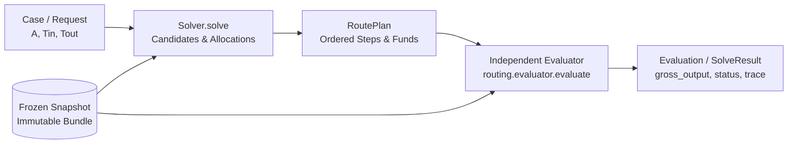

1. **Solver Isolation:** Solvers explore candidate paths, sample discrete amounts, and produce
   a `RoutePlan`. Solvers do not mutate bundle state and do not report self-certified outputs.
2. **Independent Plan Evaluation:** The evaluator (`routing.evaluator.evaluate`) takes the
   submitted `RoutePlan` and replays it from scratch against fresh copies of the bundle's
   physical pools.
3. **Fund Ledger:** Funds start in the `REQUEST` fund. Intermediate swap steps write outputs to
   unique fund IDs (e.g., `L1H1`, `F1`, `OUT1`). Later steps consume earlier funds.
4. **Remainder Draining:** Floor division integer remainder is explicitly allocated to the final
   step consuming a fund via the sentinel `ALL_REMAINING`. Residual unallocated balances cause
   immediate `invalid_plan` rejection.

### 1.7 Derivation of the Teaching Constant-Product Model

To ensure reproducible hand calculations across all chapters, we establish a standard
Constant Product Market Maker (CPMM) model with swap fee $\text{fee\_bps} \in [0, 10000)$:

Let the pool reserves be $(x, y)$, where $x$ is the reserve of token $T_{\text{in}}$ and $y$ is
the reserve of token $T_{\text{out}}$. When an input $\Delta x$ is provided:
1. The fee-adjusted input amount is:
   $$\Delta x_{\text{fee}} = \Delta x \cdot (10000 - \text{fee\_bps})$$
2. The invariant $(x \cdot 10000 + \Delta x_{\text{fee}})(y - \Delta y) \ge x \cdot y \cdot 10000$ requires:
   $$\Delta y = \left\lfloor \frac{\Delta x_{\text{fee}} \cdot y}{x \cdot 10000 + \Delta x_{\text{fee}}} \right\rfloor$$
3. State update:
   $$x' = x + \Delta x, \quad y' = y - \Delta y$$

*Note:* This integer formula governs Uniswap V2 and Merchant Moe Classic (`moe_classic_v1`).
Concentrated Liquidity (CL) and Liquidity Book (LB) use tick bitmaps and bin discrete trees,
which are evaluated in Section 11 via their exact protocol simulators.

### 1.8 Shared Vocabulary of the Five 0.2.1 Experimental Identities

Sections 14–18 explain the five strategies that Release 0.2.1 added: `metis_history`,
`direct_split_certified`, `incremental_graph_repair`, `uni_sor_cycle_safe` and `cfmm_dual`. They
share the plumbing of §1.6 and a small common vocabulary from the research contract
[`research-021/contract.md`](research-021/contract.md) (R021-C/1).

- **Group and status.** All five are in the *Experimental and other strategies* (`custom`)
  group. None is a base reference, an SOR optimization, a default router or Jupiter Metis.
  `--strategies all` appends each of them once, after `metis_inspired`, in this order, so a
  six-algorithm source profile runs **14** strategies. Inclusion is not adoption.
- **Options and presets.** Each identity reads its own `algorithm_options.<name>` section. Under
  `all`, a source that does not configure it receives the identity's pinned bounded preset. The
  saved record names the source of every option set:
  - `{kind: preset, path, sha256, key, version}`: the options equal a registered preset file,
    whose bytes are verified;
  - a verified historical pin, recorded in the same `{kind: preset, …}` form with its own path
    and version: only `cfmm_dual` has one, its WHI-1558 preset `cfmm_dual/1`, kept so that saved
    v1 options keep their identity;
  - `{kind: override}`: any other valid values, such as a stress profile or a forced cap.

  `settings_sha256` hashes the normalized options.
- **Actual domain versus capability ceiling.** A factory's `Capabilities` state the widest plan
  shape it may ever produce. The **domain** of a run is narrower and is recorded per result
  (`r021.domain/1`: pools, protocols, hops, splits, amount grid, pool reuse, admission,
  full fill) together with its `candidate_domain_hash`. Examples:
  - `direct_split_certified` declares `direct_split`'s ceiling but certifies only all-CPMM
    direct pool sets;
  - `cfmm_dual` declares CPMM + CL, but a run uses only its preset's `market_protocols` stage;
  - `metis_history` accepts every admitted protocol but prunes strictly only on certified CPMM
    regions.

  A result is compared only with a result of the same domain as a mechanism test; other
  comparisons are labelled `expanded_domain`, `expanded_protocol` or `incomparable_domain`.
- **Certificates and bound kinds** (`r021.certificate/1`):

  | `bound_kind` | Meaning | Who emits it |
  |---|---|---|
  | `certified` | exact-rational upper bound over the declared domain; gap = upper − lower | `direct_split_certified` |
  | `estimate` | a numerical value (for example a dual value) with its residual and tolerance; **never** an upper bound or gap | `cfmm_dual` (only after a converged initial solve without fallback) |
  | `unknown` | no bound claimed; null, never zero | the others, and every fallback or capped numerical case |

  No identity claims a global, full-network or integer certificate beyond this table.
- **Fallbacks are labelled.** When an identity returns a simpler retained candidate
  (`path_split`, `direct_split`, or `cfmm_dual`'s `single_path` fallback), the record says so
  (`fallback: {used, source, reason}`), and the plan is never counted as the mechanism's result.
- **One attempt ledger and charged stages.** A single-request or batch attempt has four
  separately recorded stages:
  1. **preparation** in the worker (`prepare`: graph indexes, `metis_history`'s certified-edge
     set, `cfmm_dual`'s CL indexes);
  2. worker start-up;
  3. the **solve**: search, bounds, repair, recovery **and every internal validation replay**
     (`internal_evaluations`) happen here, on one quote meter and one wall clock, with no free
     external baseline, no fresh budget per retry and no reset;
  4. the runner's **final independent evaluation** of the returned plan, outside the solve.
- **Work units are named, never divided.** Each identity reports its own units
  (`label_relaxations`, `bb_nodes_expanded`, `repair_attempts`, `admission_checks`,
  `market_oracle_calls`, …). The only cross-strategy unit is `quotes_executed`, beside time and
  memory.
- **How the worked examples are checked.** Sections 14–18 publish only values that
  `docs/examples/routing-algorithms/r021_examples.py` (runner sections 12–17) asserts against an
  expectation from outside the code under test:
  - the module's own integer `getAmountOut` (with the Moe Classic `uint112` revert) and fund
    ledger;
  - its own exhaustive oracles (paths, label layers, chunk trajectories and sequences, grid and
    raw allocations, closed-form CPMM arbitrage, share projection);
  - the pinned research fixtures in `docs/references/research-021/fixtures/`;
  - the pinned CFMMRouter.jl author run and the pre-implementation WHI-1557 contract model;
  - exact protocol quotes (`pools.quote.quote_exact_in`) for concentrated-liquidity legs.

  Every emitted plan is also replayed by a fresh `routing.evaluator.evaluate`. Counters that no
  independent source derives (quotes executed, nodes expanded, …) are called *factory counters*
  in the text: they are regression-pinned outputs of the factory, not independently derived
  teaching numbers. No timing is asserted.

---

## 2. Algorithm 1: `direct` (Single Pool Baseline)

### 2.1 Problem and Inclusion Rationale
`direct` evaluates every admitted physical pool that directly connects $T_{\text{in}}$ and
$T_{\text{out}}$ using 100% of the input amount $A$. It represents the minimal baseline
capability (no multi-hop, no split) required by `docs/DESIGN.md` §2.6.

### 2.2 Mathematical Model and Assumptions
- Candidate set: $\mathbb{P}_{\text{direct}} = \{p \in \text{Bundle} \mid \text{pairs}(p) = \{T_{\text{in}}, T_{\text{out}}\}\}$.
- Output for pool $p$: $O_p = f_p(A)$.
- Selection: $p^* = \arg\max_{p \in \mathbb{P}_{\text{direct}}} O_p$.
- **Incomplete Snapshot Policy:** If any evaluated direct pool fails with `INCOMPLETE_SNAPSHOT`
  (meaning the swap amount crossed into uncollected tick/bin state), the entire solve returns
  `SolveStatus.INCOMPLETE_SNAPSHOT`. Because that uncollected pool might have offered the best rate,
  claiming another pool is "best direct" would be misleading (`docs/DESIGN.md` §2.2).

### 2.3 Concise Pseudocode
```python
def solve_direct(case, bundle, objective, budget):
    pools = bundle.pools_for_pair(case.token_in, case.token_out)
    caps = [c for c in (budget.max_candidates, budget.max_quotes) if c is not None]
    candidates = pools[:min(caps)] if caps else pools
    truncated = len(pools) - len(candidates)
    
    best_plan, best_eval, best_score = None, None, None
    incomplete = []
    
    for pool in candidates:
        plan = plan_for_pool(pool.pool_id, case)
        evaluation = evaluate(bundle, case, plan, objective)
        if evaluation.status != OK:
            if evaluation.trace and evaluation.trace[-1].status == INCOMPLETE_SNAPSHOT:
                incomplete.append(pool.pool_id)
            continue
        score = objective.score(evaluation)
        if best_score is None or score > best_score:
            best_plan, best_eval, best_score = plan, evaluation, score
            report_candidate(plan)
            
    if incomplete:
        return SolveResult(status=INCOMPLETE_SNAPSHOT)
    if best_plan is None:
        return SolveResult(status=NO_ROUTE)
    return SolveResult(status=OK, plan=best_plan, evaluation=best_eval)
```

### 2.4 Architecture and Topology Diagram


### 2.5 Hand-Worked Numeric Example
Using our synthetic teaching bundle:
- Request: $A = 10\,000$ `TKA` $\to$ `TKB`.
- Pool `P_AB1`: Reserves $(100\,000, 100\,000)$, $\text{fee\_bps} = 30$.
  $$\Delta x_{\text{fee}} = 10\,000 \cdot 9970 = 99\,700\,000$$
  $$\text{num} = 99\,700\,000 \cdot 100\,000 = 9\,970\,000\,000\,000$$
  $$\text{den} = 100\,000 \cdot 10\,000 + 99\,700\,000 = 1\,099\,700\,000$$
  $$\Delta y_1 = \lfloor 9\,970\,000\,000\,000 / 1\,099\,700\,000 \rfloor = 9066 \text{ TKB}$$
- Pool `P_AB2`: Reserves $(200\,000, 180\,000)$, $\text{fee\_bps} = 30$.
  $$\Delta x_{\text{fee}} = 99\,700\,000$$
  $$\text{num} = 99\,700\,000 \cdot 180\,000 = 17\,946\,000\,000\,000$$
  $$\text{den} = 200\,000 \cdot 10\,000 + 99\,700\,000 = 2\,099\,700\,000$$
  $$\Delta y_2 = \lfloor 17\,946\,000\,000\,000 / 2\,099\,700\,000 \rfloor = 8546 \text{ TKB}$$
- **Selection:** $9066 > 8546 \implies$ `P_AB1` is selected. Evaluated output: `9066`.

### 2.6 Implementation Map
- File: `routing/algorithms/direct.py`
- Main entry point: `solve(case, context, budget)` (lines 48–109)
- Plan creation: `_plan_for_pool(pool_id, case)` (lines 35–45)

### 2.7 Parameters, Budgets, and Ties
- Parameters: None.
- Budgets: `Budget.max_candidates` and `Budget.max_quotes` truncate the candidate pool list:
  `candidates = admitted[:min(max_candidates, max_quotes)]`.
- Ties: First pool in bundle insertion order is retained (`score > best_score`).

### 2.8 Computational and Memory Cost
- Time Complexity: $\mathcal{O}(\lvert \mathbb{P}_{\text{direct}} \rvert \cdot c_q)$, where $c_q$ is the quote simulation cost.
- Quote Work: At most $\lvert \mathbb{P}_{\text{direct}} \rvert$ quotes.
- Memory: $\mathcal{O}(1)$ beyond immutable bundle data structures.

### 2.9 Guarantees and Limitations
- **Guarantee:** Globally optimal among single-pool direct routes across the *evaluated complete-state*
  candidates under the declared budget.
- **Limitation:** Blind to multi-hop routes and split allocations; fails completely when no direct
  pool exists (`NO_ROUTE`). If truncated by budget, `no_route` indicates that no *evaluated*
  pool succeeded.

---

## 3. Algorithm 2: `single_path` (Bounded Hop-Major Path Search)

### 3.1 Problem and Inclusion Rationale
When direct pools suffer from deep price impact or do not exist, routing through intermediate
tokens (multi-hop) can unlock superior exchange rates. `single_path` evaluates complete,
cycle-free multi-hop paths at 100% of the input amount.

### 3.2 Mathematical Model and Assumptions
- Candidate paths: $\Pi_H = \{\pi = (e_1, \dots, e_k) \mid 1 \le k \le H, \pi \text{ is cycle-free}\}$.
- Chained quote: $y_0 = A, \quad y_i = f_{e_i}(y_{i-1}) \quad \forall i \in \{1, \dots, k\}$.
- Selection: $\pi^* = \arg\max_{\pi \in \Pi_H} y_k(\pi)$.
- **Pruning Assumption:** If step $i$ along prefix $(e_1, \dots, e_i)$ fails (zero output,
  insufficient liquidity, or uncollected tick state), all candidate paths sharing that exact
  prefix are pruned immediately without quoting.
- **Incomplete Candidates Excluded:** Unlike `direct`, incomplete intermediate detours are
  excluded and recorded in `search_stats["paths_incomplete"]` rather than aborting the case,
  because intermediate amounts on multi-hop paths cannot be bounded by a token envelope.

### 3.3 Concise Pseudocode
```python
def solve_single_path(case, bundle, index, max_hops, cache, budget):
    best_plan, best_score = None, None
    pruned_prefixes = set()
    
    for path in enumerate_paths(index, case.token_in, case.token_out, max_hops):
        if any(path[:k] in pruned_prefixes for k in range(1, len(path) + 1)):
            continue
        if budget_would_be_exceeded(path, budget, cache):
            record_truncation()
            continue
            
        plan = path_plan(path, case.amount_in)
        evaluation = evaluate(bundle, case, plan, objective, quote=cache)
        
        if evaluation.status != OK:
            pruned_prefixes.add(path[:len(evaluation.trace)])
            continue
            
        score = objective.score(evaluation)
        if best_score is None or score > best_score:
            best_plan, best_score = plan, score
            report_candidate(plan)
            
    return format_result(best_plan, best_score)
```

### 3.4 Architecture and Topology Diagram

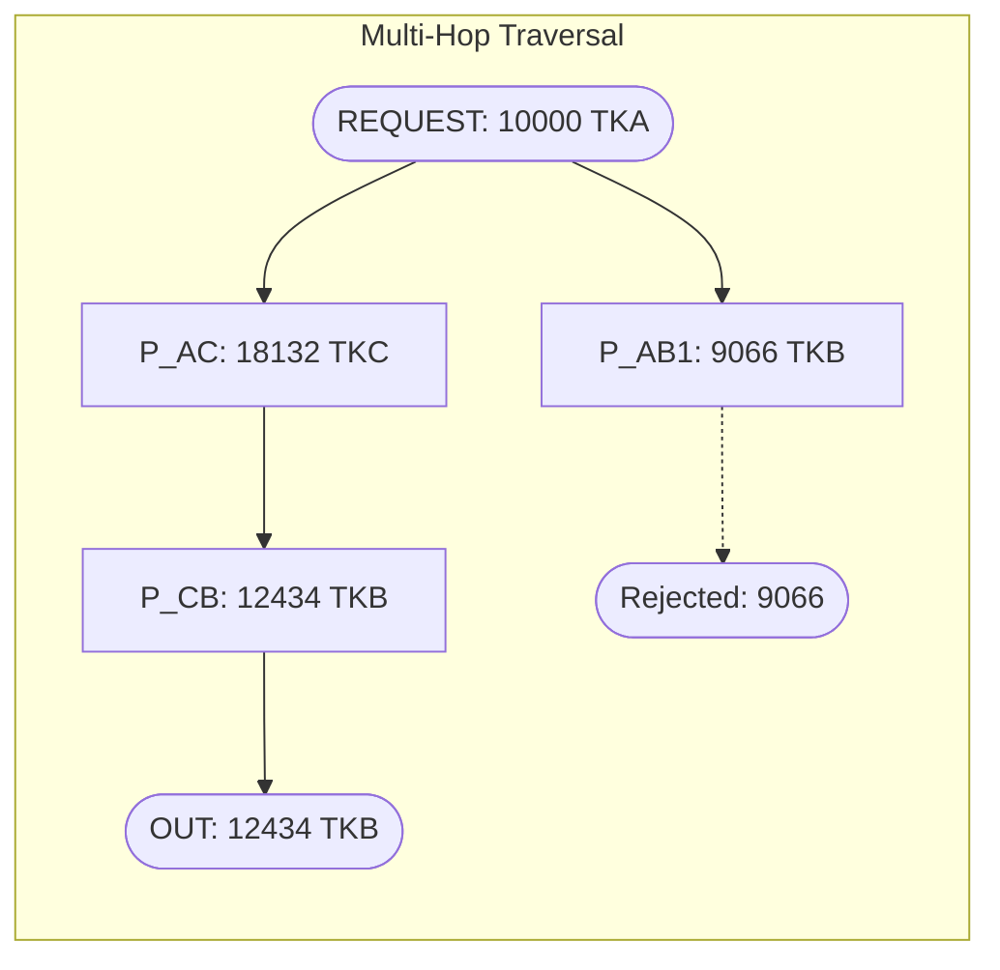

### 3.5 Hand-Worked Numeric Example
Consider the multi-hop candidate path `TKA -[P_AC]-> TKC -[P_CB]-> TKB`:
- Hop 1 (`P_AC`): Reserves $(100\,000, 200\,000)$, $\text{fee\_bps} = 30$, input $10\,000$ TKA:
  $$\Delta x_{\text{fee}} = 10\,000 \cdot 9970 = 99\,700\,000$$
  $$\text{num} = 99\,700\,000 \cdot 200\,000 = 19\,940\,000\,000\,000$$
  $$\text{den} = 100\,000 \cdot 10\,000 + 99\,700\,000 = 1\,099\,700\,000$$
  $$\Delta y_{\text{AC}} = \lfloor 19\,940\,000\,000\,000 / 1\,099\,700\,000 \rfloor = 18132 \text{ TKC}$$
- Hop 2 (`P_CB`): Reserves $(200\,000, 150\,000)$, $\text{fee\_bps} = 30$, input $18132$ TKC:
  $$\Delta x_{\text{fee}} = 18132 \cdot 9970 = 180\,776\,040$$
  $$\text{num} = 180\,776\,040 \cdot 150\,000 = 27\,116\,406\,000\,000$$
  $$\text{den} = 200\,000 \cdot 10\,000 + 180\,776\,040 = 2\,180\,776\,040$$
  $$\Delta y_{\text{CB}} = \lfloor 27\,116\,406\,000\,000 / 2\,180\,776\,040 \rfloor = 12434 \text{ TKB}$$
- **Outcome:** The 2-hop path yields $12434$ TKB, outperforming direct pool `P_AB1` ($9066$ TKB) by $+3368$ raw units (+37.15%).
- **Quote Work & Memoization:** On the 6 enumerated paths of the teaching graph, exactly 10 pool quotes are executed and 2 are memoized:
  - 1-hop paths `P_AB1` (1) and `P_AB2` (1) execute 2 quotes.
  - 2-hop paths `P_AC -> P_CB` (2) and `P_AD -> P_DB` (2) execute 4 quotes.
  - 3-hop path `P_AC -> P_CD -> P_DB` reuses `P_AC` at 10000 (memo hit) and executes 2 new quotes.
  - 3-hop path `P_AD -> P_CD -> P_CB` reuses `P_AD` at 10000 (memo hit) and executes 2 new quotes.
  - Total: $2 + 4 + 2 + 2 = 10$ quotes executed, 2 hits.

### 3.6 Implementation Map
- File: `routing/algorithms/single_path.py`
- Preparation: `prepare(bundle, config)` (line 107) creates immutable `GraphIndex`.
- Traversal generator: `routing/search.py:enumerate_paths` (lines 142–165).
- Solver: `solve(case, context, budget)` (lines 133–294).

### 3.7 Parameters, Budgets, and Ties
- `search.max_hops`: Hop bound $H$ (integer $\ge 1$).
- Enumeration order: Hop-major (1-hop, then 2-hop, ..., up to $H$ hops). Within the same
  hop count, depth-first order based on bundle pool insertion order.
- Status differentiation:
  - `unreachable`: $T_{\text{out}}$ has no path from $T_{\text{in}}$ at any hop distance.
  - `hop-bound`: $T_{\text{out}}$ is reachable, but the shortest path requires $> H$ hops.
  - `timeout`: Budget truncated the search before any valid candidate was evaluated.

### 3.8 Computational and Memory Cost
- Worst-Case Work: $\mathcal{O}(H \cdot \lvert \Pi_H \rvert \cdot c_q)$ unmemoized. With prefix
  memoization, each unique prefix is quoted once.
- Stack Memory: $\mathcal{O}(H)$ traversal generator stack.
- Cache Memory: $\mathcal{O}(\lvert \text{prefixes} \rvert)$ storing exact `(pool_id, token_in, amount)` results.

### 3.9 Guarantees and Limitations
- **Guarantee:** Best evaluated full-input single route across the bounded, unpruned path set
  under the declared budget.
- **Limitation:** Cannot split volume across parallel paths. Truncation cuts longest paths first.

---

## 4. Algorithm 3: `direct_split` (Discrete Dynamic Programming)

### 4.1 Problem and Inclusion Rationale
When multiple pools directly connect $T_{\text{in}}$ and $T_{\text{out}}$, splitting the input
across them mitigates individual price impact. `direct_split` finds the gross-optimal split
allocation across direct pools using a discrete percentage grid and exact dynamic programming.

### 4.2 Mathematical Model and Assumptions
- Grid: Step size $\delta \in (0, 100]$ dividing 100; total units $N = 100 / \delta$.
- Splits: At most $S = \text{max\_splits}$ nonzero legs.
- Allocation vector: $u = (u_1, \dots, u_m)$ with $u_i \in \{1, \dots, N\}$, $\sum u_i = N$.
- Integer Amounts and Remainder:
  $$\text{amount}_i = \left\lfloor \frac{A \cdot u_i}{N} \right\rfloor \quad \forall i < m$$
  $$\text{amount}_m = A - \sum_{i=1}^{m-1} \text{amount}_i \quad (\text{via } \texttt{ALL\_REMAINING})$$
- Accumulator Residue: $r = \sum_{i=1}^{m-1} (A \cdot u_i \bmod N)$, ensuring exact integer conservation.

### 4.3 Concise Pseudocode
```python
def solve_direct_split(case, bundle, max_splits, percent_step, cache):
    N = 100 // percent_step
    pools = bundle.pools_for_pair(case.token_in, case.token_out)
    
    # 1. Quote single pools at 100%
    singles = [quote(p, case.amount_in) for p in pools]
    
    # 2. Sample smaller grid units
    for u in range(N - 1, 0, -1):
        for p in pools:
            quote(p, case.amount_in * u // N)
            
    # 3. Exact DP over (legs_used, units_used, residue)
    states = {(0, 0, 0): (0, ())}
    finalists = {}
    for j, pool in enumerate(pools):
        for (legs, used, res), (gross, alloc) in states.items():
            final_amount = case.amount_in - (case.amount_in * used - res) // N
            out = quote(pool, final_amount)
            update_finalists(finalists, legs + 1, gross + out, alloc + [(j, N - used)])
            
        grown = dict(states)
        for (legs, used, res), (gross, alloc) in states.items():
            if legs + 1 < max_splits:
                for u in range(1, N - used):
                    out = sample_table[j, u]
                    key = (legs + 1, used + u, res + (case.amount_in * u % N))
                    update_dp(grown, key, gross + out, alloc + [(j, u)])
        states = grown
        
    # 4. Re-evaluate finalists as complete RoutePlans
    return select_best_finalist(finalists)
```

### 4.4 Architecture and Topology Diagram

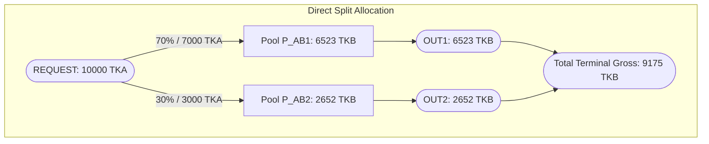

### 4.5 Hand-Worked Numeric Example and DP Transitions
Input $A = 10\,005$ TKA, $\text{percent\_step} = 10 \implies N = 10$ units, $\text{max\_splits} = 2$.
1. **Grid Sampling:**
   - Samples full input $10005$ on `P_AB1` ($9070$ TKB) and `P_AB2` ($8551$ TKB).
     Calculation for `P_AB2` at $10005$:
     $$\Delta x_{\text{fee}} = 10005 \cdot 9970 = 99749850$$
     $$\text{num} = 99749850 \cdot 180000 = 17954973000000$$
     $$\text{den} = 200000 \cdot 10000 + 99749850 = 2099749850$$
     $$\Delta y_2 = \lfloor 17954973000000 / 2099749850 \rfloor = 8551 \text{ TKB}$$
   - Samples floored amounts $10005 \cdot u // 10$ for $u \in [1..9]$.
2. **DP State Transition:**
   - State representation: `(legs_used, units_used, residue)`.
   - Consider transition for $u_1 = 7$:
     $$\text{amount}_1 = \lfloor 10005 \cdot 7 / 10 \rfloor = \lfloor 7003.5 \rfloor = 7003 \text{ TKA}$$
     Quote on `P_AB1` for $7003$ TKA yields $6526$ TKB.
     Residue: $10005 \cdot 7 \bmod 10 = 5$.
     State reaches: `(1, 7, 5)` with accumulated gross $6526$.
   - Closing allocation on `P_AB2`:
     Remaining units: $10 - 7 = 3$.
     $$\text{final\_amount} = 10005 - \lfloor (10005 \cdot 7 - 5) / 10 \rfloor = 10005 - 7003 = 3002 \text{ TKA}$$
     Notice that $3002$ is exactly the base share $3001$ plus the accumulated remainder $+1$.
     Quote on `P_AB2` for $3002$ TKA yields $2653$ TKB.
     Total gross for 2-split: $6526 + 2653 = \mathbf{9179}$ TKB.
3. **Outcome:** $9179 > 9070 \implies$ 2-split wins, executing $7003$ on `P_AB1` and $3002$ on `P_AB2` with 0 residual.
4. **Quote Accounting:** 2 initial full quotes + 18 grid quotes ($9 \times 2$) + 5 on-demand remainder quotes = 25 quotes executed.

### 4.6 Implementation Map
- File: `routing/algorithms/direct_split.py`
- Preparation: `prepare(bundle, config)` (line 107) validates $N = 100 / \text{percent\_step}$.
- Leg amount calculation: `leg_amounts(amount_in, legs, units)` (line 121).
- Plan builder: `allocation_plan(case, pool_ids, legs)` (line 128).
- Solver: `solve(case, context, budget)` (lines 157–348).

### 4.7 Parameters, Budgets, and Ties
- `search.percent_step`: Divisor of 100 (e.g. 5, 10).
- `search.max_splits`: Upper bound on leg count $S$.
- Ties: Fewer splits win ties; earlier admitted pools win identical gross outputs.

### 4.8 Computational and Memory Cost
- Pool Quotes: $P_{\text{direct}}$ full quotes $+ P_{\text{direct}} \cdot (G - 1)$ grid samples, plus on-demand quotes for non-grid remainder amounts (up to $P_{\text{direct}} \cdot \lvert \text{reachable non-grid remainders} \rvert$). On our $P=2, G=10, S=2$ teaching example ($A=10005$), this executes $2 + 18 + 5 = 25$ pool quotes.
- DP Transitions: In addition to the $(l, u)$ grid state, the dynamic program tracks the accumulated remainder residue $r = \sum (A \cdot u_i \bmod G)$. Let $R$ denote the reachable residue multiplicity at any $(l, u)$ pair. Because each non-final leg accumulates integer residue from floored grid division, $R = \mathcal{O}(S)$ in the worst case (with $R = 1$ when $A$ is divisible by $G$). Total DP state transitions are therefore bounded by $\mathcal{O}(P_{\text{direct}} \cdot S \cdot G^2 \cdot R)$.
- Re-scoring: At most $S$ candidate finalist plans (one per split count $m \in \{1, \dots, S\}$) are re-evaluated under `ObjectiveContext`, subject to feasibility and candidate budgets.

### 4.9 Guarantees and Limitations
- **Guarantee:** Best evaluated direct split allocation on the declared finite grid under additive gross output.
- **Limitation:** Does not support multi-hop routes; finalist re-scoring does not exhaustively
  search non-additive per-pool fixed fees across all non-finalist grid combinations.

---

## 5. Algorithm 4: `path_split` (Conflict-Aware Branch-and-Bound)

### 5.1 Problem and Inclusion Rationale
To combine multi-hop routing with volume splitting, an aggregator must split volume across
multi-hop paths. However, paths that share physical pools cannot be evaluated independently
because sequential transactions on the same pool alter reserves and invalidate additive quotes.
`path_split` strictly enforces **physical-pool disjointness**: no two paths in a split plan
may share a pool ID.

### 5.2 Mathematical Model and Assumptions
- Candidate paths: $\Pi_H$ generated as in `single_path`.
- Pool Disjointness Constraint:
  $$\text{pools}(\pi_i) \cap \text{pools}(\pi_j) = \emptyset \quad \forall i \ne j$$
- Pruning Assumptions:
  1. **Nondecreasing output:** $x_1 \le x_2 \implies f_p(x_1) \le f_p(x_2)$.
  2. **Nonincreasing average rate:** Average return $f(x)/x$ is nonincreasing (concave liquidity curves).
  3. **State traversal:** Larger swaps only traverse more pool state.
  4. **Rounding absorption:** The $+1$ in the bound absorbs integer floor division rounding.
- Pruning Bound $B$: Let $B = (S - 1) \cdot H$. If more than $B$ pairwise pool-disjoint paths
  are each strictly superior to path $P$ at grid size $u$, then $P$ cannot be part of the optimal
  $S$-split plan and is safely pruned (`_family_exceeds`).
- Upper Bound on Path Quote:
  $$\text{UB}(P, u) = \min\left(\text{out}_P(N), \left\lceil \frac{(\text{out}_P(u_0) + 1) \cdot a_u}{a_{u_0}} \right\rceil\right)$$
- Floored Grid vs. Remainder: Finalists are selected using floored grid shares. Re-evaluation
  allocates the final leg with `ALL_REMAINING`, so evaluated gross is never below search gross.

### 5.3 Concise Pseudocode
```python
def compute_knapsack_bounds(kept_table, max_splits, n_units):
    """ub[cap][k][r]: Knapsack upper bound of k legs, sizes <= cap, summing to r."""
    ub = [[[None] * (n_units + 1) for _ in range(max_splits + 1)] for _ in range(n_units + 1)]
    for c in range(n_units + 1):
        ub[c][0][0] = 0
        for k in range(1, max_splits + 1):
            for r in range(1, n_units + 1):
                vals = [kept_table[u][0][0] + prev for u in range(1, min(c, r) + 1)
                        if u in kept_table and (prev := ub[c][k - 1][r - u]) is not None]
                ub[c][k][r] = max(vals) if vals else None
    return ub

def solve_path_split(case, bundle, max_hops, max_splits, percent_step, cache):
    # 1. Retain simpler candidates (single path, direct split)
    best_single = solve_single_path(...)
    best_direct = solve_direct_split(...)
    
    # 2. Sample endpoints and prune dominated candidates
    paths = enumerate_paths(...)
    sample_endpoints(paths, u0, N)
    B = (max_splits - 1) * max_hops
    kept_table = prune_with_disjoint_family_bound(paths, B)
    
    # 3. Exact Branch and Bound over kept table (O(S * G^3) knapsack bound precomputation)
    ub = compute_knapsack_bounds(kept_table, max_splits, N)
    best = {}  # m_legs -> (best_gross, legs)
    
    def beats(gross, m):
        return all(gross > best[k][0] for k in range(1, m + 1) if k in best)

    def promising(gross, k, rest, cap):
        if rest == 0:
            return beats(gross, k)
        for m in range(k + 1, max_splits + 1):
            bound = ub[cap][m - k][rest] if ub is not None else None
            if bound is not None and beats(gross + bound, m):
                return True
        return False

    def dfs(used, cap, min_idx, taken_pools, gross, legs):
        r = N - used
        if r == 0:
            if beats(gross, len(legs)):
                best[len(legs)] = (gross, legs)
            return
            
        legs_left = max_splits - len(legs)
        for u in range(min(cap, r), 0, -1):
            if u * legs_left < r:
                break  # Non-increasing sizes cannot cover remaining units
            if u not in kept_table or (legs_left == 1 and u != r):
                continue
                
            lst = kept_table[u]
            for idx in range(min_idx if u == cap else 0, len(lst)):
                v, path = lst[idx]
                if not promising(gross + v, len(legs) + 1, r - u, u):
                    break  # Value-descending list: later entries cannot beat bound
                if not taken_pools.isdisjoint(path.pools):
                    continue  # Pool conflict: skipped
                dfs(used + u, u, idx + 1, taken_pools | path.pools, gross + v, legs + ((path, u),))
                
    dfs(0, N, 0, frozenset(), 0, ())
    return select_best_finalist([best_single, best_direct, best])
```

### 5.4 Architecture and Topology Diagram

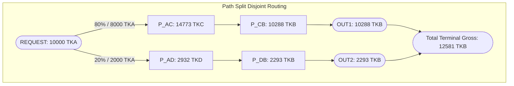

### 5.5 Hand-Worked Numeric Example, Conflict Rejection, and Pruning
Request: $10\,000$ TKA $\to$ TKB, $\text{percent\_step} = 10, \text{max\_splits} = 2$.
1. **Candidate Paths:**
   - $\pi_1$: `TKA -[P_AC]-> TKC -[P_CB]-> TKB` (Pools: `P_AC`, `P_CB`)
   - $\pi_2$: `TKA -[P_AD]-> TKD -[P_DB]-> TKB` (Pools: `P_AD`, `P_DB`)
   - $\pi_3$: `TKA -[P_AC]-> TKC -[P_CD]-> TKD -[P_DB]-> TKB` (Pools: `P_AC`, `P_CD`, `P_DB`)
2. **Conflict Rejection:**
   - $\pi_1$ and $\pi_3$ share `P_AC`; $\pi_2$ and $\pi_3$ share `P_DB`.
   - `paths_conflict` evaluates to `True`, rejecting these combinations. Exactly 13 candidate branches
     are excluded by pool conflicts (`bnb_conflicts_excluded = 13`).
3. **Exact Branch-and-Bound Traversal and Pruning Decisions:**
   The DFS explores non-increasing allocation sizes ($u \le \text{cap}$) and uses the knapsack upper bound table `ub[cap][k][r]`:
   - **Initial Incumbent (1-leg, size $u = 10$):**
     Path 2 (`P_AC -> P_CB`) takes 10 units ($10\,000$ TKA) $\to 12434$ TKB, setting `best[1] = 12434`.
     Next at $u = 10$, Path 4 (`P_AC -> P_CD -> P_DB`) yields $11082$. Since $r = 0$, `promising(11082, 1, 0, 10)` checks if $11082 > 12434$: False $\implies$ **PRUNED!** Because the list is value-descending, all remaining paths at $u = 10$ are pruned immediately.
   - **Size $u = 9$ (Remaining $r = 1$ unit):**
     Path 2 at $u=9$ yields $11379$. Knapsack bound for 1 remaining unit from sizes $\le 9$ is $\text{ub}[9][1][1] = 1519$.
     Upper bound $= 11379 + 1519 = 12898 > 12434 \implies$ promising!
     Second leg must have size $r = 1$:
     - Path 3 (`P_AD -> P_DB`, disjoint) yields $1168$. Total gross $= 11379 + 1168 = 12547 > 12434$, setting new 2-leg incumbent `best[2] = 12547`!
     - Next path at size 1: Path 5 ($v = 1079$): gross $+ v = 11379 + 1079 = 12458 \le 12547 \implies$ **PRUNED!**
     - Next candidate at size 9: Path 4 ($v = 10284$): bound is $1519$, total $= 10284 + 1519 = 11803 \le 12547 \implies$ **PRUNED!**
   - **Size $u = 8$ (Remaining $r = 2$ units):**
     Path 2 at $u=8$ yields $10288$. Knapsack bound for 2 units is $\text{ub}[8][1][2] = 2919$.
     Upper bound $= 10288 + 2919 = 13207 > 12547 \implies$ promising!
     Second leg must have size $r = 2$:
     - Path 3 (`P_AD -> P_DB`, disjoint) yields $2293$. Total gross $= 10288 + 2293 = \mathbf{12581} > 12547$, setting optimal 2-leg incumbent `best[2] = 12581`!
     - Next path at size 2: Path 5 ($v = 2093$): gross $+ v = 10288 + 2093 = 12381 \le 12581 \implies$ **PRUNED!**
     - Next candidate at size 8: Path 4 ($v = 9433$): bound is $2919$, total $= 9433 + 2919 = 12352 \le 12581 \implies$ **PRUNED!**
   - **Sizes $u \in \{7, 6, 5\}$ (Remaining $r = 10 - u$ units):**
     At each size $u$, the root candidate has an upper bound using Path 2 (the best quote at remaining size $r = 10 - u$) that exceeds the incumbent $12581$:
     - For $u = 7$ ($r = 3$): Path 2 ($9160$) and Path 4 ($8527$) both have relaxed bound $\text{ub}[7][1][3] = 4220$ (from Path 2 at size 3). Totals are $9160 + 4220 = 13380$ and $8527 + 4220 = 12747$, both exceeding $12581$, so DFS enters both branches.
       - Under Path 2 ($u=7$): child scan evaluates Path 3 ($v=3376$, disjoint), yielding $9160 + 3376 = 12536 \le 12581 \implies$ terminal cutoff (`beats() == False`), terminating the scan.
       - Under Path 4 ($u=7$): child scan for remaining 3 units first evaluates Path 2 ($v=4220$, total $12747$) and Path 4 ($v=4212$, total $12739$); both pass `promising()` but fail the pool-conflict check (Path 2 shares `P_AC`; Path 4 shares `P_AC`, `P_CD`, `P_DB`). The third candidate, Path 3 ($v=3376$), yields $8527 + 3376 = 11903 \le 12581 \implies$ `promising()` fails at `rest == 0`, terminating the scan before checking its pool conflict with Path 4!
     - For $u = 6$ ($r = 4$): Path 2 ($7990$) and Path 4 ($7559$) have relaxed bound $\text{ub}[6][1][4] = 5524$ (from Path 2 at size 4). Both enter DFS. Under Path 4, Path 2 ($v=5524$) and Path 4 ($v=5409$) are excluded by pool conflicts; Path 3 ($v=4418$) yields $7559 + 4418 = 11977 \le 12581 \implies$ `promising()` terminates the scan.
     - For $u = 5$ ($r = 5$): Path 2 ($6779$) and Path 4 ($6522$) have relaxed bound $\text{ub}[5][1][5] = 6779$ (from Path 2 at size 5). Both enter DFS. Equal-size symmetry avoidance (`idx >= min_idx`) skips redundant combinations; testing Path 3 ($v=5423$) yields $6522 + 5423 = 11945 \le 12581 \implies$ `promising()` terminates the scan.
   - **Loop termination for $u \le 4$:**
     Since $u \cdot \text{legs\_left} < r \iff 4 \cdot 2 = 8 < 10$, non-increasing size allocations can no longer cover the 10 units, terminating the loop.
   - **Summary:** Across the search, exactly 12 DFS nodes are visited (`bnb_nodes = 12`) and 13 candidate branches are excluded by pool conflicts (`bnb_conflicts_excluded = 13`), proving $12581$ optimal.
4. **Disjoint Allocation Evaluation (80% / 20%):**
   - $\pi_1$ at $8\,000$ TKA:
     - Hop 1 (`P_AC`): in = $8\,000 \to$ out = $14773$ TKC.
     - Hop 2 (`P_CB`): in = $14773 \to$ out = $10288$ TKB.
   - $\pi_2$ at $2\,000$ TKA:
     - Hop 1 (`P_AD`): in = $2\,000 \to$ out = $2932$ TKD.
     - Hop 2 (`P_DB`): in = $2932 \to$ out = $2293$ TKB.
   - Total Gross Output: $10288 + 2293 = \mathbf{12581}$ TKB.
   - Comparison: Beats single path ($12434$ TKB) by $+147$ raw units (+1.18%).

### 5.6 Implementation Map
- File: `routing/algorithms/path_split.py`
- Conflict detection: `paths_conflict(p1, p2)` (line 133).
- Branch-and-bound engine: `_branch_and_bound(...)` (lines 183–265).
- Disjoint family counting: `_family_counts` (line 301), `_family_exceeds` (line 318), `_members_above` (line 335).
- Solver: `solve(case, context, budget)` (lines 341–572).

### 5.7 Parameters, Budgets, and Ties
- Parameters: `search.max_hops`, `search.max_splits`, `search.percent_step`.
- Ties: Simpler route wins ties (single path > direct split > fewer legs).

### 5.8 Computational and Memory Cost
- Pool Quotes: Combines sub-solver quotes ($\text{Quotes}(\text{single\_path}) + \text{Quotes}(\text{direct\_split})$), plus candidate route samples across grid sizes $\sum_{\pi \in \text{kept}} \text{hops}(\pi) \cdot \lvert \text{sizes}(\pi) \rvert$. On our 6-path teaching graph, 100 pool quotes were executed (59 memo hits).
- Memory: Knapsack upper-bound table `ub` allocated with dimensions $(G + 1) \times (S + 1) \times (G + 1)$, kept table $\mathcal{O}(\lvert \Pi_H \rvert \cdot G)$, and the shared `QuoteCache`.

### 5.9 Guarantees and Limitations
- **Guarantee:** Best evaluated pool-disjoint allocation on the declared finite grid under stated pruning.
- **Limitation:** Cannot route through shared pools or topology merges (e.g., cannot split volume
  after a common first hop).

---

## 6. Algorithm 5: `incremental_graph` (Shared-Pool Marginal Routing)

### 6.1 Problem and Inclusion Rationale
Restricting multi-hop routes to disjoint pools forbids natural liquidity topologies such as
shared-prefix splits (e.g., all funds route through a high-liquidity `USDC -> WMNT` pool, then
split across distinct pools to the target). `incremental_graph` solves this by allowing
paths to share physical pools.

### 6.2 Mathematical Model and Assumptions
- Chunks: Input $A$ is partitioned into $K = \text{graph.chunks}$ integer chunks:
  $$\Delta_k = \left\lfloor \frac{A \cdot k}{K} \right\rfloor - \left\lfloor \frac{A \cdot (k-1)}{K} \right\rfloor$$
- Aggregate Input Accounting: Each pool maintains total tentative input $x_p$. When a chunk
  of size $d$ traverses pool $p$, its marginal output is:
  $$m = f_p(x_p + d) - f_p(x_p)$$
  and pool state is updated to $x_p \leftarrow x_p + d$.
- **Crucial Invariant:** $f(x + \Delta) - f(x)$ represents one merged swap of size $x + \Delta$,
  **not** two sequential swaps. Sequential fee-bearing swaps would re-apply base fees and yield
  strictly less.
- **Merged Plan Normalization:** All chunks traversing pool $p$ are coalesced into a single
  `SwapStep` executing $x_p$ in the final transaction plan.

### 6.3 Concise Pseudocode
```python
def solve_incremental_graph(case, bundle, chunks_K, max_hops, cache):
    retained_candidate = solve_path_split(...)
    paths = enumerate_paths(...)
    
    amounts = chunk_amounts(case.amount_in, chunks_K)
    pool_inputs = defaultdict(int)
    chunk_allocations = []
    last_positive_chunk_idx = max(k for k, a in enumerate(amounts) if a > 0)
    carry = 0
    
    for k, chunk in enumerate(amounts):
        if chunk == 0:
            continue  # 1. Skip raw empty chunk first (A < K)
            
        amount = carry + chunk
        choice = None  # (marginal, path, updates)
        
        for path in paths:
            if creates_cycle(token_edges(chunk_allocations), path):
                continue
            try:
                marginal, updates = simulate_marginal(path, amount, pool_inputs)
            except ChunkFailed:
                continue
            if choice is None or marginal > choice[0]:
                choice = (marginal, path, updates)  # Accepts marginal == 0 if choice is None
                
        # 2. Intermediate zero-marginal or unroutable: carry forward
        if k != last_positive_chunk_idx and (choice is None or choice[0] == 0):
            carry = amount
            continue
            
        # 3. Final chunk unroutable: abandon and fallback
        if choice is None:
            return retained_candidate
            
        # 4. Commit chunk (including zero-marginal on final chunk)
        carry = 0
        commit_chunk(choice[1], amount, choice[2], pool_inputs)
        chunk_allocations.append(choice[1])
        
    merged = merged_plan(case, build_flows(chunk_allocations, pool_inputs))
    evaluation = evaluate(bundle, case, merged)
    return select_best(retained_candidate, (merged, evaluation))
```

### 6.4 Architecture and Topology Diagram

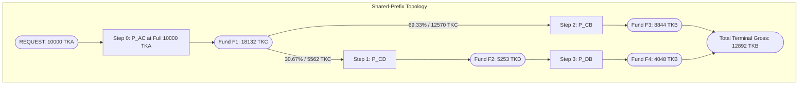

### 6.5 Hand-Worked Numeric Example, Chunk Accounting, and Fallback
Using our synthetic teaching bundle, let $K = 10$ chunks ($1\,000$ TKA each):
1. **Marginal Allocation Sequence:**
   - Candidate Path 0: `TKA -[P_AC]-> TKC -[P_CD]-> TKD -[P_DB]-> TKB`
   - Candidate Path 1: `TKA -[P_AC]-> TKC -[P_CB]-> TKB`
   - Chunk greedy choices: `[0, 1, 1, 0, 1, 1, 1, 0, 1, 1]`.
   - Path 0 captures 3 chunks ($3\,000$ TKA); Path 1 captures 7 chunks ($7\,000$ TKA).
2. **Telescoping Flow Accounting:**
   - Both paths traverse `P_AC`. Total input on `P_AC` is $3000 + 7000 = 10\,000$ TKA, producing $18132$ TKC.
   - At intermediate token `TKC`, the flow splits:
     - 3 chunks allocated to Path 0 draw $5562$ TKC into `P_CD`, producing $5253$ TKD.
     - That $5253$ TKD enters `P_DB`, producing $4048$ TKB.
     - The remaining $18132 - 5562 = 12570$ TKC enters `P_CB`, producing $8844$ TKB.
3. **Merged Plan Execution:**
   - Step 0 (`P_AC`): in = $10\,000$ TKA $\to$ out = $18132$ TKC (Fund `F1`)
   - Step 1 (`P_CD`): in = $5562$ TKC $\to$ out = $5253$ TKD (Fund `F2`)
   - Step 2 (`P_CB`): in = $12570$ TKC (`ALL_REMAINING` of `F1`) $\to$ out = $8844$ TKB (Fund `F3`)
   - Step 3 (`P_DB`): in = $5253$ TKD $\to$ out = $4048$ TKB (Fund `F4`)
   - Terminal Gross Output: $8844 + 4048 = \mathbf{12892}$ TKB.
4. **Conservation & Reconciliation:**
   - Fund `REQUEST`: 10000 consumed.
   - Fund `F1`: 18132 produced, exactly $5562 + 12570 = 18132$ consumed.
   - Fund `F2`: 5253 produced, exactly 5253 consumed.
   - Zero residuals. Evaluated gross matches accounted gross exactly.
5. **Retained Simpler Candidate Fallback:**
   - `incremental_graph` runs `path_split` first. The incremental plan is only returned if its objective
     score strictly exceeds the `path_split` incumbent.
   - If an input is small (e.g. $A=10$), splitting volume provides no gross improvement over the best single
     path; ties retain the simpler candidate.

### 6.6 Implementation Map
- File: `routing/algorithms/incremental_graph.py`
- Chunk schedule: `chunk_amounts(amount_in, chunks)` (line 149).
- Cycle detection: `creates_cycle(edges, path)` (line 155).
- Merged plan builder: `merged_plan(case, flows)` (line 190).
- Topology classification: `topology(route_paths)` (line 270).
- Solver: `solve(case, context, budget)` (lines 407–706).
- Marginal simulation: `marginal(path, amount, memo)` (line 471).

### 6.7 Parameters, Budgets, and Ties
- Parameters: `graph.chunks` ($K$), plus `path_split` parameters for retained candidates.
- Fallback: Retains simpler `path_split` candidate if the incremental plan does not strictly beat it.

### 6.8 Computational and Memory Cost
- Pool Quotes: Sub-solver quotes ($\text{Quotes}(\text{path\_split})$), plus up to $K \cdot \sum_{\pi} \text{hops}(\pi)$ marginal pool simulations.
- Memory: flow map $\mathcal{O}(P)$, chunk allocations $\mathcal{O}(K)$, candidate paths $\mathcal{O}(\lvert \Pi_H \rvert)$, and the `QuoteCache`.

### 6.9 Guarantees and Limitations
- **Guarantee:** Never performs worse than `path_split` on objective score (fallback preservation).
- **Limitation:** Greedy heuristic; larger chunk counts do not guarantee monotonic improvements
  due to greedy path trapping.

---

## 7. Algorithm 6: `uni_sor_port` (Uniswap Smart Order Router Parity Port)

### 7.1 Problem and Inclusion Rationale
Uniswap SOR is the industry standard benchmark for EVM DEX aggregation. `uni_sor_port` is an exact
source-pinned Python translation of the routing core from
`Uniswap/smart-order-router@04c7c0b4` (v4.31.10). It provides an authoritative reference
comparator for exact-input V2/V3 routing.

### 7.2 Mathematical Model and Assumptions
- Scope: Exact-input V2 and V3 pools only. Merchant Moe Liquidity Book (LB) pools are strictly
  excluded by Contract Deviation D-4.
- Candidate Generation (`compute_all_routes`): Bounded BFS/DFS across V3 and V2 pools (configurable
  hop bound via `search.max_hops`, default 3 in upstream contract B-S12).
- Quote Matrix: Precomputes quotes for routes across percentage distribution (e.g. 5%, 10%, ..., 100%).
- Upstream Selection Queue (`get_best_swap_route_by`):
  1. 100% single-route baseline forms the initial incumbent.
  2. FIFO queue of partial solutions seeded with the best and second-best single routes for each percentage bucket.
  3. Explores continuations in descending percentage order.
  4. Finds the first non-overlapping route **within each percentage group** (`find_first_route_not_using_used_pools`).
  5. Prunes layers that exceed `max_splits` or cannot beat the incumbent.
- Tie Breaking: Strict V8 binary insertion sort emulation (`v8_small_array_sort`).

### 7.3 Concise Pseudocode
```python
def solve_uni_sor_port(case, bundle, max_hops, max_splits, percent_step):
    routes = compute_all_routes(case.token_in, case.token_out, max_hops, bundle.sor_pools)
    percentages = amount_distribution(case.amount_in, percent_step)
    quote_table = build_route_quotes(routes, percentages, case.amount_in)
    
    # 1. Baseline: Best 100% single route
    best_quote = quote_table.best_at_percent(100)
    best_swap = (quote_table.best_route_at_percent(100),)
    
    # 2. FIFO Queue of partial solutions
    queue = deque()
    for i in range(len(percentages) - 1, -1, -1):
        pct = percentages[i]
        queue.append(Node(routes=[quote_table.best(pct)], percent_idx=i, rem=100 - pct))
        if quote_table.second_best(pct):
            queue.append(Node(routes=[quote_table.second_best(pct)], percent_idx=i, rem=100 - pct))
            
    # 3. Layer expansion
    splits = 1
    while queue:
        layer = len(queue)
        splits += 1
        if splits >= 3 and best_swap and len(best_swap) < splits - 1:
            break
        if splits > max_splits:
            break
        while layer > 0:
            layer -= 1
            node = queue.popleft()
            for i in range(node.percent_idx, -1, -1):
                pct = percentages[i]
                if pct > node.rem:
                    continue
                route = find_first_route_not_using_used_pools(node.routes, quote_table[pct])
                if not route:
                    continue
                rem_new = node.rem - pct
                routes_new = node.routes + (route,)
                if rem_new == 0:
                    if sum(r.quote for r in routes_new) > best_quote:
                        best_quote = sum(r.quote for r in routes_new)
                        best_swap = routes_new
                else:
                    queue.append(Node(routes=routes_new, percent_idx=i, rem=rem_new))
                    
    # 4. Adapter Integer Fill (D-1) and Re-Quote (D-3)
    plan = build_integer_fill_plan(best_swap, case.amount_in)
    evaluation = evaluate(bundle, case, plan)
    return SolveResult(status=OK, plan=plan, evaluation=evaluation)
```

### 7.4 Architecture and Topology Diagram

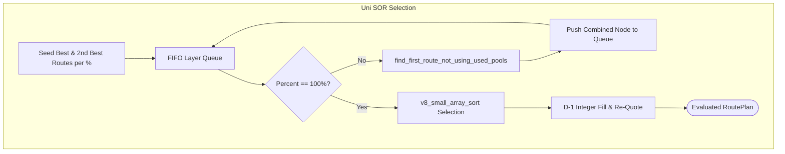

### 7.5 Hand-Worked Numeric Example
On our synthetic teaching graph ($N = 10, S = 2$):
1. Candidate Routes: $\pi_1 = \text{P\_AB1}, \pi_2 = \text{P\_AB2}, \pi_3 = \text{P\_AC}\to\text{P\_CB}, \pi_4 = \text{P\_AD}\to\text{P\_DB}$.
2. Quote Matrix (80% / 20%):
   - At 80% ($8\,000$ TKA): $\pi_3$ yields $10288$ TKB ($8000 \to 14773 \to 10288$).
   - At 20% ($2\,000$ TKA): $\pi_4$ yields $2293$ TKB ($2000 \to 2932 \to 2293$).
3. Queue Continuation:
   - Partial solution $\pi_3$ (80%) looks for non-overlapping routes for remaining 20%.
   - In 20% group, `find_first_route_not_using_used_pools` inspects sorted routes:
     - $\pi_3$: shares `P_AC`, skipped.
     - $\pi_4$: uses `P_AD`, `P_DB`, strictly disjoint $\implies$ selected!
   - Combined route achieves $10288 + 2293 = \mathbf{12581}$ TKB.
4. Adapter Fill (D-1) and Re-quote (D-3):
   - Leg 1 draws $8\,000$ TKA; Leg 2 draws `ALL_REMAINING` ($2\,000$ TKA).
   - Evaluated gross matches cached quote: $12581$ TKB (`requote_delta` = "0").
5. Quote Accounting: 2 1-hop routes $\times 10$ buckets ($20$ quotes) + 2 2-hop routes $\times 10$ buckets $\times 2$ hops ($40$ quotes) = 60 pool quotes executed.

### 7.6 Implementation Map
- File: `routing/algorithms/uni_sor_port.py`
- Route discovery: `compute_all_routes(...)` (line 266).
- Amount distribution: `amount_distribution(...)` (line 352).
- Quote matrix: `build_route_quotes(...)` (line 429).
- V8 sorting emulation: `v8_small_array_sort(...)` (line 453).
- Non-overlapping route finder: `find_first_route_not_using_used_pools(...)` (line 501).
- Selection engine: `get_best_swap_route_by(...)` (line 538), `get_best_swap_route(...)` (line 670).
- Integer fill: `integer_fill(...)` (line 709).
- Adapter solver: `solve(...)` (lines 833–1051).

### 7.7 Parameters, Budgets, and Ties
- Gas Scores (Adaptation A-3): Gas scores set to zero (`(0, 0, 0)`), selecting purely on gross quotes.
- Excluded Pools (Deviation D-4): Liquidity Book pools are excluded from candidate generation.
- Budget Rejection: SOR returns `timeout` if declared candidate or quote budgets would truncate the quote table.

### 7.8 Computational and Memory Cost
- Pool Quotes: $\sum_{\pi} \text{hops}(\pi) \cdot G$ quotes to populate the percentage quote matrix, plus on-demand replay quotes if the adapter integer fill creates a non-percentage remainder allocation on the final route (bounded by $\text{hops}(\pi_{\text{last}})$). On our teaching example with $H=1, A=10005$, this executes $2 \times 10 + 1 = 21$ quotes; with $H=2, A=10001$, it executes $60 + 2 = 62$ quotes; with divisible $A=10000$, exactly 60 quotes.
- Memory: Dense $|\Pi_H| \times G$ table storing `RouteQuote` objects.

### 7.9 Guarantees and Limitations
- **Guarantee:** 100% bit-for-bit parity with pinned upstream Uniswap SOR selection logic
  over identical inputs (`tests/routing/test_uni_sor_parity.py`).
- **Limitation:** Does not support Liquidity Book pools, negative quote loops, or arbitrary-depth DAG topologies.

---

## 8. Algorithm 7: `uni_sor_adaptive` (Optimized Recipe H3: Adaptive Percentage Sampling)

### 8.1 Problem and Inclusion Rationale
`uni_sor_port` fills its entire quote matrix before it combines anything. Every enumerated
route is quoted at every grid percent: $\lvert \Pi_H \rvert \cdot G$ entries, each costing
$\text{hops}(\pi)$ pool quotes. Most of those entries lie far from the allocation SOR finally
selects and never influence it. `uni_sor_adaptive` keeps the SOR combination logic and quotes
only a **coarse grid first, then fine percents next to the current best allocation**, until no
new percent is proposed.

It is one of the two **named optimized strategies** (WHI-1528, [`strategy-groups.md`](strategy-groups.md)).
It is not a separate solver. It is a frozen recipe of the opt-in `uni_sor_fast` heuristic:

- **Recipe:** L08 arm **H3**, the L07 adaptive-only nomination `adaptive_only-c25-r1-snone`,
  registered in [`config/latency/l08.yaml`](../../config/latency/l08.yaml) v1 (sha256
  `e7add86a…beaa`).
- **Execution:** `solve` calls the unchanged `uni_sor_fast.solve`, which calls the unchanged
  translated SOR core of §7, then relabels the result as `uni_sor_adaptive`.
- **Scope:** It is experimental: not a default, not adopted, with no parity claim and no
  accepted loss tolerance.

| Recipe setting | Value | Effect |
|---|---|---|
| `shortlist.probe_percents` | `[25, 50, 75, 100]` | Probe percents used to rank routes (§9.2); here they equal the coarse grid |
| `shortlist.routes_per_probe` | `1000000` | Keeps every ranked route: the shortlist is vacuous ("near-full candidates") |
| `shortlist.direct_routes` | `0` | No extra one-hop routes |
| `sampling.coarse_step` | `25` | First table: grid percents divisible by 25 |
| `sampling.refine_radius` | `1` | Each refinement proposes neighbours one grid step away |
| `sampling.soft_max_quotes` | `null` | No soft quote cap: refinement runs to its fixed point |
| exact controls | none | Default reference quote path |

### 8.2 Mathematical Model and Assumptions
The model reuses §7.2 verbatim for everything except **which table entries exist**:
- Routes $\Pi$ are the V2/V3 cohort routes from `compute_all_routes`. Liquidity Book is excluded
  (D-4). The grid is $\mathcal{P} = \{\delta, 2\delta, \dots, 100\}$ with $\delta = \text{percent\_step}$.
  Entry amounts are $a_p = \lfloor A \cdot p / 100 \rfloor$.
- Let $C(T)$ denote the **unchanged** SOR core (`get_best_swap_route`) applied to a sub-table
  $T \subseteq \Pi \times \mathcal{P}$. It returns a pool-disjoint selection
  $\sigma = ((\pi_1, p_1), \dots, (\pi_m, p_m))$ with $\sum p_i = 100$ and $m \le S$, or nothing.
  A percent group that is missing from $T$ is simply absent, as B-S4/B-S6 already allow.
- **Ranked routes:** $L$ is every route with at least one valid entry at the probe percents
  $Q = \{25, 50, 75, 100\}$. Because $K = 10^6 \ge \lvert \Pi \rvert$, no ranked route is ever cut.
  A route whose probe entries are all null is unranked and is not searched.
- **Coarse table:** $S_0 = \{p \in \mathcal{P} : p \bmod c = 0\}$ with $c = \text{coarse\_step} = 25$,
  so $S_0 = \{25, 50, 75, 100\}$ and $T_0 = L \times S_0$. The value 100 is always included.
- **Seed incumbent $I$:** the sampled 100 % entries in descending quote order, each tried as a
  single-route selection, until one replays valid. This is the simplest full-input plan.
- **Refinement proposal** (`refine_percents`), with $r = \text{refine\_radius}$:
  $$R(B) = \{\, p - j\delta,\ p + j\delta,\ j\delta \;:\; p \in B,\ 1 \le j \le r \,\} \cap [\delta, 100]$$
  - The basis is $B = \text{percents}(\sigma_k) \cup \text{percents}(I)$.
  - The term $j\delta$ is a *freed share* that another route may take.
  - Update: $S_{k+1} = S_k \cup R(B)$ and $\sigma_{k+1} = C(L \times S_{k+1})$.
- **Acceptance:** A selection becomes the incumbent only after the D-1 integer fill, a
  pool-disjoint `split_path_plan` and an evaluator replay. Its score must be strictly better, or
  a combined selection may tie the full-input seed.
- **Termination:** The search stops when $R(B) \setminus S_k = \emptyset$ (`converged`). Because
  $S_k$ strictly grows every round, there are at most $G$ rounds.
- **Approximation:** The result is a *local fixed point over the sampled table*. An optimum whose
  percents are never proposed can be missed (§8.5, step 8).

### 8.3 Concise Pseudocode
```python
def solve_uni_sor_adaptive(case, bundle, search, recipe_H3):
    routes = compute_all_routes(case.token_in, case.token_out, search.max_hops, sor_cohort)  # §7
    percents, amounts = amount_distribution(case.amount_in, search.percent_step)

    # 1. Probe and rank (vacuous here: K = 10**6 keeps every ranked route)
    probe = build_route_quotes(routes, [25, 50, 75, 100], ...)   # memoized table entries
    shortlist = shortlist_routes(routes, probe, K=10**6, direct_routes=0)

    # 2. Coarse table, full-input seed, first combined selection
    sampled = {25, 50, 75, 100}
    selection = sor_core(table(shortlist, sampled), max_splits=search.max_splits)
    incumbent = first_valid([single(rq) for rq in sorted_100pct_entries(table)])  # replayed
    consider(selection)            # D-1 fill + pool-disjoint plan + evaluator replay

    # 3. Coarse-to-fine refinement around the incumbent and the latest selection
    while True:
        basis = percents(selection) | percents(incumbent)
        new = refine_percents(basis, search.percent_step, radius=1) - sampled
        if not new:
            break                                          # "converged": local fixed point
        sampled |= new                                     # quote only the new entries
        selection = sor_core(table(shortlist, sampled), max_splits=search.max_splits)
        consider(selection)        # published only if valid and strictly better

    # 4. Safety nets: grid completion, then full-table fallback (both charged)
    if selection is None or incumbent is None:
        complete_grid()            # quote the rest of the grid before concluding anything
    return incumbent.plan, incumbent.evaluation      # already replayed; no re-quote
```

### 8.4 Architecture and Topology Diagram

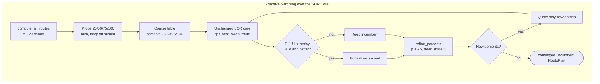

### 8.5 Hand-Worked Numeric Example
The example uses the teaching graph of §7.5 with the recipe's grid:
$A = 10\,000$ TKA $\to$ TKB, $H = 2$, $S = 2$, $\delta = 5$ ($G = 20$).
1. **Routes:** The same 4 routes as §7.5: `P_AB1`, `P_AB2`, `P_AC -> P_CB` and `P_AD -> P_DB`.
2. **Probe (25/50/75/100):** 16 entries cost 24 pool quotes: $2 \times 4$ one-hop quotes plus
   $2 \times 4 \times 2$ two-hop quotes. The ranking is identical at every probe, and all 4 routes
   are kept:

   | Route | 25 % | 50 % | 75 % | 100 % |
   |---|---|---|---|---|
   | `P_AC -> P_CB` | 3550 | 6779 | 9729 | 12434 |
   | `P_AD -> P_DB` | 2840 | 5423 | 7783 | 9947 |
   | `P_AB1` | 2431 | 4748 | 6957 | 9066 |
   | `P_AB2` | 2215 | 4377 | 6487 | 8546 |

   Hand check of the two 75 % / 25 % legs:
   - `P_AC` at $7500$:
     $$\Delta x_{\text{fee}} = 7500 \cdot 9970 = 74\,775\,000$$
     $$\Delta y = \lfloor 74\,775\,000 \cdot 200\,000 / (10^9 + 74\,775\,000) \rfloor = \lfloor 14\,955\,000\,000\,000 / 1\,074\,775\,000 \rfloor = 13914$$
   - `P_CB` at $13914$:
     $$\lfloor 20\,808\,387\,000\,000 / 2\,138\,722\,580 \rfloor = 9729$$
   - `P_AD` at $2500$:
     $$\lfloor 3\,738\,750\,000\,000 / 1\,024\,925\,000 \rfloor = 3647$$
   - `P_DB` at $3647$:
     $$\lfloor 4\,363\,270\,800\,000 / 1\,536\,360\,590 \rfloor = 2840$$
3. **Round 0 (coarse):** The table is exactly the probe entries, so it costs 0 new quotes (memo
   hits).
   - Seed: the best 100 % entry, `P_AC -> P_CB`, replays valid at $12434$. It is the first
     published incumbent.
   - The SOR core compares the pool-disjoint combinations:

     | Allocation | Gross (TKB) |
     |---|---|
     | 100 % (seed) | 12434 |
     | 50 / 50 | $6779 + 5423 = 12202$ |
     | 75 / 25 | $9729 + 2840 = \mathbf{12569}$ |

   - It selects `P_AC -> P_CB` @ 75 % + `P_AD -> P_DB` @ 25 %. The selection replays valid,
     and $12569 > 12434$ makes it the new incumbent.
4. **Round 1 (refine):** The basis is $\{75, 25\}$.
   - The proposal is $\{70, 80, 5\} \cup \{20, 30, 5\} = \{5, 20, 30, 70, 80\}$.
   - The 5 new percents across 4 routes add 20 entries and cost 30 quotes.
   - The core now finds 80 / 20: $10288 + 2293 = \mathbf{12581}$. That beats 75 / 25 and
     70 / 30 ($9160 + 3376 = 12536$), and it becomes the incumbent.
5. **Round 2 (refine):** The basis is $\{80, 20\}$.
   - The only new percents are $\{15, 85\}$: 8 entries and 12 quotes.
   - 85 / 15 ($10838 + 1737 = 12575$) does not win.
   - The selection is the already-seen 80 / 20, so the outcome is `unchanged`.
6. **Stop:** The basis $\{80, 20\}$ proposes nothing new, so the search stops with `converged`.
   The search sampled 11 of 20 percents (44 of 80 entries).
7. **Outcome and accounting:**
   - The plan is identical to §7.5: $8000 \to 14773 \to 10288$ and $2000 \to 2932 \to 2293$,
     for $\mathbf{12581}$ TKB.
   - It executed $24 + 30 + 12 = \mathbf{66}$ pool quotes. `uni_sor_port` needs **120** on the
     same 5 % grid.
   - The 34 memo hits are 24 coarse re-reads of probe entries plus 10 replay hops. Those hops
     come from 3 validations: the seed (2), 75 / 25 (4) and 80 / 20 (4).
8. **Where it loses: a narrow optimum.** The case uses the `NARROW` pools of
   `tests/routing/test_uni_sor_fast.py`: $A = 10^8$, $S = 4$, $\delta = 5$.
   - `uni_sor_port` selects `d1`@90 + `d0`@5 + `ax -> xb`@5 = $20\,795\,709$, using 80 quotes.
   - `uni_sor_adaptive` walks through these allocations:
     - coarse: `d1`@50 / `d0`@25 / `ax -> xb`@25;
     - refine: `d1`@75 / `ax -> xb`@20 / `d0`@5;
     - refine: `d1`@80 / `d0`@10 / `ax -> xb`@10.
   - It then stops (`converged`). No single-step neighbour improves, and 90 % is never sampled.
   - It returns a valid $20\,740\,242$ using 56 quotes. The loss is $55\,467$ raw units,
     or **26.67 bps**.
   - The loss is kept in the result, not hidden by the exact final replay.

### 8.6 Implementation Map
- Strategy adapter: `routing/algorithms/uni_sor_strategies.py`.
  - Recipe reader: `registered_settings` (line 84) reads the sha256-pinned arm, and
    `check_recipe` (line 122) refuses any other values.
  - Strategy table: `STRATEGIES` (line 166).
  - Preparation and solve: `_prepare` (line 260) and `_solve` (line 290).
  - Entry points: `prepare_adaptive` / `solve_adaptive` (lines 320–326).
  - Factory: `ADAPTIVE_FACTORY` (line 348).
- Heuristic engine: `routing/algorithms/uni_sor_fast.py`.
  - Setup: `prepare` (line 294) and `shortlist_routes` (line 323).
  - Refinement proposal: `refine_percents` (line 273).
  - Solver: `solve` (lines 367–969). It contains the probe/rank/shortlist block
    (lines 563–597), `validate` (line 603) and `sampled_search` (lines 648–811). The latter holds
    `run_round` (line 692), `consider` (line 720), `seed` (line 748) and `complete_grid`
    (line 764).
  - Table search and fallback: `search` (line 814) and the full-table fallback (lines 857–866).
- Profile integration: `benchmark/profile.py` WHI-1528 strategies section (line 418). The CLI
  selection is `--strategies all|base|optimized|profile` ([`strategy-groups.md`](strategy-groups.md)).

### 8.7 Parameters, Budgets, and Ties
- **Caller parameters:** The caller supplies `search.max_hops`, `search.max_splits` and
  `search.percent_step`. They are shared with the base strategies and are not part of the recipe.
  The grid must contain every recipe percent: `coarse_step` 25 must be a multiple of $\delta$, so
  $\delta \in \{1, 5, 25\}$. A profile with `percent_step: 10` is refused, never silently re-tuned.
- **Recipe values are fixed:** The profile loader and `prepare` both refuse any `shortlist` /
  `sampling` / `controls` value that differs from arm H3. Other settings belong to the
  profile-selected `uni_sor_fast`.
- **Budgets:**
  - If `max_candidates` is below the number of enumerated routes, the solve returns `timeout`
    before probing.
  - `max_quotes` is a hard limit. Exceeding it gives `timeout` with no plan; the last valid
    incumbent survives only as labelled metadata and through the candidate sink.
  - There is no soft cap (`soft_max_quotes: null`).
- **Ties:**
  - Entries follow the reference B-Q1 quote-list order (family V3, V2, MIXED, then DFS order),
    and the SOR core keeps its V8 sort emulation.
  - A new selection must score strictly better. The one exception: a combined selection
    replaces an equal-scoring full-input seed.
- **Statuses:**
  - Enumeration returns `unsupported` / `no_route` exactly as the reference does.
  - If there is no selection even over the full grid, the result is `no_route` or
    `incomplete_snapshot`.
  - If there are selections but none replays valid, the result is `invalid_plan`, and that plan
    is never published.

### 8.8 Computational and Memory Cost
- **Pool quotes:** probes $\sum_{\pi} \text{hops}(\pi) \cdot \lvert Q \rvert$, plus table entries
  $\sum_{\pi \in L} \text{hops}(\pi) \cdot \lvert S_{\text{final}} \setminus Q \rvert$, plus replay
  quotes for non-grid D-1 remainders.
  - Sampled entries are a subset of the reference table. Several incumbents may be replayed,
    though, so the evidence counts quotes against the reference per case and assumes no bound.
  - Measured: 66 vs 120 on the teaching graph; 12 vs 40 on the fixed-block request of §11;
    **0.467 ×** the reference's quotes over the L08 matrix.
- **CPU:** One SOR-core combination per round (at most $G$ rounds), each over
  $\lvert L \rvert \cdot \lvert S_k \rvert$ entries. Add one evaluator replay per new distinct
  selection.
- **Memory:** The sampled table holds at most $\lvert \Pi \rvert \cdot G$ entries. On the L08
  full-source matrix, cold solve peak was 171.0 MiB vs 268.7 MiB for `uni_sor_port`.
- **Timing:** The L08 sentinel warm median was 1.618 s vs 3.752 s for S0. That arm ran above the
  host-load rule, so the figure is a diagnostic only, never adoption evidence
  ([`latency-optimization-results.md`](latency-optimization-results.md) §3.4).

### 8.9 Guarantees and Limitations
- **Guarantees:**
  - Every returned plan is protocol-exact, funds the whole input, is pool-disjoint and is
    replayed by the independent evaluator.
  - No unvalidated plan is ever published.
  - Because 100 % is always sampled and the full-input seed is validated first, the result is,
    under a gross objective, never worse than the best valid full-input single route over the
    ranked routes.
  - With `coarse_step == percent_step`, a non-recipe setting, the first table is the full grid
    and the result is the L06 result whenever the combined selection replays valid and scores at
    least the seed. This always holds under a gross objective.
- **Limitations:**
  - The search stops at a local fixed point, not a global optimum (26.67 bps loss in §8.5).
  - It inherits `uni_sor_port`'s scope: no Liquidity Book (LB-only cases are `unsupported`) and
    zero gas scores (A-3).
- **Recorded scope (L08):** 0 held-out losses over 13 `ok` cases at 0.467 × quotes. That is no
  guarantee. The decision comparison was `inconclusive` (host load), so the disposition is
  **opt-in only, not a default**.

---

## 9. Algorithm 8: `uni_sor_optimized` (Optimized Recipe H4: Shortlist + Sampling + Exact Controls)

### 9.1 Problem and Inclusion Rationale
`uni_sor_adaptive` cuts the *percent* dimension of the SOR table. `uni_sor_optimized` stacks three
independent savings:

1. It cuts the **route** dimension with the L06 amount-aware shortlist.
2. It cuts the **percent** dimension with the same L07 sampling as §8.
3. It makes each concentrated-liquidity (CL) and Liquidity Book (LB) quote cheaper with the
   **exact** quote controls L02–L04. These change work, never results.

The recipe is L08 arm **H4**, which is H2 (L06 + L07) composed with L02–L04, without L05.
As in §8, the strategy is the unchanged `uni_sor_fast.solve` with frozen settings. It is
experimental, not a default, and carries no parity or loss-tolerance claim.

| Recipe setting | Value | Effect |
|---|---|---|
| `shortlist.probe_percents` | `[5, 100]` | Rank every route at 5 % and at 100 % of the input |
| `shortlist.routes_per_probe` | `8` | Keep the top 8 routes of each probe (at most 16 routes) |
| `shortlist.direct_routes` | `0` | No extra one-hop routes |
| `sampling` | `coarse_step 25, refine_radius 1, soft_max_quotes null` | Identical to §8 |
| `L02` | `skip_empty_spans: true` | Skip zero-liquidity, uninitialized CL bitmap words |
| `L03` | `tick_capacity 16384, bin_capacity 4096, per_solve` | Memoize tick and bin price math |
| `L04` | `max_keys 4096, max_checkpoints 262144, per_solve` | Reuse CL traversal prefixes across amounts |

### 9.2 Mathematical Model and Assumptions
- **Probe ranking:** For each probe $q \in \{5, 100\}$, the routes with a valid entry are ranked
  by `quote_adjusted_for_gas` in descending order. Gas scores are zero (A-3), so this is the raw
  quote. Ties follow the B-Q1 quote-list order.
- **Shortlist:**
  $$L = \text{top}_8(5) \cup \text{top}_8(100), \qquad \lvert L \rvert \le 16$$
  - Probing 100 % keeps the best full-input single route, SOR's B-S3 baseline.
  - Probing 5 % keeps routes that are poor at full size but best as a small split, such as a
    thin pool with a better price.
  - Nothing is ranked by TVL or spot price. The frozen bundle has no pool TVL, and TVL can miss
    profitable small splits.
- **Search:** The §8.2 sampling runs over $L \times S_k$ instead of all ranked routes.
- **Fallback:** If no route was ranked, or $L$ yields no complete selection even after grid
  completion, the full reference table over all routes is built and searched. It is
  deterministic and charged to the same solve. A shortlist failure is never reported as
  `no_route`.
- **Exact controls:** For every pool state $s$, direction and amount $x$,
  $\text{swap}_{\text{controlled}}(s, x) = \text{swap}_{\text{ref}}(s, x)$. The outcome is identical
  in amount, new state, logical steps and errors; only the executed work changes.
  - **L02:** While in-range liquidity is 0, a whole collected, all-zero bitmap word strictly
    before the price limit is stepped over. Those iterations move only price and tick, and they
    are still counted as logical steps.
  - **L03:** `getSqrtRatioAtTick(tick)` (CL) and `getPriceFromId(id, binStep)` (LB) are pure
    functions, so bounded memos return the stored integers.
  - **L04:** On one original CL state, a query of amount $A'$ repeats every *full* step whose
    cumulative gross input satisfies $C[i+1] \le A'$. Checkpoints are recorded after each full
    step. A query resumes at `bisect_left(C, A')` and lets the reference code run the partial
    step. Partial steps and errors are never cached.
- **Control lifetime:** Fresh instances are built inside each timed solve (`per_solve`) and
  installed into `pools.concentrated.swap` / `pools.liquidity_book.swap` for that solve only.
  The reference kernels are restored in a `finally`. The runner's independent evaluation runs in
  another process on the reference path.

### 9.3 Concise Pseudocode
```python
def solve_uni_sor_optimized(case, bundle, search, recipe_H4):
    controls = QuoteControls.fresh({"L02": ..., "L03": ..., "L04": ...})  # per solve
    with exact_controls.installed(controls):          # reference kernels restored in finally
        routes = compute_all_routes(...)              # unchanged, §7
        probe = build_route_quotes(routes, [5, 100], ...)
        shortlist = set()
        for q in (5, 100):
            ranked = sorted(entries_at(probe, q), key=lambda e: (-e.quote, bq1_order(e.route)))
            shortlist |= {e.route for e in ranked[:8]}  # union of the two top-8 lists
        result = adaptive_sampling(shortlist, search)  # §8.3 steps 2-4, over the shortlist
        if result.selection is None:
            result = adaptive_sampling(routes, search)  # full-table fallback, charged
    stats["strategy"] = controls.stats()             # memo / prefix counters of this solve
    return relabel(result, "uni_sor_optimized")
```

### 9.4 Architecture and Topology Diagram

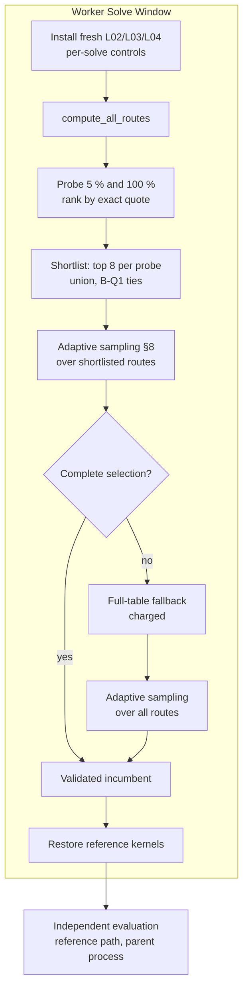

### 9.5 Hand-Worked Numeric Example
**(a) Teaching graph (same request as §8.5).**
- **Probes:** The 5 % and 100 % probes give 8 entries and cost 12 quotes. At 5 % the ranking is
  `P_AC -> P_CB` 738, `P_AD -> P_DB` 590, `P_AB1` 496, `P_AB2` 447. At 100 % it is 12434, 9947,
  9066, 8546. The graph has only 4 routes and $K = 8$, so the shortlist keeps everything
  (`search_scope = full_cohort`).
- **Sampling:** The rounds are exactly those of §8.5: coarse 75 / 25, then 80 / 20, then
  `converged` after sampling 11 percents. The result is the same $\mathbf{12581}$ plan.
- **Quote accounting:** The total is again **66** quotes, but split differently:

  | Phase | Quotes | Why |
  |---|---|---|
  | probe | 12 | 5 % and 100 % |
  | coarse | 18 | 25 / 50 / 75 are new; 100 % is memoized |
  | round 1 | 24 | 20 / 30 / 70 / 80 are new; 5 % is memoized |
  | round 2 | 12 | 15 / 85 |

  The 22 memo hits are 6 (100 %), 6 (5 %) and 10 replay hops.
- **Controls:** Every teaching pool is CPMM, so L02–L04 never run. The per-solve counters in
  `search.strategy` are all zero (`tick_math` misses 0, `prefix` queries 0). The controls change
  only CL/LB kernels.

**(b) Wide graph: the shortlist cuts a route, and the 5 % probe saves a thin pool.**
- **Setup:** Nine equal-price pools `D1`…`D9` with reserves $(k \cdot 10^6, k \cdot 10^6)$, plus
  one thin pool `T` with $(300\,000, 600\,000)$. All pools have 30 bps fees. The request is
  $A = 10^6$ A $\to$ B, with $H = 1$, $S = 2$ and $\delta = 5$.
- **Probe values:**
  - `T` at 5 %:
    $$\Delta x_{\text{fee}} = 50\,000 \cdot 9970 = 498\,500\,000$$
    $$\Delta y = \lfloor 498\,500\,000 \cdot 600\,000 / (3 \cdot 10^9 + 498\,500\,000) \rfloor = 85493$$
  - `T` at 100 %:
    $$\lfloor 5\,982\,000\,000\,000\,000 / 12\,970\,000\,000 \rfloor = 461218$$
  - `D9` at 5 %:
    $$\lfloor 4\,486\,500\,000\,000\,000 / 90\,498\,500\,000 \rfloor = 49575$$
  - `D1` at 100 %:
    $$\lfloor 9\,970\,000\,000\,000\,000 / 19\,970\,000\,000 \rfloor = 499248$$
- **Ranking:**

  | Rank | 5 % probe | 100 % probe |
  |---|---|---|
  | 1 | `T` 85493 | `D9` 897569 |
  | 2–8 | `D9` 49575 … `D3` 49035 | `D8` 886517 … `D2` 665331 |
  | 9 | `D2` 48637 (cut) | `D1` 499248 (cut) |
  | 10 | `D1` 47482 (cut) | `T` 461218 (cut) |

- **Shortlist:** The union is `D2`…`D9` plus `T`: 9 routes. `D1` is skipped
  (`candidates_truncated = 1`, `search_scope = shortlist`). `T` ranks last at full size but first
  at 5 %.
- **Sampling:**
  - The seed is `D9` @ 100 % = 897569.
  - Coarse: `D9`@75 + `T`@25 = $690\,390 + 272\,280 = 962\,670$.
  - Refine: `D9`@80 + `T`@20 = $972\,236$.
  - Refine: `D9`@85 + `T`@15 = $774\,520 + 199\,599 = \mathbf{974\,119}$.
  - Refine: $\{10, 90\}$ gives `D9`@90 + `T`@10 = $965\,611$, which does not win.
  - The search stops with `converged`.
- **Outcome:** The result equals `uni_sor_port`: `D9` receives 850000 and returns 774520; `T`
  receives 150000 and returns 199599.
- **Quote accounting:**

  | Algorithm | Quotes | Breakdown |
  |---|---|---|
  | `uni_sor_port` | 200 | $10 \times 20$ |
  | `uni_sor_adaptive` | 130 | 40 probe + 90 table |
  | `uni_sor_optimized` | **119** | 20 probe + $9 \times 11$ table |

- **Counterfactual (not the recipe):** This shows why the 5 % probe exists. `uni_sor_fast` with
  `probe_percents: [100]` and $K = 8$ keeps only `D2`…`D9`, drops `T`, and returns `D9`@55 +
  `D8`@45 = $941\,683$ using 74 quotes. That is a loss of $32\,436$ raw units, or
  **332.98 bps**.

**(c) Recorded losses.**
- The L08 matrix recorded two real held-out losses, 1.125 bps and 1.095 bps, both on
  `09bc4e`-`201eba` cases.
- Both come from the shortlist. Sampling added none (H1 $\to$ H2), and H3, which keeps every
  ranked route, has none.

### 9.6 Implementation Map
- Strategy adapter: `routing/algorithms/uni_sor_strategies.py`.
  - `_controls` (line 233) validates the recipe's control settings.
  - `_solve` (line 290) wraps `uni_sor_fast.solve` in `exact_controls.installed(QuoteControls.fresh(...))`.
  - Entry points: `prepare_optimized` / `solve_optimized` (lines 328–334).
  - Factory: `OPTIMIZED_FACTORY` (line 349).
- Shortlist: `routing/algorithms/uni_sor_fast.py`.
  - `shortlist_routes` (line 323) ranks and takes the per-probe union.
  - The probe block is at lines 563–597, and the full-table fallback at lines 857–866.
- Control installer: `pools/exact_controls.py`.
  - Control keys: `QUOTE_CONTROL_KEYS` (line 32).
  - `QuoteControls.fresh` / `stats` (line 44) and `installed` (line 74).
  - The same code serves the L08 driver.
- Control kernels: `pools/concentrated.py` `swap(..., skip_empty_spans, math_reuse, prefix_reuse)`,
  `pools/cl_math.py` `TickMathReuse`, `pools/liquidity_book.py` `BinMathReuse`, and
  `concentrated.CLPrefixReuse`.
- Contracts: [`latency-l02-empty-cl-spans.md`](latency-l02-empty-cl-spans.md),
  [`latency-l03-math-reuse.md`](latency-l03-math-reuse.md),
  [`latency-l04-prefix-reuse.md`](latency-l04-prefix-reuse.md) and
  [`latency-l06-sor-shortlist.md`](latency-l06-sor-shortlist.md).

### 9.7 Parameters, Budgets, and Ties
- **Caller parameters:** They are the same caller-owned `search.*` values as §8.7. The 5 % probe
  must be a grid percent, so $\delta \in \{1, 5\}$. Under `--strategies all|optimized`, a
  `percent_step` that does not divide 5 is refused before any worker starts.
- **Recipe values are fixed:** Changing the probes, $K$, the sampling or the control settings is
  refused under this name.
- **Budgets:** `max_candidates` counts *enumerated* routes, because all of them must be probed.
  The `max_quotes` hard limit and the absent soft cap behave as in §8.7. A budget interruption
  during the fallback reports the planned scope, not completed coverage.
- **Ties:** Probe ranks break ties by B-Q1 order, and a route's best rank over the probes decides
  `direct_routes` (unused here, $d = 0$). Selection ties follow §8.7.

### 9.8 Computational and Memory Cost
- **Pool quotes:** probes $\sum_{\pi \in \Pi} \text{hops}(\pi) \cdot 2$, plus the sampled table over
  at most 16 shortlisted routes, plus replay quotes. The probe cost is the only term that grows
  with $\lvert \Pi \rvert$.
  - With a fallback, the full-table work is added and charged.
  - Measured: 66 vs 120 (teaching graph), 119 vs 200 (wide graph), 12 vs 40 (§11) and
    **0.152 ×** the reference's quotes over the L08 matrix.
- **Per-quote work:** L02–L04 remove executed CL iterations, tick/bin price computations and
  repeated full steps. On the WHI-1504 L01 records, L02 alone executed 6.26 M of 36.00 M logical
  CL iterations. The controls do not change the number of pool quotes: H2 $\to$ H4 has identical
  quotes and 0 semantic mismatches.
- **Memory:** The table holds at most $16 \cdot G$ entries (plus a fallback). The controls are
  bounded by 16384 tick entries, 4096 bin entries, and 4096 keys / 262144 checkpoints per solve,
  and they are discarded after it. The L08 full-source cold peak was 41.0 MiB vs 268.7 MiB for
  `uni_sor_port`.
- **Timing:** The L08 sentinel warm median was 0.120 s vs 3.752 s for S0. H4 ran at 100 % of
  samples above the load threshold, so this is a diagnostic only, never adoption evidence.

### 9.9 Guarantees and Limitations
- **Guarantees:**
  - Everything in §8.9 holds.
  - The controls are exact: identical outcomes, and H2 $\to$ H4 has 0 mismatches in every stage.
  - The controls never reach the independent evaluation or any base strategy's worker.
  - The best full-input single route is always shortlisted.
  - A shortlist failure falls back to the full table and is never reported as `no_route`.
- **Limitations:**
  - The shortlist ranks *single-route* quotes at only two sizes. A route that is outside the top
    8 at both sizes but useful inside a combination is skipped (§9.5 (b)). This caused the
    recorded L08 held-out losses of ≤ 1.125 bps.
  - $K$ is fixed at 8, and there is no TVL signal.
  - The §8.9 local-fixed-point limitation also applies.
  - The controls help only CL/LB pools, and their lifetime is per solve only (no cross-solve
    cache).
- **Recorded scope (L08):** The disposition is **opt-in only, not a default**. The decision
  comparisons were `inconclusive` (host load), and any quality loss needs the owner's explicit
  acceptance.

---

## 10. Algorithm 9: `metis_inspired` (Experimental Hop-Layered Label Search per Chunk)

### 10.1 Problem and Inclusion Rationale
For every chunk, `incremental_graph` scores **every** enumerated cycle-free path. That number
grows roughly as the product of the parallel-pool counts along each hop, so deep hop bounds
become expensive. Jupiter's archived Metis post (J1) describes a "heavily modified"
Bellman-Ford variant that combines route generation and quoting. It does not describe the
modifications, and no Metis routing source is public.

`metis_inspired` tests one narrow, falsifiable hypothesis, H-M1
([`jupiter-metis-challenge.md`](jupiter-metis-challenge.md) §9). The hypothesis: keep
`incremental_graph` exactly, and replace only its per-chunk path choice with a **hop-layered,
quote-driven label search** in the textbook Bellman-Ford shape (W1).

- **Identity:** It is an experimental Python variant, **NOT Jupiter Metis**. It carries no
  production-equivalence, global-optimality or source-parity claim. Every label rule below is
  this repository's inference (*[inferred]* in the contract), not a Metis fact.
- **Group:** In the CLI it is in the *Experimental and other strategies* group (WHI-1540). It is
  neither a seventh base reference nor an SOR optimization
  ([`strategy-groups.md`](strategy-groups.md)).
- **Recorded verdict (WHI-1449):** **keep, experimental opt-in**. It is not a default
  ([`metis-challenge-results.md`](metis-challenge-results.md)).

| Setting (`graph.*`, explicit, no default) | Meaning |
|---|---|
| `chunks` | Chunk count $K$, exactly as in `incremental_graph` |
| `label_hops` | Label-layer depth $H_L \ge$ `search.max_hops`; only the chunk search uses it |
| `label_pruning` | `true` = label search; `false` = the disabled-mechanism ablation (`incremental_graph`'s own per-chunk enumeration at $H_L$ hops) |

There is no k-best label count and no other knob.

### 10.2 Mathematical Model and Assumptions
Everything outside the per-chunk choice is §6.2 unchanged:

- integer chunks $\Delta_k$ with carry;
- aggregate accounting $f_p(x_p + d) - f_p(x_p)$ on the pools' original states;
- atomic `creates_cycle` admission;
- one merged `SwapStep` per pool;
- the independent evaluator replay;
- the retained simpler `path_split` candidate at `search.max_hops`, which is kept unless the
  incremental plan scores strictly better.

**Edge marginal.** With committed flows $x_e$ and $f_e(x_e)$, one edge of a chunk that carries
$m$ units of its input token has the marginal
$$g_e(m) = f_e(x_e + m) - f_e(x_e).$$
A zero $m$ makes no pool call. A failing or partial quote, or an output below the committed
one (`nonmonotone`), yields no label and is counted.

**Labels.** $L_k[t] = (a, \pi)$ is the one label per token $t$ reached in **exactly** $k$ hops.
It holds the largest chunk marginal $a$ found at $t$ and its path $\pi$.

- Initialization: $L_0 = \{S : (\Delta, ())\}$, where $\Delta$ is the chunk amount including
  carry.
- Relaxation of layer $k$ from layer $k-1$ only (never in place): for every label $(a, \pi)$
  at $t \in L_{k-1}$, in token insertion order, and every edge $e = (t \to v)$, in the bundle's
  adjacency order, the candidate label is
  $$(g_e(a),\ \pi \cdot e).$$
- A candidate is skipped **before** its quote when any of these holds:
  - $v = S$ (never back to the source);
  - $v \in \text{tokens}(\pi)$ (token-simple; counted as `label_skipped_revisit`);
  - $v \ne D$ and $\text{dist}(v) > H_L - k$ (target out of reach; `label_pruned_distance`);
  - `creates_cycle(committed token edges, \pi \cdot e)` (atomic over the prefix;
    `label_rejected_cycle`).
- $\text{dist}(v)$ is the breadth-first pool-hop distance to $D$ on the graph without edges into
  $S$ or out of $D$. It is a lower bound on every token-simple completion, so this prune is
  exact: it removes only prefixes that no enumerated path extends.
- **Dominance (strict):** $L_k[v]$ is replaced only if the new marginal is **strictly** larger.
  On a tie, the label found first is kept. A relaxation into $D$ competes, strictly, for the
  chunk's choice. The target is never expanded further.

**Why it usually agrees with enumeration** (§9.3 of the contract, checked empirically by gate
S2).

- With the committed state fixed, $g_e(m)$ is nondecreasing in $m$ for exact-input AMMs.
- A larger amount at $t$ therefore does at least as well on every admissible, non-failing
  continuation from $t$.
- For $H_L \le 3$, token-simple pruning can never remove a needed continuation. Every
  relaxation is a prefix that `incremental_graph` also quotes at the same amount, so the label
  search's quotes are a subset of the reference's.

**Divergence classes** (a chunk choice can differ from exhaustive enumeration only by):

1. **tie** — several paths share the maximal marginal, and the orders differ;
2. **non-downward-closed quote failure** — the maximal label's larger amount makes a later edge
   fail, while a dominated smaller amount would succeed;
3. **budget order** — `max_quotes` / `max_candidates` truncate at a different point;
4. **token-revisit pruning**, $H_L \ge 4$ only — the best prefix to $v$ visits a token that the
   best continuation needs (§10.5 step 8);
5. **prefix-dependent admission** (4b), $H_L \ge 4$ only — the best prefix's token edges close a
   committed cycle on a continuation that a dominated prefix could take.

### 10.3 Concise Pseudocode
```python
def solve_metis_inspired(case, bundle, max_hops, label_hops, label_pruning, chunks_K, cache):
    retained = solve_path_split(..., max_hops=max_hops)       # simpler candidate, unchanged
    dist = hops_to_target(index, case.token_in, case.token_out)  # structural BFS, exact prune
    flows, token_edges, carry = {}, set(), 0
    for k, chunk in enumerate(chunk_amounts(case.amount_in, chunks_K)):
        if chunk == 0:
            continue
        amount = carry + chunk
        choice = (choose_labels(amount, label_hops, dist) if label_pruning
                  else choose_enumeration(amount, enumerate_paths(..., label_hops)))
        ...                                                    # carry / commit / abandon: §6.3
    return select_best(retained, evaluate(merged_plan(case, flows)))

def choose_labels(amount, H, dist):
    layers, best = [{S: Label(amount, path=(), tokens={S})}], None
    for k in range(1, H + 1):
        layer = {}
        for t, lab in layers[k - 1].items():               # insertion order
            for e in index.edges_from(t):                  # adjacency order
                v = e.token_out
                if v == S:                          continue
                if v != D and dist.get(v, H + 1) > H - k:  continue   # label_pruned_distance
                if v in lab.tokens:                 continue           # label_skipped_revisit
                p = lab.path + (e,)
                if creates_cycle(token_edges, p):   continue           # label_rejected_cycle
                result = marginal_edge(e, lab.amount)                  # one guarded quote
                if result is FAILED:                continue           # counted failure
                m, update = result
                if v == D:
                    if best is None or m > best.marginal:              # strict
                        best = (m, p, lab.updates + [update])
                elif v not in layer or m > layer[v].amount:           # strict dominance
                    layer[v] = Label(m, p, lab.updates + [update], lab.tokens | {v})
        layers.append(layer)
    return best
```

### 10.4 Architecture and Topology Diagram

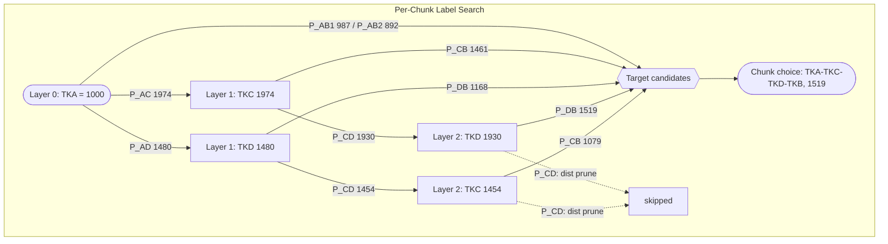

### 10.5 Hand-Worked Numeric Example
The example uses the teaching graph of §6.5: $A = 10\,000$ TKA $\to$ TKB, $K = 10$ chunks of
$1\,000$, `search.max_hops` 3, `label_hops` 3, `label_pruning` true.

1. **Structural distances:** `dist` = {TKB: 0, TKC: 1, TKD: 1}.
2. **Chunk 1, layer 1:** 4 relaxations from TKA, each quoting $1\,000$ TKA.
   - `P_AC`:
     $$\Delta x_{\text{fee}} = 1000 \cdot 9970 = 9\,970\,000$$
     $$\Delta y = \lfloor 9\,970\,000 \cdot 200\,000 / (10^9 + 9\,970\,000) \rfloor = \lfloor 1\,994\,000\,000\,000 / 1\,009\,970\,000 \rfloor = 1974$$
   - The layer holds TKC = 1974 (`P_AC`) and TKD = 1480 (`P_AD`).
   - The target candidates are `P_AB1` 987 and `P_AB2` 892.
3. **Chunk 1, layer 2:** 4 relaxations.
   - From TKC 1974:
     - `P_CB` $\to$ TKB = 1461;
     - `P_CD` $\to$ TKD:
       $$\lfloor 19\,680\,780 \cdot 100\,000 / (10^9 + 19\,680\,780) \rfloor = \lfloor 1\,968\,078\,000\,000 / 1\,019\,680\,780 \rfloor = 1930$$
   - From TKD 1480:
     - `P_DB` $\to$ TKB = 1168;
     - `P_CD` $\to$ TKC = 1454.
   - The layer holds TKD = 1930 (via TKC) and TKC = 1454 (via TKD). These are layer-2 labels.
     They do not compete with the layer-1 labels of the same tokens.
4. **Chunk 1, layer 3:** Only edges into TKB survive. `P_CD` out of either label has
   $\text{dist} = 1 > 3 - 3$, so both are distance-pruned (2 skips).
   - TKD 1930 $\to$ `P_DB`:
     $$\lfloor 19\,242\,100 \cdot 120\,000 / (1.5 \cdot 10^9 + 19\,242\,100) \rfloor = \lfloor 2\,309\,052\,000\,000 / 1\,519\,242\,100 \rfloor = \mathbf{1519}$$
   - TKC 1454 $\to$ `P_CB` = 1079.
   - The chunk choice is the maximum over the six target candidates
     $\{987, 892, 1461, 1168, 1519, 1079\}$: `TKA -[P_AC]-> TKC -[P_CD]-> TKD -[P_DB]-> TKB`,
     marginal **1519**. This is exactly `incremental_graph`'s chunk-1 choice.
   - Work: **10 relaxations** ($4 + 4 + 2$) vs **6 enumerated paths**, both with 10 executed
     quotes.
5. **Remaining chunks and the plan:**
   - Later chunks see the committed aggregates. For example, chunk 2's best marginal is
     `P_AC -> P_CB` at 1433.
   - The chunk sequence is `[0, 1, 1, 0, 1, 1, 1, 0, 1, 1]`, identical to §6.5.
   - The merged plan is also identical: `P_AC` 10000 $\to$ 18132, then 5562 / 12570 split at TKC,
     for $\mathbf{12892}$ TKB.
   - The S2 diagnostic classifies all 10 chunks as `agree`, with 0 quote-subset violations.
   - Totals are 82 relaxations (9 cycle-rejected, 11 distance-pruned) vs `incremental_graph`'s
     51 scored paths, and 128 quotes on both sides.
   - **On this 4-token graph the label search does not save anything.** The two work units
     differ (relaxations vs paths) and are never compared as the same unit.
6. **Where it saves work: parallel pools (fixture X1).**
   - Setup: $k = 3$ parallel CPMM pools on every hop of S–B–C–D, plus one shallow S–D pool;
     10 chunks, $H_L = 3$.
   - Per chunk, the label search relaxes $3k + 1 = 10$ edges: $k$ S→B plus the direct pool,
     $k$ B→C, and $k$ C→D. It distance-prunes the $k$ C→B edges.
   - Enumeration scores $k^3 + 1 = 28$ paths per chunk.
   - Totals: 100 relaxations vs 280 paths, and 848 vs 1011 quotes. Plan and gross are identical
     (9692524563).
7. **Where it gains: a 4-hop-only route (fixture X3).**
   - Setup: deep 5 bps pools only along S–B–C–E–D, plus a shallow direct S–D pool;
     $A = 10^{10}$, 1 chunk.
   - `incremental_graph` at 3 hops can use only the direct pool: 4992488733.
   - `metis_inspired` with `label_hops` 4 takes the 4-hop path:
     $10^{10} \to 9994900100 \to 9989802852 \to 9984708255 \to \mathbf{9979616307}$.
   - The embedded `path_split` candidate stays at `search.max_hops` 3.
8. **Where it loses: token-revisit pruning (fixture X4, $H_L = 4$).**
   - Setup: $A = 10^9$. The best 2-hop label at X runs S–Y–X ($19\,979\,965\,070$), which
     dominates S–A–X ($9\,989\,982\,535$).
   - The best 4-hop path S–A–X–Y–D needs X→Y, and the dominant label already visits Y.
   - The label search skips it (`label_skipped_revisit` 2) and returns the 2-hop S–Y–D:
     $998\,998\,253$.
   - The ablation (`label_pruning: false`) finds $\mathbf{1\,995\,991\,039}$, a loss of
     **4994.98 bps** on this constructed case.
   - This heuristic limit is accepted, not repaired. A k-best label list would repair it, but it
     would be an unsourced extra parameter.

### 10.6 Implementation Map
- File: `routing/algorithms/metis_inspired.py`
- Settings: `GRAPH_PARAMS` (line 115); `prepare(bundle, config)` (line 206) validates the explicit
  bool / integer settings and `label_hops >= search.max_hops`.
- Structural prune: `hops_to_target(index, source, target)` (line 229).
- Label record: `Label` (line 269).
- Chunk choosers: `_Allocator` (line 283).
  - `step` (line 312) is the edge marginal rule.
  - `choose_enumeration` (line 356) is the ablation.
  - `choose_labels` (lines 382–427) is the mechanism.
  - `commit` (line 429).
- Solver: `solve(case, context, budget)` (lines 446–658).
- S2 diagnostic: `diagnose_case(case, bundle, prepared)` (line 721) and `_attribute` (line 682).
  This is a separate correctness pass; `solve` never calls it.
- CLI settings under `--strategies all`: `benchmark/strategies.py` `metis_graph_settings`
  (line 142). It reads the sha256-pinned `config/metis_challenge/m4.yaml`.
- Contract and results: [`jupiter-metis-challenge.md`](jupiter-metis-challenge.md) §§9–10 and
  [`metis-challenge-results.md`](metis-challenge-results.md). Fixtures X1–X7 and X4b are in
  `tests/routing/test_metis_inspired.py`.

### 10.7 Parameters, Budgets, and Ties
- **Parameters:** `search.max_hops`, `search.max_splits` and `search.percent_step` (for the
  retained `path_split`), plus `graph.chunks`, `graph.label_hops` and `graph.label_pruning`.
  - Under `--strategies all`, a value the source profile declares wins.
  - Undeclared values come from the registered arm M4: `label_hops` 4, `label_pruning` true,
    and `chunks` 50 only if the source has none.
  - `config/daily_gross.yaml` therefore runs `metis_inspired` at 4 label hops while the others
    search at most 2 hops. The report prints this different hop domain.
  - A source with `search.max_hops` > 4 and no `label_hops` is refused, not lowered.
- **Budgets:**
  - `max_quotes` is checked before the meter. A cut is declared truncation and yields
    `timeout` when no valid route exists, never `no_route`.
  - In label mode, `Budget.max_candidates` caps **relaxations per chunk** (a declared unit
    change). In ablation mode it caps paths per chunk.
- **Ties:** Dominance and the target choice are strict, so the earlier label wins. Tokens
  expand in insertion order and edges in adjacency order, which is deterministic across
  processes. The final plan is kept only if it scores strictly better than the retained
  simpler candidate.
- **Ablation identity (X7):** With `label_pruning: false` and `label_hops == search.max_hops`,
  the whole solve equals `incremental_graph`: plan, evaluation, statuses and every logical
  counter.

### 10.8 Computational and Memory Cost
- **Relaxations per chunk:**
  $$\sum_{k=1}^{H_L} \sum_{t \in L_{k-1}} \deg^{+}(t) \quad \text{(minus skips)}$$
  Each layer holds at most one label per token, so this is bounded by
  $H_L \cdot \lvert T \rvert \cdot \deg_{\max}$. Enumeration's $\lvert \Pi_{H_L} \rvert$ can grow
  exponentially with $H_L$.
- **Quotes:** $\text{Quotes}(\text{path\_split})$ plus at most one quote per relaxation, through
  the shared `QuoteCache`.
- **Measured (WHI-1449 tuning split, 96 cases, different units):**

  | Arm | Work unit | Median work | Median quotes | Max solve (s) |
  |---|---|---|---|---|
  | A0 (`incremental_graph`, 3 hops) | `paths_scored` | 218,591 | 27,175.5 | 51.8 |
  | M3 (label, 3 hops) | `label_relaxations` | 9,229.5 | 17,491.5 | — |
  | M4 (label, 4 hops) | `label_relaxations` | 13,080.5 | 19,945 | 20.0 |
  | M4-off (enumeration, 4 hops) | `paths_scored` | 1,778,207.5 | 116,745 | 270.9 |

  M3 did less work than A0 on 96/96 cases and executed at most as many quotes on 96/96.
- **Memory:** $H_L + 1$ layers of at most $\lvert T \rvert$ labels. Each label stores its path and
  pool-flow updates, so the size is $\mathcal{O}(H_L^2 \cdot \lvert T \rvert)$. The committed flows
  are $\mathcal{O}(P)$ and chunk allocations $\mathcal{O}(K)$. There is no path list in label mode.

### 10.9 Guarantees and Limitations
- **Guarantees:**
  - Every plan is protocol-exact, merged per pool, independently replayed and fully filled.
  - It is never worse than the retained `path_split` candidate on objective score.
  - For $H_L \le 3$, every relaxation is a prefix the reference quotes. S2 found 0 unexplained
    chunks (4,588 agree, 212 tie over 4,800 chunks).
- **Limitations:**
  - It is a greedy chunk heuristic, like §6.
  - For $H_L \ge 4$, token-revisit and prefix-admission losses are accepted (§10.5 step 8;
    fixture X4b).
  - A non-downward-closed quote failure can hide a path that enumeration finds (fixture X2).
  - The recorded held-out effect is small: 132 wins, 48 losses and 121 ties over 301 paired
    cases (p = 2.93 × 10⁻¹⁰), paired median 0 bps, mean +1.41 bps. It is gross-only and comes
    from one block.
  - That comparison changed the mechanism and the hop bound together, so the gain is not
    attributed to the label mechanism alone. The unpruned 4-hop search also finished (S4), so
    pruning is not what made 4 hops tractable.

---

## 11. Real-State Fixed-Block Walkthrough (Block 101082044)

To demonstrate how these strategies behave on real blockchain liquidity, we execute all fourteen
`--strategies all` strategies (six base, two optimized, `metis_inspired` and the five 0.2.1
experimental identities) against the verified frozen Mantle snapshot
`mantle-5src-101082044-091b0759-fixture`:
- **Parent Bundle:** `mantle-5src-101082044-091b0759-fixture`
- **Bundle Hash:** `5401b1de8c83a3527e5f9b5afae4510a760f171f2b306d49dbb5c830256c9ad0`
- **Block:** 101082044
- **Block Hash:** `0x091b0759c9d3031f30658cdfa8bf4cd5ed311ece986e3c91eb1eeb121b2b65c4`
- **Request:** $10\,000$ USDC $\to$ USDT0
  - In: `0x09bc4e0d864854c6afb6eb9a9cdf58ac190d0df9` (decimals: 6, raw: `10000000000`)
  - Out: `0x779ded0c9e1022225f8e0630b35a9b54be713736` (decimals: 6)
- **Profile:** `config/daily_gross.yaml` (sha256 `577b43ebc2d2`), `gross_only` development mode
- **Scope:** 19 admitted pools across 5 sources: agni_v3 (6), fusionx_v3 (2), moe_classic_v1 (3), moe_lb_v2_2 (7), uniswap_v3 (1).
- **Execution Command:**
  ```bash
  uv run python main.py quote \
    --bundle tests/fixtures/corpus/bundle \
    --profile config/daily_gross.yaml \
    --token-in USDC --token-out USDT0 --amount 10000 --details
  ```
  `--strategies all` is the default. It runs the profile's six base strategies, then
  `uni_sor_adaptive` and `uni_sor_optimized`, then `metis_inspired`, then `metis_history`,
  `direct_split_certified`, `incremental_graph_repair`, `uni_sor_cycle_safe` and `cfmm_dual`,
  one after the other, each in its own isolated worker and with exactly one solve attempt.
  `--strategies base` reproduces the six-row table.
- **`metis_inspired` settings:** the profile's `search.*`, budget and `graph.chunks: 200`, plus
  `label_hops: 4` and `label_pruning: true` from the pinned arm `config/metis_challenge/m4.yaml`.
  Its chunk search therefore reaches 4 hops while the others search at most 2. This is a
  different hop domain, and it is not the frozen WHI-1449 M4 arm. `metis_history` receives the
  same `chunks` and `label_hops` (it does not read `label_pruning`).
- **0.2.1 settings:** the source configures none of the five, so `all` writes each identity's
  pinned current preset into the effective profile:

  | Identity | Options source | `settings_sha256` |
  |---|---|---|
  | `metis_history` | `config/metis_history/preset_v1.yaml` v1 (`history`, 1 label per signature, 1,024 frontier labels) | `183bb1ff…` |
  | `direct_split_certified` | `config/direct_split_certified/preset_v1.yaml` v1 (`repository_grid`, 100,000 / 100,000 nodes) | `03cfe301…` |
  | `incremental_graph_repair` | `config/incremental_graph_repair/preset_v1.yaml` v1 (`repair: true`, 4, 2, 8) | `89af5028…` |
  | `uni_sor_cycle_safe` | `config/uni_sor_cycle_safe/preset_v1.yaml` v1 (`{}`) | `44136fa3…` |
  | `cfmm_dual` | `config/cfmm_dual/preset_v2.yaml` v2, the current CL stage (`constant_product+concentrated`) | `aa6eea57…` |

  The historical `cfmm_dual/1` CPMM-only preset is not one of the 14 rows; it runs only through
  the explicit profile `config/cfmm_dual/cpmm.yaml` (§11.3 item 10).

*Classification:* This is an **exploratory single request** evaluated on a checked-in 19-pool fixture
subset, not a held-out corpus result. The fixture is not the full frozen corpus (whose tuning
bundle alone has 143 pools). The `quote` command solves on a derived single-case request bundle of
the same 19 pools (it records that bundle's own hash); `r021_examples.py` section 17 re-runs the
same 14 rows in process on the fixture itself and checks each gross against the exact protocol
quotes below.

### 11.1 Summary Comparison Table

| Algorithm | Status | Evaluated Gross (USDT0) | Gross Raw Units | Quotes Counted | Trace Characteristics |
|---|---|---|---|---|---|
| `direct` | `ok` | 10000.660449 | 10000660449 | 4 | 100% Agni V3 pool `0x36f6...` |
| `single_path` | `ok` | 10000.660449 | 10000660449 | 4 | 100% Agni V3 pool `0x36f6...` |
| `direct_split` | `ok` | 10000.660449 | 10000660449 | 80 | 100% Agni V3 (split rejected by DP) |
| `path_split` | `ok` | 10000.660449 | 10000660449 | 80 | 100% Agni V3 (multi-hop splits unviable) |
| `incremental_graph` | `ok` | **10000.663447** | **10000663447** | 264 | **99.5% Agni V3 + 0.5% Moe LB** |
| `uni_sor_port` | `ok` | 10000.660449 | 10000660449 | 40 | 100% Agni V3 (LB pool excluded) |
| `uni_sor_adaptive` | `ok` | 10000.660449 | 10000660449 | **12** | 100% Agni V3 (6 of 20 percents sampled) |
| `uni_sor_optimized` | `ok` | 10000.660449 | 10000660449 | **12** | 100% Agni V3 (L02–L04 installed; result unchanged) |
| `metis_inspired` | `ok` | **10000.663447** | **10000663447** | 264 | **99.5% Agni V3 + 0.5% Moe LB** (same plan as `incremental_graph`) |
| `metis_history` | `ok` | **10000.663447** | **10000663447** | 264 | Same plan as `incremental_graph`; `termination: complete` (no label dropped) |
| `direct_split_certified` | `unsupported` | N/A | N/A | 0 | Direct pools are CL + CPMM + LB: `non_constant_product_direct_pool`, no plan, no certificate |
| `incremental_graph_repair` | `ok` | **10000.663447** | **10000663447** | 265 | Incumbent kept: one `duplicate` and one `rejected_worse` repair attempt |
| `uni_sor_cycle_safe` | `ok` | 10000.660449 | 10000660449 | 40 | 100% Agni V3; 0 cycle rejections, `reference_trajectory: identical` |
| `cfmm_dual` | `ok` | 10000.660449 | 10000660449 | 1 | 100% Agni V3; CL stage `cfmm_dual/2`, markets Agni V3 + one Moe Classic pool, `converged`, bound `estimate` |

The gross values are checked by `r021_examples.py` section 17 against independent exact protocol
quotes: Agni V3 at the full input gives 10000660449, and Agni V3 at 9950000000 plus the Moe LB
pool at 50000000 give $9950659893 + 50003554 = 10000663447$. The quote counts are the runner's
per-row counters of this run (factory-reported, not independently derived); they are not a
performance comparison.

### 11.2 Execution Order and Fund Ledger Trace

#### The Baseline Plan (`direct`, `single_path`, `direct_split`, `path_split`, `uni_sor_port`, `uni_sor_adaptive`, `uni_sor_optimized`)
The 0.2.1 rows `uni_sor_cycle_safe` and `cfmm_dual` return this same one-step plan
(`cfmm_dual` names its output fund `F1` instead of `OUT`).
```
Step 0: agni_v3 pool 0x36f66548cda219c6fc037037cee063b9f28b13ef
  Token In:  USDC (0x09bc4e0d864854c6afb6eb9a9cdf58ac190d0df9)
  Token Out: USDT0 (0x779ded0c9e1022225f8e0630b35a9b54be713736)
  Input:     REQUEST 10000000000 raw (10,000 USDC)
  Output:    OUT 10000660449 raw (10000.660449 USDT0)
Terminal Total: 10000660449 raw
Residuals: None. Reconciled exactly.
```

#### The Incremental Split Plan (`incremental_graph`, `metis_inspired`)
The 0.2.1 rows `metis_history` and `incremental_graph_repair` return this same two-step plan. The
fresh replay's fund ledger: `REQUEST` produced 10000000000 and consumed 10000000000; `F1` and
`F2` are terminal USDT0 funds of 9950659893 and 50003554.
```
Step 0: agni_v3 pool 0x36f66548cda219c6fc037037cee063b9f28b13ef
  Input:     REQUEST 9950000000 raw (99.5% = 9,950 USDC)
  Output:    F1 9950659893 raw (9950.659893 USDT0)
Step 1: moe_lb_v2_2 pool 0x368b148052a1a775dbe70e56d04474e54c694cac
  Input:     REQUEST ALL_REMAINING (0.5% = 50 USDC = 50000000 raw)
  Output:    F2 50003554 raw (50.003554 USDT0)
Terminal Total: 9950659893 + 50003554 = 10000663447 raw
Residuals: None. Reconciled exactly.
```

#### The Unsupported Row (`direct_split_certified`)
```
Status:  unsupported (scope reason non_constant_product_direct_pool)
Direct pools USDC/USDT0: agni_v3 (concentrated), moe_classic_v1 (constant product),
                         2 x moe_lb_v2_2 (liquidity book)
Plan: none. Quotes: 0. Certificate: null (not_produced).
```
The row stays in the table. Certifying only the constant-product subset would prove a different,
smaller domain next to `direct_split` rows that use all four pools (§15.1).

### 11.3 Analysis of Real-World Behavior
1. **Marginal Exploitation:** `incremental_graph` identified that Merchant Moe Liquidity Book pool
   `0x368b...` possessed an extremely favorable active bin exchange rate for the first $50$ USDC,
   capturing a marginal gain of $+2998$ raw base units ($+0.003\text{ bps}$, calculated as
   $2998 / 10000660449 \times 10000 \approx 0.003\text{ bps}$) over the dominant Agni V3 pool.
2. **Contract-Enforced Boundary:** `uni_sor_port` evaluated 2 candidate routes: 1 direct Agni V3
   route and 1 direct Merchant Moe Classic V2 route. Across 20 percentage buckets (5% to 100%),
   it quoted $2 \times 20 = 40$ times. Contract Deviation D-4 explicitly excludes Liquidity Book
   pools, accurately mirroring upstream Uniswap SOR behavior on non-Uniswap concentrated architectures.
3. **Adaptive Sampling Stops After One Refinement:** Both optimized strategies search the same
   2 routes as `uni_sor_port`, but they sample only 6 of the 20 percents: $2 \times 6 = 12$ quotes
   instead of 40.
   - `uni_sor_adaptive` probes 25/50/75/100 (8 quotes), and those entries are its coarse table.
   - `uni_sor_optimized` probes 5/100 (4 quotes) and quotes 25/50/75 at the coarse round.
   - In both, the full-input Agni V3 seed replays valid first. The coarse selection is that same
     100 % route (outcome `unchanged`).
   - The basis $\{100\}$ proposes only 95 and the freed share 5. The selection stays unchanged,
     nothing new is proposed, and the search stops with `converged` after 1 validation.
   - Here the result equals `uni_sor_port`'s. The single-request CLI shows one observation of the
     solve latency, not a latency distribution.
4. **Exact Controls on a Real CL Pool:** `uni_sor_optimized` records its per-solve counters in
   `search.strategy`.
   - Across the six Agni V3 quotes, the tick memo records 1 miss and 5 hits (1 entry).
   - The prefix reuse sees 6 queries on 1 key but resumes none (`reused_steps = 0`). Every swap
     ends inside its first step, so no full step exists to reuse.
   - The controls leave the result, quotes and trace unchanged. Their saving grows with deep
     tick traversals, such as the large L08 sentinel (sentinel cold charge, contaminated:
     `uni_sor_fast` H2 0.64 s vs H4 0.27 s).
5. **Label Search Degenerates to a Direct Choice Here:** In this fixture, USDC's only 4 pools all
   lead directly to USDT0.
   - Every chunk relaxes exactly those 4 edges and nothing else: 800 relaxations over 200 chunks,
     with 0 distance, revisit or cycle skips.
   - One of the four edges fails every chunk (`insufficient_liquidity`, 200 counted failures).
   - All 200 committed chunk paths are 1-hop (`chunk_path_hops` = {"1": 200}): 199 chunks go to
     Agni V3 and 1 goes to the Moe LB pool.
   - The merged plan, gross and 264 quotes are identical to `incremental_graph`'s, and the plan
     beats the retained `path_split` candidate (10000660449).
   - The 4-hop label depth has nothing to reach on this request, so it neither helps nor costs
     here.
6. **`metis_history` has nothing to disambiguate here.** Every chunk's edges lead straight to the
   target, so no label is ever stored at an intermediate token: 800 label relaxations and 800
   admission checks over 200 chunks, no state comparison, no dominance discard, no cap drop
   (factory counters). The row is `termination: complete` with `metis_inspired`'s plan. A
   history signature matters only where two prefixes meet at one token (§14.5).
7. **`direct_split_certified` is a visible `unsupported` row.** Its scope is all-CPMM direct pool
   sets. This pair's direct pools include the Agni V3 and two Liquidity Book pools, so the whole
   case is `unsupported (non_constant_product_direct_pool)` before any quote. It is not a failure
   of the search and not a zero.
8. **`incremental_graph_repair` keeps the incumbent.** The incumbent equals `incremental_graph`'s
   plan. According to the factory's repair record (observed, not independently derived), its one
   structural checkpoint is restored once; one forced alternative reconverges to the same flows
   (`duplicate`, not replayed), and one replays below the incumbent (`rejected_worse`). The repair
   stops `complete`, and the published plan is the incumbent, whose gross is checked above. The
   extra work (265 vs 264 quotes executed, 9 in-solve evaluations; factory counters) is charged to
   the same attempt.
9. **`uni_sor_cycle_safe` equals `uni_sor_port`.** At `search.max_hops` 2 a two-route union can
   never be cyclic (§17.2). The factory reports 200 admission checks and 0 rejections, so
   `reference_trajectory` is `identical`: the same 40-quote table, the same plan and gross.
10. **`cfmm_dual` sees only its stage's markets.**
    - The `cfmm_dual/2` universe is the Agni V3 pool and one Moe Classic pool (`0x69a707d8…`).
      The Liquidity Book pools are outside every `cfmm_dual` stage, so the 0.5 % LB leg of the
      incremental plans is not in its domain. That difference is `expanded_protocol` coverage,
      not search quality.
    - The initial solve ends `converged` (residual $5.73 \times 10^{-6}$ below the tolerance
      $10^{-5}$). The recovered plan is the whole input on Agni V3, **10000660449**, the exact
      quote.
    - The research diagnostic prints `estimate 10000660450.063116 (not a bound)`: a numerical dual
      value, 1.06 raw units above the exact plan, not an upper bound on anything.
    - **CPMM-stage ablation** (historical `cfmm_dual/1`, only through
      `--profile config/cfmm_dual/cpmm.yaml --strategies profile`, never one of the 14 rows): the
      only market is the Moe Classic pool, whose USDT0 reserve in the fixture's `pools.json` is
      only 14410 raw units. The row is
      **14409**, equal to the best exact CPMM single path by hand. This is the limitation of the
      CPMM stage on a CL-dominated pair, not a search result.

### 11.4 Reproducing the Walkthrough: `quote --details`, the Saved Replay and Explicit Profiles

1. **The comparison** (above). `--details` prints, for every row, the replayed plan and fund
   ledger, and the stages of this one execution: preparation, worker start-up, solve (which
   includes every internal validation replay) and the final independent evaluation, with the
   quote and candidate counters. The 0.2.1 rows add a *research diagnostics* block: bound kind,
   domain hash, `max_candidates` unit, named work units, fallback/repair, scope, and observed
   per-stage seconds (for `cfmm_dual`: `prepare_cl_indexes`, `initial_solve`, `recovery`).
2. **Timing.** Each latency is one observation of one solve. There is no sample list, no p95 and
   no distribution statistic, and nothing here is a performance or latency claim.
3. **The replay.** The quote prints `saved: <quote dir>` and `replay: …`. The replay command is
   also stored as `replay_command` in `<quote dir>/quote.json` and in the run's `manifest.json`;
   copy it from there instead of reconstructing paths. It has the form
   ```bash
   uv run python main.py run --bundle <quote dir>/bundle --profile <quote dir>/profile.yaml \
     --results-dir <quote dir>/runs --strategies profile
   ```
   `--strategies profile` runs the saved effective profile **literally**: the same 14 algorithms,
   preset identities and settings, never a re-expansion under a later default.
4. **Explicit comparison profiles** (each runs literally with `--strategies profile`):

   | Profile | Runs | Options source |
   |---|---|---|
   | `config/cfmm_dual/cl.yaml` | `path_split`, `incremental_graph`, `cfmm_dual` | preset `cfmm_dual/2` (CL stage) |
   | `config/cfmm_dual/cpmm.yaml` | same | historical preset `cfmm_dual/1` (CPMM-only ablation) |
   | `config/direct_split_certified/grid.yaml` / `raw_stress.yaml` | `direct_split`, `direct_split_certified` | preset / `override` (raw domain) |
   | `config/incremental_graph_repair/repair_on.yaml` / `repair_off.yaml` / `stress.yaml` | `incremental_graph`, `incremental_graph_repair` | preset / `override` |
   | `config/metis_history/history_on.yaml` / `history_off.yaml` | `metis_inspired`, `metis_history` | preset / `override` |
   | `config/uni_sor_cycle_safe/matched.yaml` | `uni_sor_port`, `uni_sor_cycle_safe` (3 hops) | preset `{}` |

   On this request, `cfmm_dual` returns 10000660449 under `cl.yaml` and 14409 under `cpmm.yaml`.

[`single-request.md`](single-request.md) documents the inputs, the saved files and the report,
and [`strategy-groups.md`](strategy-groups.md) the selection modes and the literal replay of
older saved profiles.

---

## 12. Algorithmic Comparison Matrix, Complexity, and Reading Map

### 12.1 High-Level Comparison Matrix

The two optimized strategies share `uni_sor_port`'s scope (multi-hop $\le H$, splits $\le S$,
no shared pools, CPMM + CL only). They differ only in how the quote table is built.
`metis_inspired` shares `incremental_graph`'s scope and changes only the per-chunk path choice.
Its chunk search uses its own depth $H_L$ (`graph.label_hops`).

| Property | `direct` | `single_path` | `direct_split` | `path_split` | `incremental_graph` | `uni_sor_port` | `uni_sor_adaptive` | `uni_sor_optimized` | `metis_inspired` |
|---|---|---|---|---|---|---|---|---|---|
| **Multi-Hop Support** | No | Yes ($\le H$) | No | Yes ($\le H$) | Yes ($\le H$) | Yes ($\le H$) | Yes ($\le H$) | Yes ($\le H$) | Yes ($\le H_L$ per chunk) |
| **Split Support** | No | No | Yes ($\le S$) | Yes ($\le S$) | Yes ($\le K$) | Yes ($\le S$) | Yes ($\le S$) | Yes ($\le S$) | Yes ($\le K$) |
| **Shared Intermediate Pools** | N/A | N/A | No | No | **Yes** | No | No | No | **Yes** |
| **Supported Protocols** | All 5 | All 5 | All 5 | All 5 | All 5 | CPMM + CL only (No LB) | CPMM + CL only (No LB) | CPMM + CL only (No LB) | All 5 |
| **Search Mechanism** | Exhaustive scan | Hop-major bounded DFS | Exact Grid DP | Knapsack Branch & Bound | Greedy marginal chunks | FIFO layer priority queue | SOR core on a coarse-to-fine sampled table | 5 % / 100 % route shortlist + sampled SOR core | Greedy chunks, hop-layered label search per chunk |
| **Optimality Scope** | Best evaluated | Best evaluated | Best on grid | Best disjoint grid | Local heuristic | Local heuristic | Local fixed point (approximates `uni_sor_port`) | Shortlist + local fixed point (approximates `uni_sor_port`) | Local heuristic; one label per (layer, token) |
| **Group / Default** | Base | Base | Base | Base | Base | Base (parity reference) | Optimized, experimental, opt-in | Optimized, experimental, opt-in | Experimental (NOT Jupiter Metis), opt-in |
| **Quote Controls** | Reference | Reference | Reference | Reference | Reference | Reference | Reference | Exact L02–L04, per solve | Reference |

The five 0.2.1 identities (§§14–18) are all in the *Experimental and other strategies* group and
opt-in. "Ceiling" is the factory's declared capability; "actual domain" is what a run of the
current preset searches and records.

| Property | `metis_history` | `direct_split_certified` | `incremental_graph_repair` | `uni_sor_cycle_safe` | `cfmm_dual` |
|---|---|---|---|---|---|
| **Reference control** | `metis_inspired`, `incremental_graph` | `direct_split` (same grid) | `incremental_graph` (repair off) | `uni_sor_port` (same table) | `path_split`, `incremental_graph` (matched cohort) |
| **Multi-Hop Support** | Yes ($\le H_L$ per chunk) | No | Yes ($\le H$) | Yes ($\le H$) | Market universe on paths $\le H$; merged DAG may be longer |
| **Split Support** | Yes ($\le K$) | Yes ($\le S$, grid) | Yes ($\le K$) | Yes ($\le S$) | Yes (one merged step per market; no split bound) |
| **Shared Intermediate Pools** | **Yes** | No | **Yes** | No | **Yes** (merged) |
| **Ceiling (declared)** | All 5 | `direct_split`'s (all 5) | All 5 | CPMM + CL (no LB) | CPMM + CL (no LB) |
| **Actual domain** | All 5; strict pruning only on certified CPMM regions | All-CPMM direct pools, `gross_only`; otherwise `unsupported` | All 5, same as `incremental_graph` | V2/V3 cohort, same as `uni_sor_port` | Stage of the preset: `cfmm_dual/2` CPMM + CL; historical `cfmm_dual/1` CPMM only; `gross_only` |
| **Search Mechanism** | Greedy chunks; history-signature labels | Best-first branch and bound, exact-rational bounds | Greedy incumbent + checkpoint/suffix repair | SOR core with plan-token-DAG admission | L-BFGS-B on the dual + exact share projection |
| **Optimality Scope** | Per-chunk same-depth maximum when uncapped (T1); no whole-plan claim | Proven in its grid domain (gap 0) or certified gap | None (never below repair off) | None (safety only) | None (heuristic recovery) |
| **Bound kind** | `unknown` | `certified` | `unknown` | `unknown` | `estimate` (converged, no fallback) or `unknown` |
| **Bounded preset** | `metis_history/1` | `direct_split_certified/1` (`repository_grid`) | `incremental_graph_repair/1` | `uni_sor_cycle_safe/1` (`{}`) | `cfmm_dual/2` (current); `cfmm_dual/1` historical |

### 12.2 Asymptotic Search Complexity

Let:
- $P$: Number of admitted pools in snapshot ($P_{\text{direct}}$ for direct pools).
- $K$: Incremental chunks (`graph.chunks`).
- $H$: Maximum hops (`search.max_hops`).
- $G$: Grid units ($100 / \text{percent\_step}$).
- $S$: Maximum splits (`search.max_splits`).
- $c_q$: Computational cost of one simulated quote (CL/LB tick traversal).
- $\Pi_H$: Cycle-free paths up to $H$ hops.
- $L$: Routes searched after probing ($L = $ all ranked routes for `uni_sor_adaptive`; $\lvert L \rvert \le 16$ for `uni_sor_optimized`).
- $\lvert S_f \rvert$: Percents sampled when refinement stops ($\le G$); $R \le G$ refinement rounds; $V$ validation replays.
- $H_L$: Label-layer depth (`graph.label_hops`); $\lvert T \rvert$: tokens; $\deg_{\max}$: largest pool degree of a token.
- $F$: `max_frontier_labels`; $n$: direct pools; $N_b$, $N_o$: `max_bound_nodes`, `max_open_nodes`; $C$, $R_a$: `max_checkpoints`, `max_repair_attempts`.
- $\lvert M \rvert$: `cfmm_dual` markets; $E_f$: `max_function_evaluations`; $c_o$: one market oracle call; $A_r$: `max_recovery_attempts`.

*Table Notation:* `\lvert \Pi_H \rvert` denotes the count of cycle-free candidate paths.

| Algorithm | Worst-Case Time Complexity | Upper Bound on Pool Quotes | Memory Complexity |
|---|---|---|---|
| `direct` | $\mathcal{O}(P_{\text{direct}} \cdot c_q)$ | $\le P_{\text{direct}}$ | $\mathcal{O}(1)$ |
| `single_path` | $\mathcal{O}(H \cdot \lvert \Pi_H \rvert \cdot c_q)$ | $\le \sum_{\pi} \text{hops}(\pi)$ | $\mathcal{O}(H)$ stack + cache |
| `direct_split` | $\mathcal{O}(P_{\text{direct}} \cdot (G + \lvert \text{remainders} \rvert) \cdot c_q + P_{\text{direct}} \cdot S \cdot G^2 \cdot R)$ | $\le P_{\text{direct}} \cdot G + P_{\text{direct}} \cdot \lvert \text{remainders} \rvert$ | $\mathcal{O}(S \cdot G^2 \cdot R)$ |
| `path_split` | $\mathcal{O}(S \cdot G^3 + \lvert \Pi_H \rvert \cdot G \cdot c_q + \text{BnB Nodes})$ | $\le \text{Quotes}(\text{sub}) + \sum_{\pi} \text{hops}(\pi) \cdot G$ | $\mathcal{O}(S \cdot G^2 + \lvert \Pi_H \rvert \cdot G)$ |
| `incremental_graph` | $\mathcal{O}(K \cdot \sum_{\pi} \text{hops}(\pi) \cdot c_q + \text{Cost}(\text{path\_split}))$ | $\le K \cdot \sum_{\pi} \text{hops}(\pi) + \text{Quotes}(\text{path\_split})$ | $\mathcal{O}(P + K + \lvert \Pi_H \rvert)$ + cache |
| `uni_sor_port` | $\mathcal{O}(\sum_{\pi} \text{hops}(\pi) \cdot G \cdot c_q + \lvert Q \rvert \cdot \lvert \Pi_H \rvert)$ | $\le \sum_{\pi} \text{hops}(\pi) \cdot G + \text{hops}(\pi_{\text{last}})$ | $\mathcal{O}(\lvert \Pi_H \rvert \cdot G + \lvert Q \rvert)$ |
| `uni_sor_adaptive` | $\mathcal{O}(\sum_{\pi \in L} \text{hops}(\pi) \cdot \lvert S_f \rvert \cdot c_q + R \cdot \text{Core}(\lvert L \rvert \cdot \lvert S_f \rvert) + V \cdot \text{Eval})$ | $\le \sum_{\pi} \text{hops}(\pi) \cdot G + \text{replay quotes}$ (grid completion); typically $\sum_{\pi \in L} \text{hops}(\pi) \cdot \lvert S_f \rvert$ | $\mathcal{O}(\lvert L \rvert \cdot \lvert S_f \rvert + \lvert Q \rvert)$ |
| `uni_sor_optimized` | $\mathcal{O}(\sum_{\pi \in \Pi_H} \text{hops}(\pi) \cdot 2 \cdot c_q' + \text{Cost}(\text{adaptive over } L))$, $c_q' \le c_q$ under L02–L04 | $\le \sum_{\pi} 2\,\text{hops}(\pi) + \sum_{\pi \in L} \text{hops}(\pi) \cdot G$ + replay quotes, plus the full table on fallback | $\mathcal{O}(16 \cdot G + \lvert Q \rvert)$ + bounded per-solve memos |
| `metis_inspired` | $\mathcal{O}(K \cdot H_L \cdot \lvert T \rvert \cdot \deg_{\max} \cdot c_q + \text{Cost}(\text{path\_split}))$ | $\le K \cdot H_L \cdot \lvert T \rvert \cdot \deg_{\max} + \text{Quotes}(\text{path\_split})$ | $\mathcal{O}(P + K + H_L^2 \cdot \lvert T \rvert)$ + cache |
| `metis_history` | $\mathcal{O}(K \cdot H_L \cdot F \cdot \deg_{\max} \cdot c_q + \text{Cost}(\text{path\_split}))$ | $\le K \cdot H_L \cdot F \cdot \deg_{\max} + \text{Quotes}(\text{path\_split})$ | $\mathcal{O}(P + K + F \cdot H_L)$ + region memo + cache |
| `direct_split_certified` | $\mathcal{O}(N_b \cdot (\text{bound} + c_q))$, bound $= \mathcal{O}(n \log n)$ exact-rational operations | $\le n + $ one per resolved leaf leg | $\mathcal{O}(N_o)$ open nodes |
| `incremental_graph_repair` | $\mathcal{O}((1 + C + R_a) \cdot K \cdot \sum_{\pi} \text{hops}(\pi) \cdot c_q + \text{Cost}(\text{path\_split}))$ | $\le (1 + C + R_a) \cdot K \cdot \sum_{\pi} \text{hops}(\pi) + \text{Quotes}(\text{path\_split})$ (restores are memo hits) | $\mathcal{O}(K \cdot (P + K) + \lvert \Pi_H \rvert)$ + cache |
| `uni_sor_cycle_safe` | $\text{Cost}(\text{uni\_sor\_port}) + \text{checks} \cdot \mathcal{O}(S \cdot H)$ | $=$ `uni_sor_port`'s | as `uni_sor_port` |
| `cfmm_dual` | $\mathcal{O}(E_f \cdot \lvert M \rvert \cdot c_o + \text{L-BFGS-B} + A_r \cdot \lvert M \rvert \cdot c_q)$, plus the charged CL index build in `prepare` | $\le A_r \cdot \lvert M \rvert$ recovery legs + fallback paths | $\mathcal{O}(\text{index segments} + \text{lbfgs\_memory} \cdot \lvert \text{tokens} \rvert)$ |

For `cfmm_dual`, a CL oracle call locates the target price in its precomputed index by binary
search, but that does not make the solve logarithmic: the evaluation count, not the lookup,
dominates the numerical work, and every exact quote and the final replay still step tick by tick
in `pools.concentrated`. The bounds above are budget-shaped: each 0.2.1 identity stops at its
declared caps, and a cap is reported, never hidden.

### 12.3 Source Reading Map

When navigating the codebase, consult these authoritative entry points:
- **Interfaces & Context:** `routing/algorithms/base.py` (`SolveContext`, `Budget`, `SolveResult`, `SolveStatus`).
- **Graph Traversal & Memoization:** `routing/search.py` (`build_graph_index`, `enumerate_paths`, `QuoteCache`).
- **Plan Evaluation Seam:** `routing/evaluator.py` (`evaluate`, `_check_plan`, `Evaluation`).
- **Algorithm Implementations:**
  - `routing/algorithms/direct.py`: `solve` (lines 48–109), `_plan_for_pool` (lines 35–45)
  - `routing/algorithms/single_path.py`: `prepare` (line 107), `_new_quotes_needed` (line 116), `solve` (lines 133–294)
  - `routing/algorithms/direct_split.py`: `prepare` (line 107), `leg_amounts` (line 121), `allocation_plan` (line 128), `solve` (lines 157–348)
  - `routing/algorithms/path_split.py`: `paths_conflict` (line 133), `_branch_and_bound` (lines 183–265), `_family_counts` (line 301), `_family_exceeds` (line 318), `_members_above` (line 335), `solve` (lines 341–572)
  - `routing/algorithms/incremental_graph.py`: `chunk_amounts` (line 149), `creates_cycle` (line 155), `merged_plan` (line 190), `topology` (line 270), `solve` (lines 407–706), `marginal` (line 471)
  - `routing/algorithms/uni_sor_port.py`: `compute_all_routes` (line 266), `amount_distribution` (line 352), `build_route_quotes` (line 429), `v8_small_array_sort` (line 453), `find_first_route_not_using_used_pools` (line 501), `get_best_swap_route_by` (line 538), `get_best_swap_route` (line 670), `integer_fill` (line 709), `prepare` (line 772), `solve` (lines 833–1051)
  - `routing/algorithms/uni_sor_fast.py` (engine of both optimized strategies): `refine_percents` (line 273), `prepare` (line 294), `shortlist_routes` (line 323), `solve` (lines 367–969) with `sampled_search` (lines 648–811) and the full-table fallback (lines 857–866)
  - `routing/algorithms/uni_sor_strategies.py`: `registered_settings` (line 84), `check_recipe` (line 122), `STRATEGIES` (line 166), `_prepare` (line 260), `_solve` (line 290), `ADAPTIVE_FACTORY` / `OPTIMIZED_FACTORY` (lines 348–349)
  - `pools/exact_controls.py`: `QUOTE_CONTROL_KEYS` (line 32), `QuoteControls` (line 44), `installed` (line 74)
  - `routing/algorithms/metis_inspired.py`: `prepare` (line 206), `hops_to_target` (line 229), `_Allocator.step` (line 312), `choose_enumeration` (line 356), `choose_labels` (lines 382–427), `solve` (lines 446–658), `diagnose_case` (line 721)
  - `routing/algorithms/metis_history.py`: `upward_safe_edges` (line 180), `prepare` (line 233), `region_certified` (line 280), `choose_history` (lines 316–418), `solve` (lines 430–665), `diagnose_history` (line 758)
  - `routing/algorithms/direct_split_certified.py`: `tangent_hint` / `tangent_bound` (lines 231–266), `final_bound` / `state_bound` / `interval_bound` (lines 267–289), `certify` (lines 403–781), `solve` (line 782)
  - `routing/algorithms/incremental_graph_repair.py`: `freeze` / `restore` (lines 214–241), `flow_key` (line 242), `_Search` (lines 309–452), `structural_checkpoints` / `alternatives` (lines 458–468), `solve` (lines 488–716), `_repair` (lines 763–860)
  - `routing/algorithms/uni_sor_cycle_safe.py`: `union_has_cycle` (line 204), `Admission` (lines 233–278), `solve` (lines 379–460)
  - `routing/algorithms/cfmm_dual.py`: `CAPABILITIES` / `STAGES` / `PRESET` / `PRESET_V1` (lines 132–176), `prepare` (line 329), `solve` (lines 457–815); `routing/cfmm/model.py` (`market_universe`, `cpmm_arb`, `cl_arb`, `dual_value`), `routing/cfmm/cl.py` (`build_cl_index`, `prepare_cl_indexes`), `routing/cfmm/optimizer.py` (`GuardedObjective`, `solve`), `routing/cfmm/recovery.py` (`recover`)
  - `routing/algorithms/registry.py`: `BASE_STRATEGIES` / `OPTIMIZED_STRATEGIES` (the base and optimized comparison groups; `metis_inspired` and the five 0.2.1 identities (`R021_ADDITIONS`, contract order) are added by `benchmark/strategies.py` under `--strategies all`)
- **Contract Verification:**
  - Uniswap SOR: [`uni-sor-port-contract.md`](uni-sor-port-contract.md) and `tests/routing/test_uni_sor_parity.py`.
  - Optimized strategies: [`strategy-groups.md`](strategy-groups.md), [`latency-optimization-results.md`](latency-optimization-results.md) (L08), `tests/routing/test_uni_sor_strategies.py` and `tests/routing/test_uni_sor_fast.py`.
  - Metis-inspired: [`jupiter-metis-challenge.md`](jupiter-metis-challenge.md), [`metis-challenge-results.md`](metis-challenge-results.md) and `tests/routing/test_metis_inspired.py` (fixtures X1–X7, X4b).
  - 0.2.1 identities: the shared contract [`research-021/contract.md`](research-021/contract.md) and one memo each: [`history-labels.md`](research-021/history-labels.md), [`integer-allocation.md`](research-021/integer-allocation.md), [`suffix-repair.md`](research-021/suffix-repair.md), [`cycle-safe-sor.md`](research-021/cycle-safe-sor.md), [`cfmm-dual.md`](research-021/cfmm-dual.md). Worked examples: `docs/examples/routing-algorithms/r021_examples.py` and `tests/docs/test_r021_examples.py`.
  - Cost Model: [`cost-model.md`](cost-model.md) and `benchmark/costs.py`.

---

## 13. Operational Boundaries, Limitations, and Known Debt

1. **`quote` CLI Profile Restrictions:**
   The `main.py quote` command explicitly refuses `empirical_cost` profiles (such as `config/daily.yaml`).
   Because an exploratory single request lacks a calibrated corpus price context, evaluating an
   empirical cost model would silently revert to unranked gross scoring. Users must use `gross_only`
   or `synthetic_fixed_cost`.
2. **Synthetic Cost Mechanics:**
   `synthetic_fixed_cost` subtracts a constant integer per plan. It exercises solver ordering
   logic in unit tests but cannot simulate per-hop execution gas fees or price cross-chain gas.
3. **SOR Zero Gas Scores (Adaptation A-3):**
   `uni_sor_port` evaluates routes assuming zero gas overhead (`(0, 0, 0)`), selecting purely on
   gross quotes. Even when the benchmark runner re-evaluates the resulting plan under a cost model,
   the internal SOR selection remains gross-driven. The same holds for both optimized strategies,
   whose shortlist ranks by `quote_adjusted_for_gas` = raw quote.
4. **Uncalibrated Split Costs:**
   Empirical cost models currently calibrate standard 1-hop and 2-hop single routes. Complex
   split or shared-pool topologies produce `UNRANKED` cost statuses in acceptance benchmarks
   ([`../DEFERRED_ISSUES.md`](../DEFERRED_ISSUES.md)).
5. **Economic Cycle Rejection:**
   Plans exhibiting token cycles (e.g., $T_A \to T_B \to T_A \to T_C$) are strictly rejected by the
   evaluator static check with status `INVALID_PLAN`.
6. **Execution Latency Measurements:**
   Single-quote CLI latencies represent one isolated process observation. They do not constitute
   a statistically valid latency distribution and must not be used for production performance claims.
   One request is one solve and one sample: no p95 or other percentile exists for it. The 0.2.1
   per-stage seconds (for example `cfmm_dual`'s `prepare_cl_indexes`) are observations too, not
   budgets.
7. **Per-Solver Missing-State & Budget Policies:**
   - `direct`: Fails closed; any candidate requiring uncollected state returns `INCOMPLETE_SNAPSHOT`
     for the whole solve.
   - `single_path`: Incomplete candidates on intermediate detours are excluded and disclosed in
     `search_stats["paths_incomplete"]`; returns `ok` if any evaluable candidate succeeded.
   - `direct_split`: Incomplete grid samples are skipped; smaller splits of the same pool remain evaluable.
   - `path_split`: Skips missing-state paths; budget exhaustion before finding a route returns `timeout`.
   - `incremental_graph`: If an intermediate chunk has zero marginal output or no admissible path,
     its amount is carried forward into the next chunk (`chunks_carried`). Only if the final chunk has
     no admissible path does the incremental solve abort and fall back to the retained `path_split` candidate.
   - `uni_sor_port`: Refuses to select over a truncated quote table; if candidate or quote budgets
     truncate the matrix, it returns `timeout`.
   - `uni_sor_adaptive` / `uni_sor_optimized`:
     - A probe entry that needs uncollected state is null and counted
       (`probe_entries_incomplete`).
     - If no complete selection exists over the sampled table, the rest of the grid is quoted
       first. The full-table fallback follows if needed, and only after that can the result be
       `no_route` / `incomplete_snapshot`.
     - A hard `max_quotes` stop is `timeout` with no plan.
     - Selections that never replay valid give `invalid_plan`.
   - `metis_inspired`: Same carry, abandon and fallback rules as `incremental_graph`.
     - A relaxation whose quote fails (including `incomplete_snapshot`) yields no label and is
       counted.
     - `incomplete_snapshot` is returned only when no valid route exists and a candidate needed
       uncollected state.
     - A `max_quotes` cut is `timeout` when no valid route exists, never `no_route`.
     - In label mode, `max_candidates` caps relaxations per chunk.
8. **Optimized Strategies Are Not Defaults:**
   - `uni_sor_adaptive` and `uni_sor_optimized` are experimental recipes.
     - Their L08 decision comparisons were `inconclusive` (host load), so neither is adopted.
     - No loss tolerance exists: `heuristic_default_loss_tolerance: null`.
     - Their recipe values cannot be changed under their names.
   - They need `search.max_hops`, `search.max_splits` and a `percent_step` that divides 5.
     - Profiles without `search`, or with `percent_step: 10`, are refused under
       `--strategies all|optimized`.
     - Use `--strategies base` or `--strategies profile` for such profiles.
   - `uni_sor_fast` stays a separate, profile-selected experiment
     ([`strategy-groups.md`](strategy-groups.md)).
9. **`metis_inspired` Is Not Jupiter Metis and Not a Default:**
   - It is a Metis-*inspired* experiment. No Metis routing source is public, and every label
     rule is this repository's inference.
   - Its WHI-1449 verdict (**keep, experimental opt-in**) holds only for the frozen corpus and
     block, the gross-only objective and the registered arms.
   - Under `--strategies all`, its chunk search can use more hops than the other strategies'
     shared `search.max_hops`. The CLI and reports print the recorded `graph.label_hops`, so
     that row is not an identical-search comparison.
10. **The 0.2.1 Identities Are Experiments, Not Defaults:**
    - `metis_history`, `direct_split_certified`, `incremental_graph_repair`, `uni_sor_cycle_safe`
      and `cfmm_dual` run under `--strategies all` with pinned bounded presets. Nothing adopts
      them, and no loss tolerance, runtime ceiling or SLA exists for them.
    - This guide contains principles, checked toy examples and bounded real-state walkthroughs
      only. The frozen WHI-1562 comparison campaign, and any disposition, are separate and not
      reported here.
    - The frozen WHI-1562 report is [`research-021/results.md`](research-021/results.md): its
      measured statuses, matched quality and experimental dispositions are recorded there only.
      It changes no claim of this guide.
11. **Certificates Stay in Their Domain:**
    - Only `direct_split_certified` emits `certified` bounds, and only for all-CPMM direct pools
      under `gross_only`, for its exact request, grid, pool order and cardinality.
    - `cfmm_dual`'s `estimate` is a numerical dual value, never an upper bound or a gap; the
      others report `unknown`.
    - There is no full-network, global or integer certificate, and no production Metis or
      Uniswap SOR equivalence.
12. **Visible Unsupported and Capped Rows:**
    - `direct_split_certified`: a mixed direct-pool pair or a net objective is `unsupported`
      with its scope reason, never a CPMM-subset result.
    - `cfmm_dual`: net objectives are `unsupported`; a request whose only paths use Liquidity
      Book or other non-stage pools is `unsupported (protocol_ceiling)`.
    - `metis_history`: a dropped label marks the chunk `state_cap`; a capped search without a
      valid plan is `timeout`, never `no_route`.
    - `incremental_graph_repair`: a quote cut stops the repair (`quote_budget`) with the best plan
      validated so far; a replay that contradicts its accounting fails closed.
    - `uni_sor_cycle_safe`: `no_route` with `no_admissible_selection: true` means the SOR search
      ended by its own rules under admission, not that no valid plan exists.
13. **CFMM Numerical Caveats:**
    - `converged` is only the residual criterion. The CL stage converges rarely on real states,
      and its recovered plans, while exact and fully funded, can be poor against the best exact
      single path (§18.9).
    - The 5e-14 author-probe agreement and the synthetic fixture's 1e-9 exact/continuous
      closeness do not transfer to real states. Missing `TickInfo` at a model endpoint is pruned
      by the exact replay.
    - The CPMM-only ablation (`config/cfmm_dual/cpmm.yaml`) shows a stage limitation, not search
      quality.
14. **Literal Replay:** Saved effective profiles, including the pre-0.2.1 eight- and nine-strategy
    ones, replay literally with `--strategies profile` and never gain a 0.2.1 identity; use each
    manifest's `replay_command` (§11.4, [`strategy-groups.md`](strategy-groups.md)).

---

## 14. Algorithm 10: `metis_history` (Experimental History/Admission-Aware Label Search; NOT Jupiter Metis)

### 14.1 Problem and Inclusion Rationale
`metis_inspired` (§10) keeps **one label per (layer, token)**: at every token it remembers only
the largest chunk amount found in exactly $k$ hops. That rule is cheap, but it compares labels
whose futures are different. Two prefixes that reach the same token $v$ can have visited
different tokens, and a later hop may be legal for one and illegal for the other:

- the continuation may need a token that the dominant prefix already visited
  (**token revisit**, fixtures X4 and R1);
- the dominant prefix's token edges, together with the chunks already committed, may close a
  token cycle on a continuation that the dominated prefix could take (**prefix admission**,
  fixture X4b).

`metis_history` (WHI-1550, research memo
[`research-021/history-labels.md`](research-021/history-labels.md), WHI-1549) keeps
`metis_inspired`'s chunk allocation unchanged and replaces only the per-chunk selector. A
label is compared only with labels that have the **same history signature**
$(k, v, \text{visited set})$, and it is discarded only when a proof says its futures are no
better. Where no proof exists (concentrated liquidity, Liquidity Book, a sourced CPMM near its
`uint112` limit), both labels are kept, and resource caps make any remaining approximation
visible.

- **Identity:** an experimental Python variant in the *Experimental and other strategies*
  (`custom`) group. It is **NOT Jupiter Metis**, carries no production-equivalence claim and is
  not a default.
- **Reference controls:** `metis_inspired` (the amount-only label rule) and
  `incremental_graph` (exhaustive per-chunk enumeration at `search.max_hops`).
- **What is claimed:** a same-depth, per-chunk statement only (Theorem T1 of the memo): for one
  chunk, on one committed state, with no cap or budget truncation in that chunk, the chosen
  marginal equals the maximum over every admissible simple path of at most
  `graph.label_hops` pools. Nothing is claimed about whole plans, ties, trajectories or speed.

### 14.2 Mathematical Model and Assumptions
Everything outside the chunk choice is §10.2 unchanged: integer chunks $\Delta_k$ with carry,
aggregate accounting $f_p(x_p + d) - f_p(x_p)$ on original states, atomic `creates_cycle`
admission against the committed token edges $E$, one merged step per pool, the in-solve
evaluator replay and the retained `path_split` candidate.

**Signature.** A label is a successful prefix $P$ from the source $S$ to a token $v \ne D$ with
chunk amount $a_P$ and visited set $V_P$. Its signature is $(k, v, V_P)$, compared by exact
set equality.

- **L0.** A continuation $Q$ of $P$ enters only tokens outside $V_P$, so it touches no pool of
  $P$. Its quotes see only the committed state, never the prefix's own tentative flows.
- **L2.** Whether $E \cup \text{edges}(P) \cup \text{edges}(Q)$ is acyclic depends only on
  $E$, $Q$ and the **set** $V_P$. So two labels with the same signature have exactly the same
  admissible continuations. No finer "reachability" signature is needed in this model.

**When a larger amount provably dominates (L3).** A directed pool edge is *certified upward
safe* when it is constant product and a larger input can never fail where a smaller one
succeeded:

- the pool has no overflow rule (no source key), or its failure is independent of the input;
- or it is a sourced pair whose `token_in` reserves, summed over every pool that holds the
  token, stay below $2^{112}$ (and every other holder is constant product).

The *continuation region* of $(v, r)$ is every directed edge on a walk of at most $r$ pools
from $v$. If the whole region is certified, two same-signature labels with $a_A \ge a_B$ give
$A \cdot Q \ge B \cdot Q$ on every continuation $Q$ that yields at least 1 unit. CL and LB
edges are never certified: their exact quotes can fail upward (`incomplete_snapshot`,
`insufficient_liquidity`).

**Rules R1–R8** (applied per group of equal signature):

| Rule | Condition | Action |
|---|---|---|
| R2 | an equal amount already exists in the group | discard the new label (equal futures, any protocol) |
| R3 | non-final chunk **and** the region is certified | keep only the larger amount |
| R4 | otherwise | keep both (`labels_retained_unknown`) |
| R5 | final non-empty chunk | never apply R3 (only R2) |
| R6 | the group already holds `max_labels_per_signature` labels | drop the lowest amount (`labels_dropped_signature_cap`) |
| R7 | the layer already holds `max_frontier_labels` labels | drop the new label (`labels_dropped_frontier_cap`) |
| R8 | any R6/R7 drop | the chunk is **capped**: T1 does not apply, the solve records `state_cap` |

`dominance: "off"` gives every label a unique key (no R2/R3; the caps still apply). It is the
disabled-mechanism control.

### 14.3 Concise Pseudocode
```python
def choose_history(alloc, amount, H, dist, budget, opts, final, safe):
    layer, best = [Label(amount, path=(), visited={S})], None
    for k in range(1, H + 1):
        groups = {}                                   # signature -> {amount: label}
        for lab in layer:                             # generation order
            for e in index.edges_from(lab.token):     # adjacency order
                v = e.token_out
                if v == S or (v != D and dist[v] > H - k) or v in lab.visited:
                    continue                          # as metis_inspired (exact prunes)
                if creates_cycle(alloc.token_edges, lab.path + (e,)):
                    continue                          # admission on the committed edges
                if budget.max_candidates is not None and relaxed >= budget.max_candidates:
                    return best                       # declared truncation
                r = alloc.step(e, lab.amount)         # f(x + m) - f(x); failure -> no label
                if v == D:
                    best = r if best is None or r.m > best.m else best   # strict
                    continue
                key = (v, lab.visited | {v})          # the history signature
                strict = not final and region_certified(safe, v, H - k)
                insert(groups[key], Label(r), strict, opts)              # R1..R8
        layer = retained labels in generation order
    return best
```
The solve around it is `metis_inspired.solve` (§10.3) with `choose_history` as the chunk
chooser: `path_split` first, then the chunk loop with carry, `merged_plan`, the in-solve
`evaluate`, and strict replacement of the retained candidate.

### 14.4 Architecture and Topology Diagram

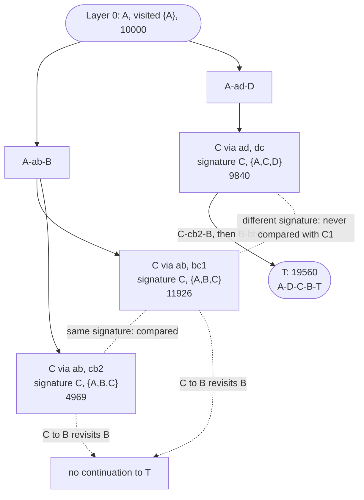

The diagram is the R1 fixture of §14.5. `metis_inspired` keeps one label at C (11926, via B),
whose only continuations revisit B. `metis_history` keeps the via-D label in its own signature
group, and that label reaches T.

### 14.5 Hand-Worked Numeric Example
All values below are checked by `r021_examples.py` section 12 (`example_metis_history`) against
its own hand `getAmountOut`, exhaustive path enumeration and the pinned research fixtures
(`reconstructions.json` R1/R8, `history-labels.json`). The factory runs with the pinned preset
`config/metis_history/preset_v1.yaml` (version 1, `dominance: history`,
`max_labels_per_signature: 1`, `max_frontier_labels: 1024`, settings sha256 `183bb1ff…`) unless a
step says otherwise.

1. **Competing prefixes (fixture R1).** Six CPMM pools with 30 bps fees: `ab`, `bc1`, `ad`,
   `dc`, `cb2`, `bt` (reserves in `reconstructions.json`). The request is $10\,000$ A $\to$ T,
   one chunk, `label_hops` 4, `search.max_hops` 2.
   - Three layer-2 prefixes reach C:

     | Prefix | Visited set | Amount at C |
     |---|---|---|
     | `ab`, `bc1` | {A, B, C} | 11926 |
     | `ab`, `cb2` | {A, B, C} | 4969 |
     | `ad`, `dc` | {A, C, D} | 9840 |

   - The first two share a signature and are compared with each other. The third has another
     visited set and is compared with neither.
   - From C, the only way to T is C $\to$ B $\to$ T. Both {A, B, C} labels have visited B, so
     they cannot continue. The {A, C, D} label can: `ad, dc, cb2, bt` gives **19560**, which is
     the exhaustive best simple path.
   - The larger walk A–B–C–B–T (`ab, bc1, cb2, bt`) would give 23708, but it repeats B. The
     independent evaluator rejects it as `invalid_plan` (`economic token cycle: B -> C -> B`).
     It is outside the domain, not a lost optimum.
   - `metis_inspired` keeps only 11926 at C, loses the 4-hop path and returns 9938 (A–B–T).
   - `metis_history` returns **19560** on A–D–C–B–T. The fresh evaluator replay and the
     independent hand ledger both give 19560.
   - The factory reports this row as `termination: state_cap` (an observed factory record, not
     an asserted value). The single chunk is also the final chunk, so R5 forbids strict pruning,
     and the preset's one-label-per-signature cap drops the lower same-signature labels (`labels_dropped_signature_cap` 2, a factory counter). The value
     happens to equal the exhaustive best, but T1 is not claimed for a capped chunk.
2. **Prefix admission (fixture X4b, 2 chunks, 5 bps pools).** Request $2 \times 10^9$ S $\to$ D.
   - Chunk 1 ($10^9$) takes `sx, xa, ad` (marginal 3550412675). It commits the token edges
     S→X, X→A and A→D.
   - In chunk 2, the dominant label at V is S–A–V. Its continuation `sa, av, vx, xd` would add
     V→X, which closes X→A→V→X with the committed edges, so it is inadmissible.
   - The dominated label S–B–V has another visited set, so it survives in its own group. It
     continues `sb, bv, vx, xd` (marginal 2993986559).
   - `metis_history` returns $3550412675 + 2993986559 = \mathbf{6544399234}$, equal to the
     independent per-chunk trajectory. `metis_inspired` puts both chunks on `sx, xa, ad` and
     returns 6391013260.
3. **Unsafe deletion (fixture `overflow`, sourced `moe_classic_v1` pools).** Request $10^7$ S $\to$ D,
   one chunk, `label_hops` 3.
   - Two S→X labels share a signature: 9871580 X (via `small`) and 9969900600 X (via `big`).
   - Pool `xd` holds almost $2^{112}$ X. The X reserves of all pools sum to
     5192296858534827629530492329220096, which is at least $2^{112}$, so the region is **not**
     certified.
   - The larger label reverts in `xd` (the Moe Classic `uint112` balance check); the smaller one
     continues to 4920982 D. A "larger amount wins" rule would therefore be wrong here.
   - With wide caps (every label kept), `metis_history` returns **4920982** with
     `termination: complete`.
   - With the preset's one label per signature, R6 keeps the larger, reverting label. The
     incremental plan falls back to the weak direct pool: 9871, `termination: state_cap`,
     fallback `retained_simpler_candidate`. This is the visible, declared approximation of the
     bounded preset, not a silent loss. `metis_inspired` also returns 9871.
4. **Safe deletion (R1, 3 chunks, wide caps).** Every R1 pool is constant product without a
   source key, so every edge is certified upward safe.
   - The two non-final chunks may apply R3: the factory reports 11 certified strict insertions
     (a factory counter).
   - Each chunk (3333, 3333, 3334) takes `ad, dc, cb2, bt`, exactly the independent per-chunk
     maxima (marginals 6518, 6520, 6522 from the independent oracle), and the merged plan gives
     **19560**, `termination: complete`.
5. **Tie with different state (`tie_state`, 2 chunks).** Pools `p1`, `p3` (S→X, `p3` slightly
   deeper) and a thin `q` (X→D). Request 20000 S $\to$ D.
   - Chunk 1 ($10\,000$): `p1` gives 996 X and `p3` gives 1006 X, but `q` rounds both to the same
     output. That is a tie of the chunk value.
   - Certified strict dominance keeps `p3`'s larger X label; enumeration keeps the first maximal
     path via `p1`. The committed pools differ.
   - The incremental plans end at 9 (history, `p3, q` twice) and 8 (enumeration, `p1, q` twice).
     Both published rows are 9 because the retained `path_split` candidate also scores 9 and an
     incremental plan must be strictly better to replace it.
6. **Per-chunk exact is not whole-plan better (`greedy_trap`, 2 chunks, 4 hops).**
   - `metis_history` takes each chunk's exhaustive maximum: `p11, p7, p6, p8` (9894172), then
     `p11, p3, p8` (49757), for **9943929**.
   - `metis_inspired` misses chunk 1's maximum (a token revisit) and commits `p11, p3, p8`. That
     leaves `p11, p3, p2, p5` admissible for chunk 2, and its plan ends at **12757712**.
   - A better chunk choice changed the committed edges and lowered the whole plan. No
     whole-plan claim is made.
7. **Caps and full fill.**
   - R1 with `max_frontier_labels: 1` drops two labels (`state_cap`). The incremental plan is
     only 9938, which does not beat the retained candidate, so the row is the fallback
     `single_path` plan A–B–T, 9938 (hand check), labelled `retained_simpler_candidate`.
   - A 4-pool graph where S–B–D is dead (`bd` has no D reserve) and S–C–D is live, $10^6$ S:
     uncapped the chunk takes S–C–D, **992032** (hand check).
   - The same graph with `max_frontier_labels: 1` keeps only the first layer-1 label (via B).
     Its continuation fails, the final chunk has no admissible path, and no `path_split`
     candidate exists at `search.max_hops` 1. The status is **`timeout`** with
     `truncated_by: state_cap`: a capped search is never evidence of `no_route`.

### 14.6 Implementation Map
Line numbers are those of `e455c7d` (unchanged on this branch); function names are the stable
anchors.
- File: `routing/algorithms/metis_history.py`.
  - Options: `validate_options` (line 167); keys `dominance`, `max_labels_per_signature`,
    `max_frontier_labels`.
  - Certified edges: `upward_safe_edges(bundle)` (line 180), computed once in `prepare` (line 233).
  - Region test: `region_certified(...)` (line 280), memoized per solve.
  - Chunk selector: `choose_history(...)` (lines 316–418), rules R1–R8.
  - Termination precedence: `_termination` (line 421).
  - Solver: `solve` / `_solve` (lines 430–665), the `metis_inspired` loop with this chooser.
  - Same-depth diagnostic: `diagnose_history` (line 758), a separate pass that `solve` never calls.
  - Factory: `FACTORY` (line 872); the preset pin is `config/metis_history/preset_v1.yaml`.
- Reused unchanged: `metis_inspired._Allocator` (`step`, `commit`), `hops_to_target`,
  `incremental_graph.creates_cycle` / `merged_plan`, `routing.evaluator.evaluate`.
- Contract: [`research-021/history-labels.md`](research-021/history-labels.md) §§3–8; tests
  `tests/routing/test_metis_history.py` and `tests/routing/test_history_labels_contract.py`.
- Worked examples: `docs/examples/routing-algorithms/r021_examples.py`,
  `example_metis_history` (runner section 12).

### 14.7 Parameters, Budgets, and Ties
- **Shared parameters:** `search.max_hops`, `search.max_splits`, `search.percent_step` (the
  retained `path_split` only), `graph.chunks` and `graph.label_hops`. `graph.label_pruning` is
  **not read**: the label search is always on, and the control is `dominance: "off"`.
- **Options** (`algorithm_options.metis_history`, all required after preset resolution):
  `dominance` (`history` | `off`), `max_labels_per_signature` (1…10⁶),
  `max_frontier_labels` (1…10⁷). The validator refuses unknown keys and every reserved
  `search.*` / `graph.*` key.
- **Preset (`--strategies all`):** version 1 above. With one label per signature it is a
  declared approximation on uncertified regions (CL/LB, sourced CPMM near $2^{112}$), visibly
  `state_cap` when it drops a label.
- **Controls:** `config/metis_history/history_on.yaml` (preset next to `metis_inspired`),
  `history_off.yaml` (`dominance: "off"` next to `metis_inspired` with `label_pruning: false`).
  Both run only by explicit `--strategies profile`.
- **Budgets:** `Budget.max_candidates` caps label relaxations per chunk (declared truncation);
  `max_quotes` abandons the incremental plan. `truncated_by` precedence is `max_quotes`, then
  `max_candidates`, then `state_cap`.
- **Ties:** labels expand in generation order, which equals enumeration order; the target
  choice is strict (the earlier path wins); R2 keeps the earlier label. An R3 discard can
  change which path attains a tied value (§14.5 step 5).

### 14.8 Computational and Memory Cost
- **Per chunk:** at most $H_L$ layers, each holding at most `max_frontier_labels` labels
  ($\le 1024$ in the preset). Relaxations are bounded by
  $H_L \cdot \text{max\_frontier\_labels} \cdot \deg_{\max}$.
- Without the caps the number of distinct signatures can grow with the number of visited
  subsets. That growth is why the caps exist and why a capped chunk is labelled.
- **Quotes:** at most one guarded quote per relaxation through the per-solve `QuoteCache`,
  plus the retained `path_split`'s quotes. The history search can quote more than
  `metis_inspired` because it keeps more labels.
- **Extra CPU:** one region test per new label (memoized per $(v, r)$ and solve), one
  signature lookup (a frozenset key) per insertion; `upward_safe_edges` is $\mathcal{O}(P)$
  once per worker in `prepare`.
- **Memory:** the layer's labels, each carrying its path and pool-flow updates
  ($\mathcal{O}(H_L)$ each), plus the region memo ($\mathcal{O}(\lvert T \rvert \cdot H_L)$).
- **Work units** (never divided by another strategy's units): `label_relaxations`,
  `labels_discarded_dominance`, `labels_retained_unknown`, `state_comparisons`,
  `peak_frontier_labels`, `admission_checks`, quotes and `internal_evaluations`.

### 14.9 Guarantees and Limitations
- **Guarantees:**
  - Every plan is protocol-exact, merged per pool, fully funded and replayed by the independent
    evaluator; the result is never below the retained `path_split` candidate on score.
  - For one uncapped, untruncated chunk the selected marginal equals the same-depth enumeration
    maximum in every admitted protocol (T1; certified pruning only on certified CPMM regions,
    retention everywhere else).
- **Limitations:**
  - Per-chunk exactness is not whole-plan optimality and not an improvement guarantee over
    `metis_inspired` or `incremental_graph` (§14.5 steps 5–6).
  - The bounded preset drops labels on uncertified regions; such chunks are `state_cap` and
    carry no T1 claim (§14.5 step 3). A capped search without a valid plan is `timeout`, never
    `no_route`.
  - There is no certificate: `bound_kind` is `unknown` (`certificate: null`, `not_produced`).
  - A real CL/LB region where the retained-unknown rule matters (for example the pinned
    `mantle_mixed` X2 state) is covered by the research tests, not by this guide's worked
    examples.
  - It is not Jupiter Metis; no latency or adoption claim is made.

---

## 15. Algorithm 11: `direct_split_certified` (Certified Integer Branch and Bound over the Direct-Split Grid)

### 15.1 Problem and Inclusion Rationale
`direct_split` (§4) finds the best allocation on its grid by exact dynamic programming, but it
returns only a value. It says nothing about how far the result could be from the best
allocation if the search were cut short, and nothing about a different domain such as another
pool order or raw integer amounts.

`direct_split_certified` (WHI-1552, research memo
[`research-021/integer-allocation.md`](research-021/integer-allocation.md), WHI-1551) searches
**exactly `direct_split`'s domain** with best-first branch and bound. Every open region carries
an exact-rational upper bound. The result is an ordinary plan plus a certificate
$[\text{lower}, \text{upper}]$ with gap $g$ that is valid after completion **and** after every
cooperative stop.

- **Identity:** experimental, `custom` group, not a default. The reference control is
  `direct_split` on the same grid.
- **Scope:** a request whose admitted direct pools are **all** constant product, under
  `gross_only`. Any concentrated or Liquidity Book direct pool makes the whole case
  `unsupported` (`non_constant_product_direct_pool`); there is no CPMM-subset approximation.
- **Contribution:** the certificate, not a better value. Untruncated, the value equals
  `direct_split`'s on the same grid (Proposition P1 of the memo).

### 15.2 Mathematical Model and Assumptions
**Domain `repository_grid`** (the preset). Let $A$ be the input, $N = 100 / \delta$ grid units,
$K$ = `search.max_splits`, and $p_0, \dots, p_{n-1}$ the direct pools in admitted order. A leg
vector uses $m \le \min(K, n)$ pools in strictly increasing admitted order with units
$u_k \ge 1$, $\sum u_k = N$:
$$a_k = \left\lfloor \frac{A u_k}{N} \right\rfloor \ (k < m), \qquad a_m = A - \sum_{k<m} a_k \ (\texttt{ALL\_REMAINING}).$$
A non-final leg that floors to 0 is not a member. These are `direct_split.leg_amounts`, so the
**last pool in admitted order receives the floor remainder**, and pool order is part of the
domain.

**Domain `raw_integer`** (stress only, explicit profile). $N := A$, so leg amounts are any
positive integers summing to $A$. It is a separately identified expanded domain and is admitted
only for $A \le$ `raw_max_amount_in`.

**Value.** Direct legs use distinct pools on original state, so the gross is
$\sum_k f_{i_k}(a_k)$ with the exact CPMM quote $f$. A leg is infeasible on dust (output floors
to 0), a zero reserve, an unmigrated source or fee, or a sourced `uint112` overflow.

**Bound.** For a live pool let $g_i(x) = \dfrac{k_i R_{\text{out}} x}{10^4 R_{\text{in}} + k_i x}$
(the quote without its floor, $k_i = 10^4 - \text{fee\_bps}$). Then:

- $f_i(x) = \lfloor g_i(x) \rfloor \le g_i(x)$ (floor);
- $g_i$ is concave, so every tangent is an upper bound: $g_i(x) \le c_i(t) + s_i(t) x$;
- relaxing integrality, the grid, the leg count, pool order and feasibility gives a superset.

So the tangent sum plus a vertex term bounds every completion of a node, for **any** tangent
points, and its floor is still a bound because values are integers. All arithmetic is Python
`int` / `fractions.Fraction`; no float appears.

**Certificate.** $L$ = the evaluator score of the best validated plan; $U = \max(L,
\max_{\text{open}} ub)$. Theorem T1 (coverage) gives $\max_{\text{domain}} \le U$ at every point of
the search, including after a stop, because a stopped node is pushed back. `optimality_proven`
iff $U = L$.

### 15.3 Concise Pseudocode
```python
def certify(case, pools, N, K, opts, budget):
    if objective != gross_only:           return unsupported("objective_not_gross_only")
    if any(not cpmm(p) for p in pools):   return unsupported("non_constant_product_direct_pool")
    root = State(j=0, used=0, legs=())
    root.ub = tangent_floor(pools, A, legs_left=K)      # first bound evaluation
    L, best = None, None
    for p in live(pools):                                # singles stage
        consider(single_leg_plan(p))                     # replayed; strict improvement only
    consider(rule_H_hint(pools))                         # efficiency only
    heap = [root]                                        # key: (unknown first, -ub, seq)
    while heap:
        if top(heap).ub <= L:  return result(L, heap, "complete")        # U = L
        if expanded == opts.max_bound_nodes:  return result(L, heap, "node_cap")
        node = pop(heap)
        children = expand(node)   # state -> final | interval | skip pool; interval -> halves
        if any quote would exceed budget.max_quotes:
            push(heap, node); return result(L, heap, "quote_budget")     # re-push: T1 holds
        for c in children:
            if c.ub > L: push(heap, c)                   # pruned at creation otherwise
        if len(heap) > opts.max_open_nodes:
            push(heap, node); return result(L, heap, "state_cap")
    return result(L, heap, "complete")

def result(L, heap, termination):
    U = max([L] + [n.ub for n in heap])
    return plan(best), certificate(lower=L, upper=U, gap=U - L, termination=termination)
```
Every candidate is a complete `direct_split.allocation_plan`. It becomes the incumbent only
after the in-solve evaluator replays it `ok` with a score equal to its quoted additive value and
strictly above $L$. A mismatch is a consistency failure: the search stops fail-closed and emits
no certificate.

### 15.4 Architecture and Topology Diagram

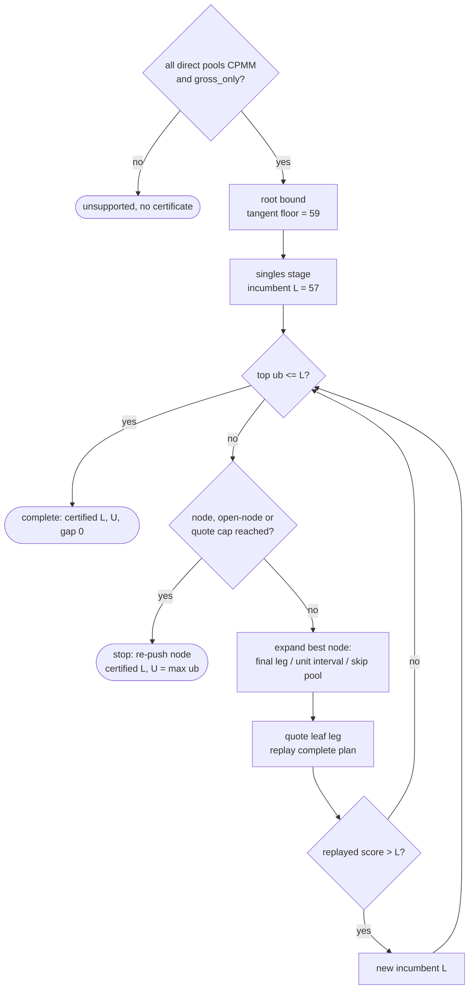

The numbers are those of the R6 request in §15.5.

### 15.5 Hand-Worked Numeric Example
All values are checked by `r021_examples.py` section 13 (`example_direct_split_certified`)
against its own enumeration of every grid and raw allocation (`grid_values`, `raw_values` with the
hand quote) and the pinned records `reconstructions.json` R3/R6 and `integer-allocation.json`.
The preset is `config/direct_split_certified/preset_v1.yaml` (version 1,
`domain: repository_grid`, 100,000 expanded nodes, 100,000 open nodes, settings sha256
`03cfe301…`).

1. **Request (fixture R6).** Pools `p1` (134, 190) and `p2` (76, 172), 30 bps, in that admitted
   order. Input 38 S $\to$ T, `percent_step` 5 ($N = 20$), `max_splits` 2.
   - The independent enumeration of the grid gives an optimum of **58**, reached by 7 tied
     allocations (`p1` with 2, 4, 5, 6, 7, 8 or 9 units).
   - The best single pool gives 57. The raw-integer optimum is 59 (`p1` 10, `p2` 28). The
     continuous optimum lies between 59.36 and 59.37.
2. **Why the grid misses 59.** In the order (`p1`, `p2`), `p1` is a non-final leg and receives
   $\lfloor 38 u / 20 \rfloor$. For $u = 5$ that is $\lfloor 9.5 \rfloor = 9$, and for $u = 6$ it
   is $\lfloor 11.4 \rfloor = 11$; no $u$ gives 10. The raw optimum is simply not in this
   domain.
3. **Complete search.**
   - The root bound is the floor of the tangent relaxation, **59** (equal to the pinned
     `tangent_upper_floor`).
   - The singles stage gives the first incumbent, 57 (`p2` alone). A later candidate raises it
     to 58 with `p1` 5 units (9 raw) and `p2` 15 units (29 raw), one of the 7 tied allocations.
   - Every open bound falls to at most 58, so the certificate is
     `lower 58, upper 58, gap 0, termination complete`, `upper_source: exact_rational`,
     `optimality_proven: true`.
   - `direct_split` on the same grid also returns 58 (P1: the certified identity adds the
     proof, not value).
4. **The proof does not transfer to another domain.**
   - Reordered pools (`p2`, `p1`): `p2` gets $\lfloor 38 \cdot 15 / 20 \rfloor = 28$ and `p1` the
     remainder 10, so the certified value is **59**.
   - `raw_integer` (the explicit stress options of `raw_stress.yaml`, resolved as an
     `override`): certified **59** at `p1` 10 / `p2` 28.
   - The three domains have three different `candidate_domain_hash` values (`e1afda09…`,
     `f98ddef6…`, `5925efb2…`). The (`p1`, `p2`) proof with upper bound 58 lies below the raw
     optimum, which is why a certificate is always bound to its domain and request.
5. **Stopped searches still certify.**

   | Run | Status | Certificate | Termination |
   |---|---|---|---|
   | complete (preset) | `ok` 58 | [58, 58], gap 0 | `complete` |
   | `max_bound_nodes: 1` | `ok` 58 | [58, 59], gap **1** | `node_cap` |
   | `Budget(max_quotes=2)` | `ok` 57 | [57, 59], gap **2** | `quote_budget` |
   | `Budget(max_quotes=0)` | `timeout` | none (no incumbent) | — |

   - Each interval contains the true grid optimum 58.
   - The quote cut keeps the best single pool (57) as the incumbent; the open root bound 59
     stays the upper end.
   - Without any incumbent there is nothing to certify: `timeout`, never `no_route`.
6. **Integer plateau (fixture R3, `raw_integer`).** Same pools, input 53. With
   $G(x) = f_1(x) + f_2(53 - x)$:
   $$G(0) = G(1) = G(2) = 70, \quad G(3) = 72, \quad G(15) = 76.$$
   - A strict ±1 local search started at a plateau stops at 70.
   - The root bound already lies above 70, so the plateau is never certified. The search
     certifies **76** with gap 0 at `p1` 19 / `p2` 34, one of the independent argmax
     allocations (`p1` 15…19).
7. **Dust, a real pool and an unsupported case.**
   - `cpmm_graph` `a_b_dust` (3 raw TKA): every split has a dust leg, so the certified optimum is
     **2**, all on one pool (`P-IA-DUST`).
   - Real Merchant Moe Classic state (`tests/fixtures/moe_classic/bundle`, case
     `wmnt_usdt_large`, 150 WMNT): the single pool gives **73242137** raw USDT by hand, certified
     with gap 0 (`P-IA-REAL-MOE`).
   - `mantle_mixed` `usdc_usdt_small`: the direct pools are CPMM **and** Liquidity Book, so the
     row is `unsupported` (`non_constant_product_direct_pool`) with no plan and no certificate.
     The fixed-block request of §11 is unsupported for the same reason.

### 15.6 Implementation Map
Line numbers are those of `e455c7d`; function names are the stable anchors.
- File: `routing/algorithms/direct_split_certified.py`.
  - Options: `validate_options` (line 159); `prepare` (line 194).
  - Exact bounds: `g` / `dg` (lines 220–227), `tangent_hint` (Rule T, line 231),
    `tangent_bound` (line 252), `final_bound` / `state_bound` / `interval_bound`
    (lines 267–289).
  - Nodes and result: `Node` (line 315), `Certified` (line 333).
  - Domain record: `domain_record` (line 374).
  - Search: `certify` / `_certify` (lines 403–781), including `consider` (candidate replay and
    publication), `expand`, the heap key and the stop handling.
  - Solver: `solve` (line 782) calls `certify` unchanged; `FACTORY` (line 799).
- Reused unchanged: `direct_split.leg_amounts` / `allocation_plan`, `routing.search.QuoteCache`,
  `routing.evaluator.evaluate`.
- Contract: [`research-021/integer-allocation.md`](research-021/integer-allocation.md) §§2–7;
  tests `tests/routing/test_direct_split_certified.py`,
  `tests/routing/test_integer_allocation_contract.py`.
- Worked examples: `r021_examples.py`, `example_direct_split_certified` (runner section 13;
  `_dsc_trace` exposes the root, first nodes and final frontier from the same `certify` call).

### 15.7 Parameters, Budgets, and Ties
- **Shared parameters:** `search.max_splits` and `search.percent_step`, exactly as
  `direct_split`.
- **Options:** `domain` (`repository_grid` | `raw_integer`), `max_bound_nodes`,
  `max_open_nodes`, and `raw_max_amount_in` (raw only).
- **Preset (`--strategies all`):** `repository_grid`, 100,000 / 100,000.
  `config/direct_split_certified/grid.yaml` runs it next to `direct_split`;
  `raw_stress.yaml` (raw domain, $A \le 100\,000$) runs only by explicit `--strategies profile`.
- **Budgets:** `Budget.max_quotes` and `Budget.max_candidates` (finalist plans evaluated) are
  cooperative stops before the next quote or evaluation; the node being expanded is re-pushed,
  so the certificate stays valid. The runner's hard wall/quote kill returns no result
  (`certificate_unavailable_reason: hard_timeout`).
- **Ties:** the heap key is (unknown first, $-ub$, creation order). The certificate certifies
  the **value**; among tied allocations the first found in this order is returned, which may
  differ from `direct_split`'s choice.

### 15.8 Computational and Memory Cost
- **Nodes:** the tree has at most $n$ state levels, each with $\lceil \log_2 N \rceil$ interval
  levels in the grid domain ($\lceil \log_2 A \rceil$ in the raw domain). Expansions are capped
  by `max_bound_nodes`, and the open heap by `max_open_nodes`.
- **Bound evaluations:** each is an exact-rational tangent sum with an integer square root in
  Rule T: $\mathcal{O}(n \log n)$ big-integer operations.
- **Quotes:** $n$ singles plus one quote per resolved leaf leg, all through the per-solve
  `QuoteCache`; every accepted incumbent costs one internal replay (memo hits only).
- **Memory:** the open heap, at most `max_open_nodes` nodes, each holding its fixed legs.
- **Work units:** `bb_nodes_expanded`, `bound_evaluations`, `peak_open_nodes`, quotes and
  `internal_evaluations`. On R6 the complete run reports 15 expansions and 26 bound
  evaluations (factory counters, regression-pinned only, not independently derived).

### 15.9 Guarantees and Limitations
- **Guarantees:**
  - `bound_kind: certified` means $\text{lower} \le \max_{\text{domain}} \le \text{upper}$ for
    this request, domain, pool order and objective, after completion and after any cooperative
    stop. Gap 0 proves optimality **in that domain**.
  - Every returned plan is a replayed `direct_split` allocation.
- **Limitations:**
  - All-CPMM direct pools and `gross_only` only. Mixed direct pools are `unsupported`; the
    frozen corpus contains only single-pool certifiable cases, and the multi-pool proofs are
    synthetic (R3, R6).
  - No multi-hop, no CL/LB and no net objectives.
  - The certificate does not transfer to another pool order, grid, cardinality, request or
    the raw domain (§15.5 step 4).
  - An `unknown` bound never arises with the genuine CPMM bounds; it exists only as a guarded
    hook (research tests) and is never reported as a zero gap. The examples show nonzero
    certified gaps instead.
  - No speed claim: the search can quote less or more than `direct_split`.

---

## 16. Algorithm 12: `incremental_graph_repair` (Checkpoint and Suffix Repair of the Greedy Chunk Trace)

### 16.1 Problem and Inclusion Rationale
`incremental_graph` (§6) commits chunks greedily. A committed chunk adds token edges, and the
atomic cycle rule then forbids every later path that uses the reverse edge. An early greedy
choice can therefore lock out a structure that a better whole plan needs (**admission
lock-in**).

`incremental_graph_repair` (WHI-1554, research memo
[`research-021/suffix-repair.md`](research-021/suffix-repair.md), WHI-1553) builds the ordinary
incumbent and records a **complete checkpoint** before every committed decision. It then:

1. restores a bounded set of checkpoints (latest structural first);
2. forces a different first suffix choice;
3. rebuilds the rest of the suffix with the unchanged greedy rule;
4. replays the complete candidate from the original snapshot;
5. replaces the incumbent only by a strictly better valid plan.

- **Identity:** experimental, `custom` group, not a default.
- **Reference control:** `incremental_graph`; with `repair: false` the identity reproduces it
  exactly (plan, statuses, counters).
- **What is claimed:** exact checkpoint round trip, whole-input conservation and exact final
  replay of every candidate, and "never below the repair-off control under the same budget
  without a hard kill". It is not optimal, even in the chunk-sequence domain it searches.

### 16.2 Mathematical Model and Assumptions
The accounting is `incremental_graph`'s, pinned in the memo §2:

- **Chunks are search allocations, not executed swaps.** A chunk of $a$ on a path is charged
  edge by edge as $m_i = f_p(x_p + m_{i-1}) - f_p(x_p)$ on the pool's **original** state, and
  the pool's aggregate $x_p$ grows. The final plan executes **one merged swap** of $x_p$ per
  pool. Two chunks on one pool are never two sequential swaps.
- **Aggregate flows are not additive.** A pool's aggregate output $f_p(x_p)$ is not the sum of
  the per-chunk quotes. Removing a chunk by subtracting its recorded delta while later chunks
  stay would leave stale aggregates.
- **Checkpoint** (taken before each decision): `position`, `carry`, every `PoolFlow` as an
  immutable record in insertion order (zero-input records included, which fixes `order`), the
  committed `token_edges` and the decision prefix.
- **Restore** builds **new** `PoolFlow` objects, a new edge set and a new decision list from the
  record. Nothing is subtracted, and only whole suffixes are rolled back. The pure
  `QuoteCache` memo is kept (rescoring is memo hits); the quote meter, wall clock and counters
  are **never** reset.
- **Identity of a candidate:** its flow key, the set of $(p, \text{token}_\text{in},
  \text{token}_\text{out}, x_p)$ with $x_p > 0$. An equal key is a `duplicate` and is not
  replayed.
- **Acceptance:** `merged_plan`, in-solve `evaluate` (status `ok`, evaluated gross equal to the
  accounted gross, else a fail-closed consistency failure), then strictly greater than the
  current best → `accepted`; equal → `tie`; less → `rejected_worse`.

### 16.3 Concise Pseudocode
```python
def solve_incremental_graph_repair(case, opts, budget):
    best = path_split.solve(...)                          # stage 1: retained candidate
    run = reference_chunk_loop(checkpoints=True)          # stage 2: the incremental_graph loop
    if replay_ok_and_consistent(run): best = better(best, run)
    if not opts.repair:  return best                      # stop: disabled
    seen = {flow_key(run.flows)}
    for i in structural_checkpoints(run, opts.max_checkpoints):      # latest first
        flows, edges, _ = restore(run.checkpoints[i])      # rebuilt by copy, never subtracted
        scored = score_chunk(flows, edges, run.decisions[i].amount)  # memo hits
        assert first_max(scored) == run.decisions[i]       # round-trip guard
        for alt in alternatives(scored, run.decisions[i], opts.alternatives_per_checkpoint):
            if attempts == opts.max_repair_attempts:  return best    # stop: attempt_cap
            cand = reference_chunk_loop(from_checkpoint=i, forced_first=alt)
            if cand.failed:              continue
            if flow_key(cand) in seen:   continue          # duplicate: not replayed
            seen.add(flow_key(cand))
            ev = evaluate(merged_plan(cand.flows))         # metered, same ledger
            assert ev.ok and ev.gross == accounted_gross(cand.flows)
            if ev.score > best.score:  best = cand; report_candidate(cand.plan)  # accepted
    return best                                            # stop: complete
```
A declared quote cut anywhere stops the repair with `quote_budget` and returns the best plan so
far; the cut candidate is abandoned and nothing is retried.

### 16.4 Architecture and Topology Diagram

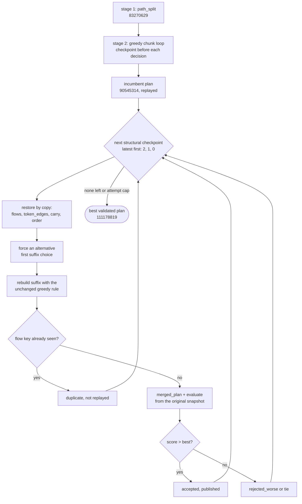

### 16.5 Hand-Worked Numeric Example
All values are checked by `r021_examples.py` section 14 (`example_incremental_graph_repair`)
against its own greedy chunk oracle (`greedy_chunks`), an exhaustive enumeration of every
complete chunk sequence (`chunk_sequences`) with the hand quote, and the pinned
`suffix-repair.json` fixtures. The preset is `config/incremental_graph_repair/preset_v1.yaml`
(version 1: `repair: true`, 4 checkpoints, 2 alternatives each, 8 attempts; settings sha256
`89af5028…`).

1. **The trap (`structural_trap`).** Six CPMM pools, 30 bps: `es` (E, S), `sb` (S, B), `bd`
   (B, D), `eb` (E, B), `ed` (E, D) and `be` (B, E). Request $3 \times 10^6$ S $\to$ D,
   `max_hops` 3, 3 chunks of $10^6$.
2. **Greedy incumbent with its state after each commit.**

   | Chunk | Path | Marginal | Aggregate flows after the commit | Token edges after the commit |
   |---|---|---|---|---|
   | 1 | `sb, eb, ed` (S→B→E→D) | 76816180 | `sb` 1000000 S, `eb` 4992488 B, `ed` 33233230 E | S→B, B→E, E→D |
   | 2 | `es, ed` (S→E→D) | 8478457 | + `es` 1000000 S; `ed` 58176937 E | + S→E |
   | 3 | `sb, bd` (S→B→D) | 5250677 | `sb` 2000000 S; + `bd` 1667498 B | + B→D |

   - The incumbent is $76816180 + 8478457 + 5250677 = \mathbf{90545314}$. It equals
     `incremental_graph`'s plan exactly, and `repair: false` returns the same plan.
   - Chunk 1 commits **B→E**. Every later path that needs **E→B** (pool `be`) is then
     inadmissible, because B→E plus E→B is a token cycle.
   - The exhaustive enumeration of all **120** complete chunk sequences finds the best at
     **111178819**: `es, be, bd`, then `es, ed` twice. It starts with E→B, so no greedy suffix
     after chunk 1 can reach it.
3. **Why restore rebuilds and never subtracts.** Pool `ed` receives chunk 1's 33233230 E and
   chunk 2's 24943707 E, 58176937 E in total. One merged quote of 58176937 E gives 85294637 D,
   while quoting the two chunk amounts separately on the original state would sum to
   148137308. The chunk contributions are marginals on a growing aggregate, so the only correct
   rollback is to rebuild the checkpoint's aggregates from their records.
4. **Merged plan of the incumbent** (a search chunk is not an executed swap):
   - `sb` executes once with 2000000 S (chunks 1 and 3 merged) into fund F1;
   - `es` takes the remaining 1000000 S (`ALL_REMAINING`) into F2;
   - `eb` takes 4992488 B of F1 into F3, and `bd` takes the rest of F1 into F4;
   - `ed` drains F3 and F2 together (one merged swap) into F5.
5. **Repair on (preset).** The structural checkpoints are 2, 1, 0 (latest first):

   | Checkpoint | Alternative | Outcome | Replayed score |
   |---|---|---|---|
   | 2 | 0 | `rejected_worse` | 87943332 |
   | 2 | 4 | `rejected_worse` | 86604696 |
   | 1 | 1 | `duplicate` (flow key seen) | — |
   | 1 | 4 | `duplicate` | — |
   | 0 | 0 | `accepted` | 111176933 |
   | 0 | 3 | `accepted` | **111178819** |

   - At checkpoint 0 (the empty prefix) nothing is committed, so the alternative first choice
     `es, be, bd` is admissible.
   - Both accepted scores are values of feasible chunk sequences in the exhaustive enumeration;
     the second equals its best.
   - The accepted plan: `es` takes all 3000000 S into F1; `be` takes 24943707 E of F1 and `ed`
     the rest; `bd` drains the B. The replay gives 111178819, `repair.stop: complete`,
     `chosen_source: incremental_graph_repair`.
   - All work is charged to one ledger. The factory reports 12 in-solve evaluations (7 in the
     embedded `path_split` stage, 1 incumbent, 4 repair replays; duplicates are not replayed)
     and 291 executed quotes against 263 for repair off (factory counters, not independently
     derived).
6. **Rejected: no improvement exists (`twin_pools`).** Three identical pools S→D, $10^8$ S,
   2 chunks, `max_hops` 1.
   - The incremental plan (50/50 over two pools) scores 94965946, below the retained
     `direct_split` grid optimum **96478164** (30/35/35).
   - The repair tries one forced first choice that reconverges to the same flows (`duplicate`)
     and one that replays at 94965946 (`rejected_worse`). Repair on and off return the same
     `direct_split` plan.
7. **No budget.**
   - `max_repair_attempts: 1`: the first attempt is `rejected_worse`, the second is refused,
     `repair.stop: attempt_cap`, and the incumbent **90545314** stands.
   - `Budget(max_quotes=262)`, one quote fewer than the repair-off solve used: the incumbent
     itself is cut (`incremental_status: truncated`), no repair attempt runs
     (`repair.stop: quote_budget`), and the published `path_split` plan (`es, ed`,
     **83270629**) is returned with its fallback label.
8. **Cross-reference (WHI-1549 `greedy_trap`, §14.5 step 6).** The repair turns the per-chunk
   exact incumbent 9943929 into **12757712**, the label plan `metis_inspired` found.

### 16.6 Implementation Map
Line numbers are those of `e455c7d`; function names are the stable anchors.
- File: `routing/algorithms/incremental_graph_repair.py`.
  - Options: `validate_options` (line 138); `prepare` (line 163) wraps `incremental_graph`'s
    prepared object.
  - Checkpoint records: `FlowRecord` (line 176), `Decision` (line 188), `Checkpoint`
    (line 201), `freeze` (line 214), `restore` (line 230).
  - Candidate identity and value: `flow_key` (line 242), `accounted_gross` (line 251).
  - Reference loop: `_Search.marginal` / `score` / `run` (lines 309–452), with the
    per-chunk `max_candidates` cap and the guarded quote budget.
  - Neighborhood: `first_max` (line 453), `structural_checkpoints` (line 458),
    `alternatives` (line 463).
  - Solver: `solve` / `_solve` (lines 488–716) for stages 1–2, `_repair` (lines 763–860)
    for stage 3, `_Ledger` (line 717) for the one attempt ledger.
  - Factory: `FACTORY` (line 931).
- Reused unchanged: `incremental_graph.PoolFlow`, `chunk_amounts`, `creates_cycle`,
  `merged_plan`, the embedded `path_split.solve`, `routing.evaluator.evaluate`.
- Contract: [`research-021/suffix-repair.md`](research-021/suffix-repair.md) §§2–8; tests
  `tests/routing/test_incremental_graph_repair.py`,
  `tests/routing/test_suffix_repair_contract.py`.
- Worked examples: `r021_examples.py`, `example_incremental_graph_repair` (runner section 14).

### 16.7 Parameters, Budgets, and Ties
- **Shared parameters:** `incremental_graph`'s `search.*` and `graph.chunks`.
- **Options:** `repair` (bool), `max_checkpoints` (1…64), `alternatives_per_checkpoint`
  (1…16), `max_repair_attempts` (1…256), all required after preset resolution.
- **Preset (`--strategies all`):** `true`, 4, 2, 8. Explicit profiles:
  `repair_on.yaml` (the preset next to `incremental_graph`), `repair_off.yaml`
  (`repair: false`, resolved as `override`) and `stress.yaml` (16, 4, 64).
- **Budgets:** `Budget.max_candidates` caps paths scored per chunk in the incumbent, every
  checkpoint rescoring and every rebuilt suffix. `max_quotes` is one shared ledger; its cut
  stops the repair with the best plan so far.
- **Ties:** checkpoints latest structural first; alternatives by marginal, then enumeration
  index; rebuild choices are the first maximum; duplicate detection by flow key; an equal score
  is a `tie` and keeps the earlier incumbent. No randomness.

### 16.8 Computational and Memory Cost
- **Chunk scorings:** at most $(\text{max\_checkpoints} + \text{max\_repair\_attempts}) \cdot K$
  ($12K$ with the preset) on top of the incumbent's $K$, each over at most $\lvert \Pi_H \rvert$
  paths, plus the embedded `path_split`.
- **Replays:** at most one per non-duplicate complete candidate (at most
  `max_repair_attempts`), each an in-solve evaluator replay on the same metered cache.
- **Memory:** one checkpoint per committed decision, each $\mathcal{O}(P + K)$ (flows, edges,
  decision prefix), plus the set of seen flow keys.
- **Work units:** `paths_scored`, `admission_checks`, `repair_attempts`,
  `checkpoint_restores`, quotes and `internal_evaluations` (every in-solve replay of all
  stages).

### 16.9 Guarantees and Limitations
- **Guarantees:**
  - A restored checkpoint resumed without forcing reproduces the incumbent exactly, with no new
    executed quote.
  - Every candidate conserves the whole input, satisfies full fill and the plan-token DAG, and
    replays to exactly its accounted gross; a contradiction is never accepted or published
    (fail-closed, `algorithm_error` if nothing was validated before).
  - Without a hard kill, the returned score is never below the repair-off control under the
    same budget.
- **Limitations:**
  - No optimality claim, not even over chunk sequences: at 5 chunks the pinned trap gives
    incumbent 92911795, repair 111172169 and sequence optimum 111193897 (memo §3.7).
  - No guaranteed improvement (`twin_pools`), and more work than `incremental_graph`.
  - No certificate (`bound_kind` unknown); no latency or same-budget-win claim.

---

## 17. Algorithm 13: `uni_sor_cycle_safe` (SOR Selection with Plan-Token-DAG Admission; Not SOR Parity)

### 17.1 Problem and Inclusion Rationale
Upstream Uniswap SOR combines routes only by **physical pool identity** (B-S9): two routes may be
combined when they share no pool. At `search.max_hops` ≥ 3, two routes can each be a simple
path, share no pool, and still form a **token cycle** together. The evaluator rejects such a
plan (`economic token cycle`), so `uni_sor_port` keeps a known `invalid_plan` defect for parity
(the recorded USDC→mETH→WETH→USDT plus USDC→WETH→mETH→USDT case).

`uni_sor_cycle_safe` (WHI-1556, research memo
[`research-021/cycle-safe-sor.md`](research-021/cycle-safe-sor.md), WHI-1555) is a separately
named adaptation. It adds **one rule at SOR's only combination point**: a combination is
admitted only if the union of its routes' token edges is acyclic. Everything else is the pinned
reference: candidates, grid, quote table, V2/V3 coverage, ordering, ties, seeds, queue, pruning,
split cap, final order, D-1 integer fill and D-3 replay.

- **Identity:** experimental, `custom` group. It is **not** upstream parity; the 35 upstream
  goldens stay authoritative for `uni_sor_port` only, which is retained unchanged.
- **What is claimed:** safety (never a token-cycle plan) and reference-trajectory identity when
  the selector completed and rejected nothing. It is not claimed to be better than, or no
  worse than, the reference, nor to find the best admissible selection.

### 17.2 Mathematical Model and Assumptions
- $\text{edges}(r)$ = consecutive pairs of route $r$'s token path. A set $R$ of routes is
  **admissible** iff $\bigcup_{r \in R} \text{edges}(r)$ has no directed cycle.
- Three rules must be kept apart:

  | Rule | Owner | Consequence |
  |---|---|---|
  | physical pool overlap | B-S9, upstream | skipped before any admission check |
  | path-local token revisit | B-R4 (DFS `tokensVisited`), upstream | never enumerated |
  | plan union cycle | the evaluator; SOR has no rule | port: `invalid_plan`; variant: rejected at admission |

- **Chooser (replaces B-S7/B-S9 inside the variant only).** For a node with routes `cur` and a
  percent $p$, scan the percent's sorted routes:
  1. skip an entry sharing a pool with `cur` (not counted);
  2. otherwise `admission_checks += 1`; choose it if `cur ∪ {entry}` is admissible;
  3. otherwise `combinations_rejected_cycle += 1` and **continue the scan**.
- **Lemmas.** A single simple route is acyclic, so the 100 % baseline and the seeds need no
  check. With `search.max_hops` ≤ 2 admission can never reject anything. B-F1 and D-1
  reorder and re-amount routes but keep the edge set.
- **Deliberate deviation from SOR.** Because `best_swap` is now the best **admissible**
  selection, the B-S5 pruning can differ, and the variant can lose to a *valid* reference
  selection (fixture K5). The variant publishes its plan only **after** an `ok` replay (CS-2);
  the reference publishes before its replay.

### 17.3 Concise Pseudocode
```python
def solve_uni_sor_cycle_safe(case, bundle, max_hops, max_splits, percent_step):
    routes = compute_all_routes(...)                      # unchanged, V2/V3 cohort (D-4)
    table = build_route_quotes(routes, amount_distribution(...))   # unchanged, same quotes
    best = best_100_percent_route(table)                  # B-S3: acyclic by L1
    queue = seeds(table)                                  # B-S4: acyclic by L1
    while queue and not pruned_or_capped(...):            # B-S5 unchanged
        node = queue.popleft()
        for p in remaining_percents(node):
            for entry in sorted_group(table, p):          # B-S2 order
                if shares_pool(entry, node.routes):  continue            # B-S9 first
                admission_checks += 1
                if acyclic(union_edges(node.routes + (entry,))):
                    extend(node, entry); break            # admitted: first acceptable entry
                combinations_rejected_cycle += 1          # rejected: keep scanning
    plan = integer_fill(best)                             # D-1, unchanged
    ev = evaluate(plan)                                   # D-3 replay
    if ev.ok: report_candidate(plan)                      # CS-2: publish after the replay
    return plan, ev
```

### 17.4 Architecture and Topology Diagram

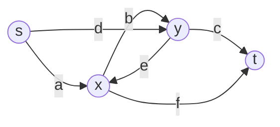

The two routes of §17.5 are `a, b, c` (s→x→y→t) and `d, e, f` (s→y→x→t). They share no pool
and each is a simple path, but their union contains x→y (pool `b`) and y→x (pool `e`), a token
cycle.

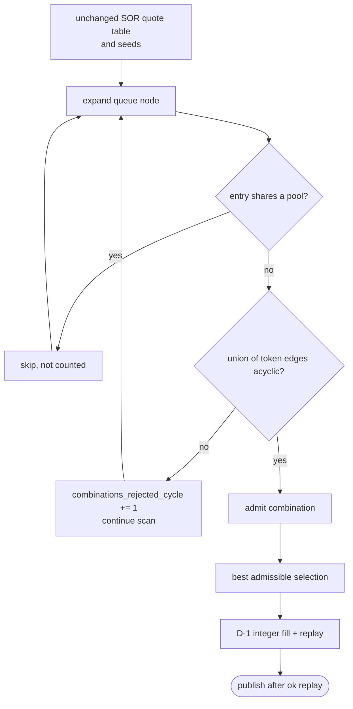

### 17.5 Hand-Worked Numeric Example
All values are checked by `r021_examples.py` section 15 (`example_uni_sor_cycle_safe`) against
its own hand quotes, an independent acyclicity test and the pinned `cycle-safe-sor.json`
adapter fixtures. The options are the empty preset
`config/uni_sor_cycle_safe/preset_v1.yaml` (`{}`).

1. **Request (fixture A1).** Six CPMM pools, 30 bps: `a` (s, x), `b` (x, y), `c` (t, y),
   `d` (s, y), `e` (x, y), `f` (t, x). Pool `b` gives about 2 y per x, and pool `e` about 2 x per
   y. Input 2000000 s $\to$ t, `max_hops` 3, `max_splits` 2, `percent_step` 50.
2. **Hand quotes of the two routes:**

   | Route | 50 % (1000000 s) | 100 % (2000000 s) |
   |---|---|---|
   | `a, b, c` (s→x→y→t) | 1427742 | 2231431 |
   | `d, e, f` (s→y→x→t) | 1418480 | 2208892 |

3. **Each route is valid; the union is not.** Each route alone is acyclic, and the routes are
   pool-disjoint. Their union has the edges s→x, x→y, y→t, s→y, y→x and x→t, which close
   x→y→x.
4. **The reference.** `uni_sor_port` selects `d, e, f` @ 50 % + `a, b, c` @ 50 %, whose quotes sum
   to 2846222. Its replay is rejected: **`invalid_plan`**, `economic token cycle: x -> y -> x`.
5. **The variant.** Each of the two 50 % seeds (`a, b, c` and `d, e, f`) looks for a 50 %
   partner. Every other enumerated route shares a pool with the seed and is skipped by B-S9, so
   the only partner checked is the other route, and the union is cyclic both times
   (`admission_checks` 2, `combinations_rejected_cycle` 2, hand-traced in the fixture). The best
   admissible selection is the 100 % baseline `a, b, c`.
   - **Final integer fill:** the single route takes the whole request (`ALL_REMAINING`), and the
     replay is `ok` with **2231431**, equal to the hand value.
   - `reference_trajectory: diverged` records that admission changed the search.
   - The independent oracle over the same table: best admissible 2231431; best if the cycle rule
     is ignored 2846222.
6. **No admissible selection (fixture A3).** Sourced Moe Classic pools near $2^{112}$: the
   first hops `a`/`d` revert at 100 %, and the last-hop pools `c`/`f` revert on every 50 % entry
   except the two 3-hop routes, whose union is cyclic.
   `uni_sor_port` returns `invalid_plan`; the variant returns **`no_route`** with
   `no_admissible_selection: true`. This `no_route` means the pinned SOR search ended by its
   own rules under admission, not that the V2/V3 domain has no valid plan.
7. **No difference where no cycle can form.** On the teaching graph of §7.5 (`max_hops` 2) the
   variant returns exactly `uni_sor_port`'s plan, **12581**, with
   `reference_trajectory: identical`.

### 17.6 Implementation Map
Line numbers are those of `e455c7d`; function names are the stable anchors.
- File: `routing/algorithms/uni_sor_cycle_safe.py`.
  - Options: `validate_options` (line 164), empty options only; `prepare` (line 185) is
    `uni_sor_port.prepare`.
  - Admission: `route_edges` (line 197), `union_has_cycle` (line 204), `Admission.choose` /
    `select` (lines 233–278), the adapted chooser inside `getBestSwapRouteBy`.
  - Solver: `solve` (lines 379–460): the port's enumeration, quote table, B-F1, D-1 and D-3
    with this selector, then the CS-2 publication rule and diagnostics (`_diagnostics`,
    line 312).
  - Factory: `FACTORY` (line 461).
- Reused unchanged (imported, not copied): `uni_sor_port.compute_all_routes`,
  `build_route_quotes`, `amount_distribution`, `v8_small_array_sort`, `integer_fill`,
  `path_split.split_path_plan`, `routing.evaluator.evaluate`.
- Contract: [`research-021/cycle-safe-sor.md`](research-021/cycle-safe-sor.md) §§2–8; tests
  `tests/routing/test_uni_sor_cycle_safe.py`, `tests/routing/test_cycle_safe_sor_contract.py`.
- Worked examples: `r021_examples.py`, `example_uni_sor_cycle_safe` (runner section 15).

### 17.7 Parameters, Budgets, and Ties
- **Parameters:** `uni_sor_port`'s `search.max_hops`, `search.max_splits`,
  `search.percent_step`. There are no options (`{}`), no fallback, no second search and no
  seed.
- **Explicit profile:** `config/uni_sor_cycle_safe/matched.yaml` runs it next to
  `uni_sor_port` at 3 hops (`--strategies profile`); at the default 2 hops admission cannot
  reject anything.
- **Budgets:** the port's: `max_candidates` is the enumerated-routes threshold, and
  `max_quotes` a quote cut while building the table or during the replay. Admission costs no
  quote.
- **Ties:** the port's B-Q1/B-S2 order and V8 sort emulation; the first admissible entry of a
  percent group is chosen.
- **Phase fields:** `selector.phase`, `replay.phase`, `reference_trajectory`
  (`identical` | `diverged` | `unavailable`) and `publication.withheld_by_cs2` keep missing work
  from being read as evidence.

### 17.8 Computational and Memory Cost
- **Quotes:** identical to `uni_sor_port` on the same inputs (same table, same replay).
- **CPU:** one acyclicity test per admission check, linear in the union's edges
  ($\mathcal{O}(S \cdot H)$); the checks are bounded by the scans of the queued nodes.
- **Memory:** the port's table, plus nothing that grows with the input.
- **Work units:** `admission_checks` and `combinations_rejected_cycle`, beside the port's
  quote counts. Wall time can differ from the port's because admission costs CPU.

### 17.9 Guarantees and Limitations
- **Guarantees:**
  - It never returns a plan whose token graph has a cycle.
  - A completed selector run with zero rejections has the port's whole search and selection;
    with an uninterrupted replay, also its plan, status and score.
- **Limitations:**
  - Not SOR parity, and it can lose to a valid reference selection (K5) or miss the best
    admissible selection (K1).
  - V2/V3 only: Liquidity Book pools are excluded (D-4), as for the port.
  - A hard wall kill or an interrupted replay is not evidence of identity; CS-2 withholds the
    candidate that the port would have published.
  - No certificate (`bound_kind: unknown`) and no speed claim.

---

## 18. Algorithm 14: `cfmm_dual` (CFMM Dual Decomposition with Exact Integer Plan Recovery)

### 18.1 Problem and Inclusion Rationale
Every earlier strategy searches a discrete space of paths, chunks or grid allocations. The CFMM
routing paper (Diamandis, Resnick, Chitra, Angeris, arXiv:2302.04938v1) treats routing as one
**convex** problem over all markets at once. Its dual assigns a **price** to every token; given
the prices, each pool solves its own tiny optimal-arbitrage problem in closed form, and an
optimizer adjusts the prices until the pools' trades fit together.

`cfmm_dual` (WHI-1558 CPMM stage, WHI-1559 CL stage; contract
[`research-021/cfmm-dual.md`](research-021/cfmm-dual.md), WHI-1557) ports that method for a
single-source exact-input gross request and adds what the paper does not have: an **exact integer
recovery** that turns the continuous trades into one fully funded `RoutePlan`, quoted and replayed
only by the repository's exact protocol code.

- **Identity:** experimental, `custom` group, not a default. The matched controls are
  `path_split` and `incremental_graph` (class `incomparable_domain`, side by side, never ranked
  as a mechanism gain).
- **Stages and presets (one identity `cfmm_dual`, one preset key `R021-P12-cfmm_dual`):**

  | Preset | File | `market_protocols` | Role |
  |---|---|---|---|
  | `cfmm_dual/2` (current) | `config/cfmm_dual/preset_v2.yaml` (sha256 `865ad592…`) | `constant_product+concentrated` | written by `--strategies all`; `config/cfmm_dual/cl.yaml` |
  | `cfmm_dual/1` (historical) | `config/cfmm_dual/preset_v1.yaml` (sha256 `1526133c…`) | `constant_product` | verified historical pin; the CPMM-only ablation `config/cfmm_dual/cpmm.yaml` |

  Liquidity Book is outside both stages. The factory's capability ceiling is CPMM + CL; the stage
  of a run is its recorded `market_protocols`, never the ceiling.
- **What is claimed:** exact monetary output (every leg is an exact original-state quote and the
  whole plan is independently replayed) and a numerical `estimate` that is not a bound. There is
  no certified bound and no integer optimality claim.

### 18.2 Mathematical Model and Assumptions
**Units.** Every amount is in raw integer token units. A price $\nu_j$ is "raw units of the output
token $t$ per raw unit of token $j$", with $\nu_t \equiv 1$.

**Dual function.** For the request (source $s$, input $A$) over the market universe $M$:
$$g(\nu) = A \nu_s + \sum_{p \in M} \text{arb}_p(\nu), \qquad
\frac{\partial g}{\partial \nu_j} = A \cdot [j = s] + \sum_{p} (\text{received}_{pj} - \text{tendered}_{pj}).$$
The gradient is the **imbalance**: for the source it is the part of $A$ not yet tendered; for an
intermediate token it is its net flow. At a dual optimum both vanish: the markets tender exactly
$A$ of $s$, and every intermediate token balances.

**Market universe (`simple_path_union`).** The admitted pools of the stage's protocols that lie on
at least one simple $s \to t$ path of at most `search.max_hops` pools, in bundle order.

**CPMM oracle** (fee $\gamma = (10^4 - \text{fee\_bps})/10^4$, reserves $R_a, R_b$). Sell $a$ for $b$
iff $r^2 = \gamma \nu_b R_b / (\nu_a R_a) > 1$; then
$$\delta = \frac{R_a (r - 1)}{\gamma}, \qquad \lambda = R_b \left(1 - \frac{1}{r}\right).$$
Inside the fee band neither direction trades. This is the migrated `getAmountOut` without its
final floor.

**CL oracle.** The known range of each pool and direction is precomputed once (the CL index):
segments of constant liquidity $L$ between initialized ticks, up to the first of a missing
`TickInfo`, the collected bitmap range, or MIN/MAX tick. Selling token0 down to
$\sqrt{P^*} = \sqrt{\nu_0/(\gamma \nu_1)}$ gives net input $\sum L(1/\sqrt{P_b} - 1/\sqrt{P_a})$ and
output $\sum L(\sqrt{P_a} - \sqrt{P_b})$ over the traversed segments (gross input = net / $\gamma$).
Nothing beyond the known range is ever extrapolated; empty segments cost no input.

**Optimizer.** $x_j = \log(\nu_j / \sigma_j)$ with a deterministic scale $\sigma$ (spot prices along a
maximum-depth spanning tree), box $\lvert x_j \rvert \le$ `log_price_bound`, start $x_0 = 0$. The
objective is $\Phi(x) = \log g(\nu(x))$, whose gradient is each token's imbalance valued at its own
price as a fraction of the dual value (unit-free). SciPy L-BFGS-B minimizes it under **our** guarded
budget: every evaluation is charged before it is made, one budget per solve attempt, shared with the
re-solve.

**Termination is a residual criterion only.** With the projected residual
$r = \max_j \lvert P_{\text{box}}(x - \nabla\Phi) - x \rvert_j$:

| Condition | `termination` |
|---|---|
| $r \le$ `residual_tolerance` | `converged` |
| $r >$ tolerance and a cap stopped it | `iteration_cap` |
| $r >$ tolerance otherwise | `not_converged` |

`converged` means the continuous KKT residual is small. It is not an optimum, a feasibility
proof or a certificate. A clamped warm start can meet the tolerance at a loose point.

**Why the dual value is not an integer bound here.** Weak duality holds in exact arithmetic, but
$g$ is evaluated in float64 without outward rounding, and the relaxation admits cycles and free
disposal. `bound_kind` is therefore `estimate` (the **initial full-network** solve converged and
no fallback was used) or `unknown`; never `certified`.

**Integer recovery `cfmm_share_projection/1`.**
1. **Support:** markets with $x_p > 0$ and $x_p \ge$ `min_split_share` of their token's outflow.
2. **Relevance:** only markets on a directed $s \to t$ path of the support.
3. **Cycles:** while the token digraph has a cycle, remove the cycle market with the smallest
   input value $\nu_{\text{in}} x_p$; if any was removed, re-solve on the rest with directions
   fixed, warm-started, on the **same** budget (skipped when nothing is left).
4. **Projection (exact, integer):** tokens in topological order; a token's exact inflow $I$ is
   split over its out-markets in admitted order: $\lfloor I x_p / \sum x \rfloor$ for all but the last
   leg, the exact remainder for the last. Each leg is quoted once with
   `pools.quote.quote_exact_in` on the pool's original state.
5. **Prune and retry:** the first failing leg (`insufficient_output_amount`,
   `insufficient_liquidity`, `incomplete_snapshot`, `reverted`, `unsupported`, zero output) is
   removed and step 4 restarts, up to `max_recovery_attempts`.
6. **Plan and replay:** `incremental_graph.merged_plan` (one merged step per market, the last
   out-leg per token takes `ALL_REMAINING`), then the evaluator replay; evaluated gross must equal
   the accounted gross.

On a recovery failure (`empty_support`, `support_exhausted`, `attempts_exhausted`,
`resolve_failed`, `numeric_failure`) and `fallback: single_path`, the best exact single path over
the same markets is returned, visibly labelled; `fallback: none` returns `model_error`.

### 18.3 Concise Pseudocode
```python
def solve_cfmm_dual(case, prepared, opts, budget):
    if objective != gross_only:           return unsupported("objective")
    M = market_universe(bundle, stage_protocols(opts.market_protocols), search.max_hops)
    if not M:  return unsupported("protocol_ceiling") if any_path else no_route()
    problem = dual_problem(M, prepared.cl_indexes)        # CL indexes built in prepare (charged)
    ev_budget = SolveBudget(opts.max_function_evaluations, opts.max_iterations)
    sol = lbfgsb(log_objective(problem), x0=0, box=opts.log_price_bound, budget=ev_budget)
    trades = sol.trades                                   # one direction per market
    rec = recover(trades, sol.prices, opts, budget, ev_budget)   # steps 1-6, exact quotes
    if rec.failed:
        if opts.fallback == "none":  return model_error(rec.code)
        return best_exact_single_path(M, budget, label=rec.code)  # estimate withheld
    certificate = estimate(sol.value, sol.residual) if sol.converged else unknown()
    return rec.plan, certificate                           # replayed, fully funded
```

### 18.4 Architecture and Topology Diagram

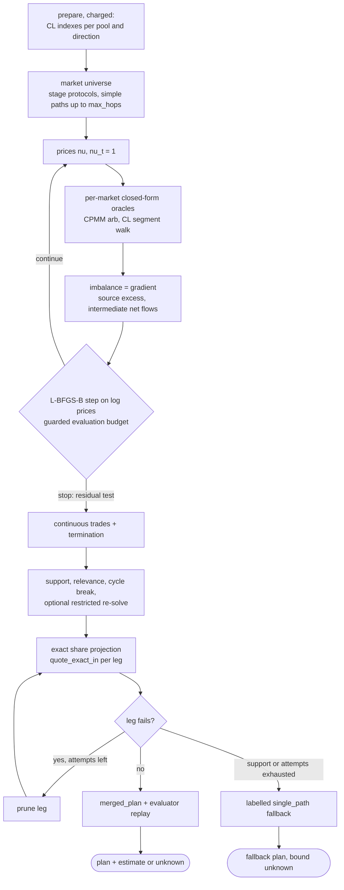

### 18.5 Hand-Worked Numeric Example
All values are checked by `r021_examples.py` section 16 (`example_cfmm_dual`). The independent
expectations are this module's own closed-form CPMM oracle and imbalance, its own share projection
written from `cfmm-dual.md` §6, a brute-force integer optimum with the hand quote, the pinned
CFMMRouter.jl author run (`tests/fixtures/cfmm/author_reference.json`, commit `5932e42`), the pinned
WHI-1557 contract model (`model_reference.json`) and exact protocol quotes for CL legs. The
numerical dependencies are pinned separately from money: the port's optimizer is SciPy 1.18.1
L-BFGS-B with NumPy 2.5.3 ([`pyproject.toml`](../../pyproject.toml);
[`research-021/cfmm-dual.md`](research-021/cfmm-dual.md) §2), and the numerical tolerances
are: CPMM oracle vs author $10^{-12}$ relative, final prices vs author $10^{-8}$, CL oracle vs
author $5 \times 10^{-14}$. Every monetary amount is exact.

**(a) Pool-level oracle.** Author probe `o-grid38-p1-sell-t0`: reserves (134, 190), 30 bps,
prices $\nu = (1, 1.5)$.
$$r^2 = \frac{0.997 \cdot 1.5 \cdot 190}{1 \cdot 134} \approx 2.1205, \quad r \approx 1.4562, \quad
\delta = \frac{134 \cdot 0.4562}{0.997} \approx 61.3132, \quad \lambda = 190 \left(1 - \frac{1}{1.4562}\right) \approx 59.5224.$$
The author run gives $\delta = 61.313204\ldots$ and $\lambda = 59.522390\ldots$; the hand oracle
and the factory's model oracle agree within $10^{-12}$ on all 7 pinned author CPMM probes.

**(b) A small multi-hop CPMM network (`r-triangle`).** Pools `st` (S, T: 1000, 1000, 30 bps),
`sm` (S, M: 1000, 2100, 30 bps), `mt` (M, T: 2000, 1000, 30 bps) and `mt2` (M, T: 500, 260,
5 bps). Request 150 S $\to$ T, `max_hops` 3.

1. **Spot start.** At the scale prices $\nu = (S\ 1.0,\ M\ 0.4762,\ T\ 1)$ only `mt` and `mt2`
   trade (M→T). Nothing tenders S, so the source excess is **150**, and M's net flow is
   **−68.83** (M is sold but not bought). Both gradient components are far from zero.
2. **At the author's optimum** ($\nu_S = 0.8448187283$, $\nu_M = 0.4561283857$, normalized to
   $\nu_T = 1$), every pool trades:

   | Pool | Direction | Tendered | Received |
   |---|---|---|---|
   | `st` | S→T | 86.5999 | 79.4780 |
   | `sm` | S→M | 63.4001 | 124.8491 |
   | `mt` | M→T | 91.1048 | 43.4427 |
   | `mt2` | M→T | 33.7443 | 16.4300 |

   - S tendered $86.5999 + 63.4001 = 150.0000$: the source excess is $-1.7 \times 10^{-8}$.
   - M received 124.8491 and tendered $91.1048 + 33.7443 = 124.8491$: net $-1.2 \times 10^{-8}$.
   - T received **139.350699**, the continuous optimum.
3. **The factory's optimizer.** The network is all-CPMM, so both stages see the same four
   markets. With their different optimizer settings, both presets (`v1` CPMM stage and `v2` CL
   stage) end `converged` with residual
   $1.558 \times 10^{-9} < 10^{-5}$ and dual value 139.350699. Their prices match the author's
   within $10^{-8}$, and the value within $10^{-6}$. The work equals the pinned contract model:
   7 iterations, 15 evaluations, 60 oracle calls (15 evaluations × 4 markets). The factory
   records no per-iteration trace; the spot and optimum points above show what the iterations move
   between.
4. **Exact integer recovery.**
   - S (inflow 150, in topological order first) splits over `st` and `sm`:
     $\lfloor 150 \cdot 86.5999 / 150.0000 \rfloor = 86$ to `st`, the remainder **64** to `sm`.
     Exact quotes: `st` 86 → **78** T, `sm` 64 → **125** M.
   - M (exact inflow 125) splits over `mt` and `mt2`:
     $\lfloor 125 \cdot 91.1048 / 124.8491 \rfloor = \lfloor 91.2 \rfloor = 91$ to `mt`, the remainder
     **34** to `mt2`. Exact quotes: 91 → **43** T and 34 → **16** T.
   - The plan: `st` takes 86 of REQUEST into F1; `sm` takes the rest (`ALL_REMAINING`, 64) into F2;
     `mt` takes 91 of F2 into F3; `mt2` drains F2 (34) into F4. Every fund is consumed or terminal,
     with no residual and no dust donation.
   - Gross $78 + 43 + 16 = \mathbf{137}$, equal to this module's independent projection of the
     author trades and to the fresh evaluator replay.
5. **Estimate versus integer optimum.**
   - The certificate is `bound_kind: estimate`, value 139.3506988816383, residual
     $1.558 \times 10^{-9}$. It is a numerical value, not an upper bound, and it is never
     `upper_raw` or a gap.
   - The brute-force integer optimum of this network is **138**. The projection is a heuristic and
     is not optimal.
   - With `max_iterations: 2` (an `override`) the initial solve stops at `iteration_cap`
     (residual 0.1727), the estimate is withheld (`unknown`), and the recovery happens to give
     **138** (flows equal to the contract model). A worse numerical point giving a better integer
     plan is exactly why no integer claim is made.

**(c) Cycle, surplus, nonconvergence and recovery failures.**

1. **Cycle (`r-cycle`, 500 S → T).** Pools `ab1` and `ab2` price A/B apart, so the continuous
   optimum trades a loop A→B→A.
   - The loop's input values are `ab1` 961.879 and `ab2` 797.598 (author trades at author prices),
     so `ab2` is removed.
   - The restricted re-solve (`sa`, `ab1`, `bt`, `at`, directions fixed, warm-started) converges,
     and the recovery gives **511** (equal to the contract model).
   - The reported estimate stays the initial full-network value, 627.0112. It includes the loop's
     arbitrage profit, which no acyclic plan can route. The restricted re-solve never supplies an
     estimate.
   - With `max_function_evaluations: 13`, the initial solve spends the whole budget, the re-solve
     is `skipped` (no refund), and the projection of the cycle-broken author support gives
     **509**: `sa` 500 → 474 A; `ab1` 349 → 403 B; `at` 125 → 123 T; `bt` 403 → 386 T.
2. **Surplus.** The relaxation allows free disposal. Given continuous trades that sell 1000 S for
   100 M but tender only 60 M onward (a 40 M surplus), the recovery (called directly as
   `routing.cfmm.recovery.recover`, the internal the factory uses) routes the **whole** exact M
   inflow: 1000 S → 996 M → **992** T. Surplus never becomes a dust donation. This is shown on the
   recovery internal, not through a factory solve.
3. **Nonconvergence (`r-tiny`, 2 S → T).** Pools `h1` (1000, 1000) and `h2` ($10^9$, $10^{11}$).
   The continuous value is 198.41 (between the pinned 198.40 and 198.41), but the exact chain is
   2 → 1 M → **99** T. The dust order meets the float noise floor: the initial solve is
   `not_converged` with its residual above the $10^{-5}$ tolerance, and the estimate is withheld
   (`unknown`); the factory reports a residual of 0.1073 (observed, not independently derived).
   The exact plan 99 is still recovered and replayed.
4. **Recovery failures** (pools `big` ($10^6$, $5 \times 10^5$) and `dust` (1, 1), 10 S):
   - The continuous support uses both pools; the `dust` leg's exact quote is
     `insufficient_output_amount`, so it is pruned and attempt 2 routes all 10 S through `big`:
     **4**.
   - `max_recovery_attempts: 1`: `attempts_exhausted`; the labelled `single_path` fallback gives
     **4**, and the bound is `unknown` (`fallback_used`).
   - The same with `fallback: none`: **`model_error`**.
   - A 1-unit order on a (1000, 1000) pool: every leg has zero output, `support_exhausted`, and
     the fallback's complete search finds nothing: **`no_route`**.

**(d) The CL stage: interval index, boundaries and exact money.** A synthetic Uniswap v3 state
(the one the pinned author UniV3 inputs were built from): fee 3000 pips ($\gamma = 0.997$), tick
spacing 60, current tick 100, positions $[-1800, -1200)$ with $L = 4 \times 10^{15}$ and
$[-600, 1200)$ with $L = 10^{16}$, collected bitmap words $(-1, 0)$.

1. **Index.** Going down from tick 100, the segment liquidities are
   $[10^{16},\ 0,\ 4 \times 10^{15},\ 0]$: the upper position, the empty range $[-1200, -600)$, the
   lower position, then nothing, up to the collected bottom $-1 \cdot 256 \cdot 60 = -15360$
   (`collected_range`). Going up: $[10^{16},\ 0]$ up to $(0 \cdot 256 + 255) \cdot 60 = 15300$.
   If tick $-1800$ has no `TickInfo`, the down range ends there (`missing_tick_data`).
2. **Author agreement.** On the 6 synthetic author probes (no-trade band, near, across the empty
   range, drain, both directions) the model oracle matches CFMMRouter.jl within
   $1.75 \times 10^{-14}$ relative, under the pinned $5 \times 10^{-14}$ (all 13 probes, including a
   real Uniswap v3 state, are in `tests/routing/test_cfmm_cl.py`).
3. **Single CL market, three sizes** (T0 → T1):

   | Input (raw T0) | Exact quote | `cfmm_dual` row |
   |---|---|---|
   | 1000000 | `ok` 1007019 (1 swap step) | `ok` **1007019**, equal to the exact quote; the factory reports this row as the labelled `single_path` fallback after an empty continuous support (`empty_support`, initial solve `not_converged`; observed diagnostics) |
   | 356469011501122 | `ok` 346536862482825 (2 initialized ticks crossed) | `ok` **346536862482825**, `converged`, recovered across the empty range without fallback |
   | 970404414235056 | `incomplete_snapshot` (beyond the collected range) | **`incomplete_snapshot`**: the leg is pruned and the fallback also meets uncollected state |

   The recovered output (or fallback output) is always the exact quote; only these outputs and
   statuses are asserted, the termination and fallback labels are the factory's own records. In
   the second row the factory-reported estimate is 346536862482828.06, a numerical value slightly
   above the exact output; this synthetic-fixture closeness does not transfer to real states (§18.9).
4. **Missing `TickInfo` at the model's endpoint.** In the missing-tick variant the continuous range
   is closed at tick $-1800$. The smallest input whose exact quote fails is 485202207117532: the
   exact swap must cross that tick and cannot, so the quote is `incomplete_snapshot`. The model
   accepts that input; the recovery prunes the leg, and the row is `incomplete_snapshot`. One raw
   unit less recovers exactly **456981049010253**.
5. **Mixed CL/CPMM cycle.** CPMM `s0` (S, T0), the synthetic CL pool, CPMM `x01` (T0, T1, priced
   away from the CL pool) and CPMM `t1` (T1, T); $10^{13}$ S. The continuous solution trades a loop
   through `x01`; the recovery removes `x01`, re-solves `s0`, CL, `t1` on the shared budget, and the
   replayed plan gives **9979954889780** (`s0` → 9960069810399 T0, CL → 10019984743887 T1,
   `t1` → 9979954889780 T).

**(e) Real admitted CPMM + CL states (`mantle_mixed`).** The checked-in fixture
`tests/fixtures/routing/mantle_mixed` holds 8 real pools at Mantle block 101,057,678 (bundle hash
`e03e3c9b…`). It is neither the 19-pool fixture of §11 nor the 143-pool corpus. Case
`usdc_usdt_small`: 1000000 raw USDC $\to$ USDT, `max_hops` 3.

- **CL stage (`cfmm_dual/2`).** The asserted facts are that the plan routes both CL and CPMM legs
  and that no Liquidity Book pool is ever a market. The factory reports its market list (2
  concentrated and 3 constant-product pools) and an initial solve that ended `converged` with
  residual $1.77 \times 10^{-8}$; these are observed diagnostics, not independently derived. The
  plan:

  | Leg | Pool (protocol) | Input | Output |
  |---|---|---|---|
  | USDC→WMNT | `0x086f…` (CL) | 22538 | 33707181338863903 |
  | USDC→WMNT | `0x1a4d…` (CPMM) | 782918 | 1172547370719607160 |
  | USDC→USDT | `0x8e3a…` (CPMM) | 194544 | 192818 |
  | WMNT→USDT | `0x4cdf…` (CL) | 460785201979270533 | 306840 |
  | WMNT→USDT | `0x4e76…` (CPMM) | 745469350079200530 | 493811 |

  - Each leg equals the exact original-state quote of its merged input; the WMNT legs drain the
    whole WMNT inflow.
  - Gross $192818 + 306840 + 493811 = \mathbf{993469}$.
- **CPMM stage (`cfmm_dual/1`, the historical ablation):** **990975** over the CPMM markets (flows
  equal to the pinned contract model).
- **Best exact single path over the CL-stage markets:** **989291** (`0x1a4d…` → `0x4e76…`).
- The CL-stage split is factory output checked for exact feasibility and against every exact
  single path, not against an independent optimum. It is one request, not a performance result.

### 18.6 Implementation Map
Line numbers are those of `e455c7d`; function names are the stable anchors.
- Strategy: `routing/algorithms/cfmm_dual.py`.
  - Ceiling, stages and pins: `CAPABILITIES` (line 132), `STAGES` (line 140), `PRESET` (v2,
    line 162) and `PRESET_V1` (the historical pin, line 171, registered as
    `FACTORY.historical_presets`), `WORK_UNITS` (line 177).
  - Options: `validate_options` (line 264).
  - Preparation: `prepare` (line 329) builds the CL indexes (`prepare_cl_indexes`) inside the
    charged worker preparation.
  - Records: `domain_record` (line 374), `_solve_view` (line 408).
  - Solver: `solve` / `_solve` (lines 457–815), with `_fallback` (line 465); `FACTORY`
    (line 816).
- Model: `routing/cfmm/model.py` — `market_universe` (line 82), `cpmm_arb` (line 119),
  `cl_arb` (line 140), `dual_problem` (line 198), `restricted` (line 234), `dual_value`
  (line 260), `scales` (line 301), `log_objective` (line 349), `projected_residual` (line 366).
- CL index: `routing/cfmm/cl.py` — `ClSide` (line 90), `ClIndex` (line 154), `build_cl_index`
  (line 281), `prepare_cl_indexes` (line 303).
- Optimizer: `routing/cfmm/optimizer.py` — `SolverSettings` (line 90), `SolveBudget` (line 129),
  `GuardedObjective` (line 159), `solve` (line 376), `resolve_restricted` (line 534).
- Recovery: `routing/cfmm/recovery.py` — `_support` (line 113), `_relevant` (line 125),
  `_find_cycle` / `_break_cycles` (lines 149–197), `_topological` (line 205), `_project`
  (line 228), `_replay` (line 274), `recover` (line 304).
- Contract and notices: [`research-021/cfmm-dual.md`](research-021/cfmm-dual.md) §§4–9;
  `routing/cfmm/NOTICE.md`; author reference harness `tools/upstream/cfmm/`.
- Tests: `tests/routing/test_cfmm_dual.py`, `test_cfmm_dual_cl.py`, `test_cfmm_cl.py`,
  `test_cfmm_model.py`, `test_cfmm_optimizer.py`, `test_cfmm_contract.py`.
- Worked examples: `r021_examples.py`, `example_cfmm_dual` (runner section 16).

### 18.7 Parameters, Budgets, and Ties
- **Shared parameter:** only `search.max_hops`, which bounds the market universe. The merged plan
  may contain longer composite paths. `search.max_splits` and `search.percent_step` are unused.
- **Options** (ranges in `cfmm-dual.md` §9.3): `market_protocols`, `max_iterations`,
  `max_function_evaluations`, `lbfgs_memory`, `pgtol`, `ftol`, `residual_tolerance`,
  `log_price_bound`, `min_split_share`, `max_recovery_attempts`, `cycle_resolve`, `fallback`.
- **Current preset `cfmm_dual/2`:** the `cfmm_dual/1` values except `market_protocols:
  constant_product+concentrated`, `lbfgs_memory` 30, `log_price_bound` 10 and
  `min_split_share` $10^{-3}$. It was chosen on the `sor_cohort_tuning` split only, by a rule
  fixed in advance. Tuning exposure only: no performance or quality claim.
- **Budgets:**
  - numerical: `max_function_evaluations` and `max_iterations` per solve attempt, shared by the
    one restricted re-solve; oracle calls ≤ evaluations × $\lvert M \rvert$;
  - exact: every recovery quote uses the run's quote budget (`quote_budget` → `timeout` without a
    plan);
  - `Budget.max_candidates` counts only fallback paths evaluated.
- **Ties:** admitted market order everywhere; cycle victims by (value, later market); topological
  ties by first use; leg order by admitted order with the remainder last; the fallback keeps the
  first best path. Deterministic for the pinned SciPy 1.18.1 / NumPy 2.5.3 wheels
  ([`pyproject.toml`](../../pyproject.toml); [`research-021/cfmm-dual.md`](research-021/cfmm-dual.md)
  §2) and platform; bitwise float identity across platforms is not claimed.

### 18.8 Computational and Memory Cost
- **Numerical work:** at most `max_function_evaluations` evaluations per solve attempt, each
  $\lvert M \rvert$ oracle calls. A CPMM oracle is $\mathcal{O}(1)$. A CL oracle locates the target
  price in its index by binary search and then sums the traversed segments.
- **CL index:** built once per worker inside the **charged** `prepare`, linear in the pool's
  collected initialized ticks, and kept in memory as float segment arrays. Logarithmic lookup in
  the oracle does **not** make the solve or the exact swap logarithmic: the exact replay still steps
  tick by tick in `pools.concentrated`, and the optimizer still needs many evaluations.
- **L-BFGS-B:** $\mathcal{O}(\text{lbfgs\_memory} \cdot \lvert \text{tokens} \rvert)$ memory and time per
  iteration.
- **Exact work:** at most one quote per leg per recovery attempt (at most `max_recovery_attempts`
  attempts), one in-solve replay (memo hits), plus the fallback's path quotes when used.
- **Work units** (different units are never divided): `market_oracle_calls`,
  `objective_evaluations`, `gradient_evaluations`, `optimizer_iterations`, `recovery_attempts`,
  `admission_checks`, `combinations_rejected_cycle`, `quotes_executed`, `quotes_memoized`,
  `exact_replay_quotes`, `internal_evaluations`, `paths_scored`.

### 18.9 Guarantees and Limitations
- **Guarantees:**
  - Every returned plan is fully funded, uses one merged step per market, has no token cycle, no
    residual and no borrowed fund, and every leg's amount is an exact original-state quote. The
    independent evaluator replays it to the reported score.
  - An estimate is reported only when the initial full-network solve met the residual criterion
    and no fallback was used.
- **Limitations:**
  - **No certified bound, no integer optimality.** The estimate is float and uncertified; the
    projection is a heuristic (137 vs brute force 138 in §18.5).
  - **`converged` is only the residual criterion.** It says nothing about optimality or
    feasibility, and a clamped warm start can satisfy it at a loose point.
  - **The CL stage rarely converges on real states.** In the WHI-1559 tuning evidence on the
    `sor_cohort_tuning` split, the frozen `cfmm_dual/2` preset converged on 9 of 96 cases, used 21 labelled fallbacks, and its worst case
    was about −4557 bp against the best exact single path over the same markets (all exact and
    fully funded, some poor). Earlier enormous relative "gains" in that tuning came from tiny
    bad-baseline denominators, not useful gains. None of this is a performance or adoption claim.
  - **Synthetic numerical agreement does not transfer.** The 13 pinned author probes agree within
    $5 \times 10^{-14}$, and the registered synthetic fixture's exact-vs-continuous closeness
    ($10^{-9}$) is a property of that fixture. On real states the exact swap's per-step rounding,
    fee rounding on dust and float cancellation put the exact output further below the continuous
    value (`cfmm-dual.md` §8.4 records up to about $5 \times 10^{-4}$ on dust inputs, and the WHI-1559
    integration observed $2.4 \times 10^{-5}$ on one small-output drain); these are numerical
    observations, not integer bounds. Exact money is never affected.
  - **Stage, not search quality.** The CPMM-only ablation can be extremely poor where CL liquidity
    matters (14409 on the §11 request, §11.3); always read `cfmm_dual` beside its stage and markets.
  - **Scope:** gross-only, single-source exact input, LB excluded, markets limited to simple paths
    of at most `search.max_hops` pools. No latency claim.
